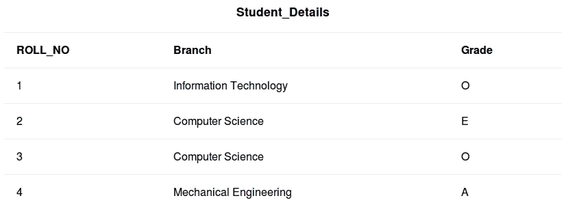
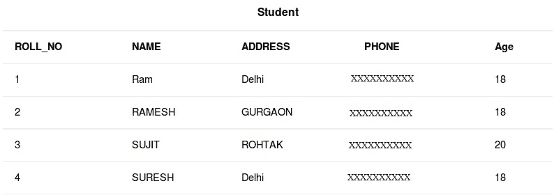

# SQL |别名

> 原文:[https://www.geeksforgeeks.org/sql-aliases/](https://www.geeksforgeeks.org/sql-aliases/)

别名是为了特定的 SQL 查询而赋予表或列的临时名称。当使用列名或表名而不是它们的原始名称时使用，但修改后的名称只是临时的。

*   创建别名是为了使表名或列名更易读。
*   重命名只是暂时的更改，表名在原始数据库中不会改变。
*   当表名或列名很大或可读性不强时，别名很有用。
*   当查询中涉及多个表时，这些是首选的。

**基本语法:**

*   对于列别名:

    ```
    SELECT column as alias_name FROM table_name;
    column: fields in the table
    alias_name: temporary alias name to be used in replacement of original column name 
    table_name: name of table

    ```

*   对于表别名:

    ```
    SELECT column FROM table_name as alias_name;
    column: fields in the table 
    table_name: name of table
    alias_name: temporary alias name to be used in replacement of original table name

    ```

[](https://media.geeksforgeeks.org/wp-content/uploads/table12.jpg)

**用于说明列别名的查询**

*   To fetch ROLL_NO from Student table using CODE as alias name.

    ```
    SELECT ROLL_NO AS CODE FROM Student; 

    ```

    输出:

    | **代码** |
    | --- |
    | one |
    | Two |
    | three |
    | four |

*   To fetch Branch using Stream as alias name and Grade as CGPA from table Student_Details.

    ```
    SELECT Branch AS Stream,Grade as CGPA FROM Student_Details; 

    ```

    输出:

    | **流** | **CGPA** |
    | --- | --- |
    | 信息技术 | O |
    | 计算机科学 | E |
    | 计算机科学 | O |
    | 机械工程 | A |

**用于说明表格别名的查询**

[](https://media.geeksforgeeks.org/wp-content/cdn-uploads/table2.jpg) 
一般来说，表别名不仅仅是从单个表中获取数据，而是通过字段关系将它们连接起来。

*   To fetch Grade and NAME of Student with Age = 20.

    ```
    SELECT s.NAME, d.Grade FROM Student AS s, Student_Details
    AS d WHERE s.Age=20 AND s.ROLL_NO=d.ROLL_NO; 

    ```

    输出:

    | **名称** | **等级** |
    | --- | --- |
    | SUJIT | O |

本文由 **[Pratik Agarwal](https://www.facebook.com/Pratik.Agarwal01)** 供稿。如果你喜欢 GeeksforGeeks 并想投稿，你也可以使用[contribute.geeksforgeeks.org](http://www.contribute.geeksforgeeks.org)写一篇文章或者把你的文章邮寄到 contribute@geeksforgeeks.org。看到你的文章出现在极客博客主页上，帮助其他极客。

如果你发现任何不正确的地方，或者你想分享更多关于上面讨论的话题的信息，请写评论。