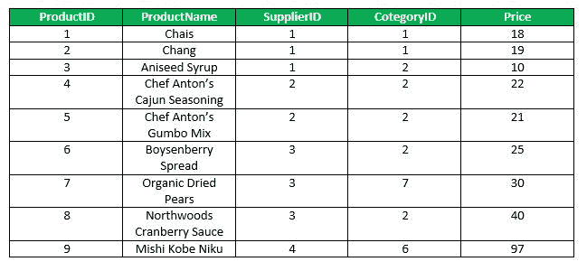
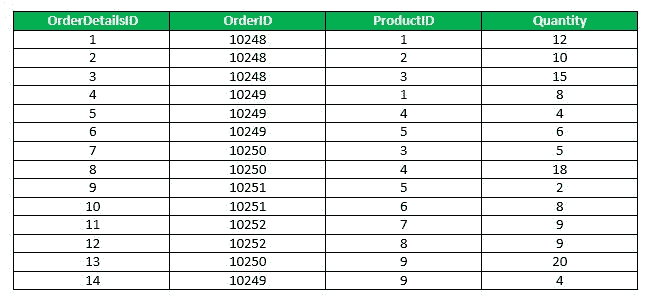
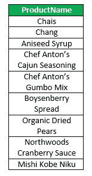
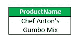
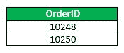
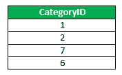
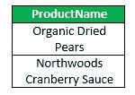

# SQL | ALL 和 ANY

> 原文:[https://www.geeksforgeeks.org/sql-all-and-any/](https://www.geeksforgeeks.org/sql-all-and-any/)

**ALL & ANY** 是 SQL 中的逻辑运算符。它们返回布尔值作为结果。

**全部**

ALL 运算符用于选择 select 语句的所有元组。它还用于将一个值与子查询的另一个值集或结果中的每个值进行比较。

*   如果所有子查询值都满足条件，则 ALL 运算符返回 TRUE。ALL 前面必须有比较运算符，如果所有子查询值都满足条件，则计算结果为 true。
*   ALL 与 SELECT、WHERE、HAVING 语句一起使用。

**所有选择语句:**

```
Syntax:
SELECT ALL field_name
FROM table_name
WHERE condition(s);

```

**所有带 WHERE 或 HAVING 语句的:**

```
Syntax:
SELECT column_name(s)
FROM table_name
WHERE column_name comparison_operator ALL
(SELECT column_name
FROM table_name
WHERE condition(s));

```

示例:
考虑以下产品表和订单明细表，

<center>**Products Table**</center>



<center>**OrderDetails Table**</center>



**查询**

*   **Find the name of the all the product.**

    ```
    SELECT ALL ProductName 
    FROM Products
    WHERE TRUE;

    ```

    输出:

    

*   **Find the name of the product if all the records in the OrderDetails has Quantity either equal to 6 or 2.**

    ```
    SELECT ProductName 
    FROM Products
    WHERE ProductID = ALL (SELECT ProductId
                           FROM OrderDetails
                           WHERE Quantity = 6 OR Quantity = 2);

    ```

    输出:

    

*   **Find the OrderID whose maximum Quantity among all product of that OrderID is greater than average quantity of all OrderID.**

    ```
    SELECT OrderID 
    FROM OrderDetails 
    GROUP BY OrderID 
    HAVING max(Quantity) > ALL (SELECT avg(Quantity) 
                                FROM OrderDetails 
                                GROUP BY OrderID);

    ```

    输出:

    

**任意**

ANY 将一个值与列表中的每个值或查询结果进行比较，如果内部查询的结果至少包含一行，则计算结果为 true。

*   如果任何子查询值满足条件，则 ANY 返回 true。
*   ANY 前面必须有比较运算符。
    **语法:**

```
SELECT column_name(s)
FROM table_name
WHERE column_name comparison_operator ANY
(SELECT column_name
FROM table_name
WHERE condition(s));
```

**查询**

*   Find the Distinct CategoryID of the products which have any record in OrderDetails Table.

    ```
    SELECT DISTINCT CategoryID
    FROM Products 
    WHERE ProductID = ANY (SELECT ProductID 
                           FROM OrderDetails);

    ```

    输出:

    

*   Finds any records in the OrderDetails table that Quantity = 9.

    ```
    SELECT ProductName
    FROM Products
    WHERE ProductID = ANY (SELECT ProductID
                           FROM OrderDetails
                           WHERE Quantity = 9);

    ```

    

本文由 **[Anuj Chauhan](https://www.facebook.com/anuj0503)** 供稿。如果你喜欢 GeeksforGeeks 并想投稿，你也可以使用[contribute.geeksforgeeks.org](http://www.contribute.geeksforgeeks.org)写一篇文章或者把你的文章邮寄到 contribute@geeksforgeeks.org。看到你的文章出现在极客博客主页上，帮助其他极客。

如果你发现任何不正确的地方，或者你想分享更多关于上面讨论的话题的信息，请写评论。