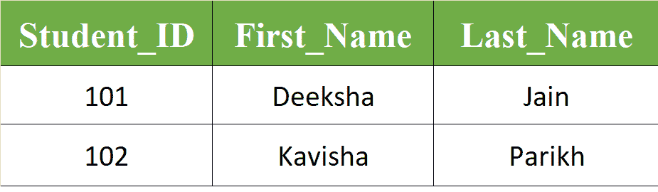

# SQL 自动递增

> 原文:[https://www.geeksforgeeks.org/sql-auto-increment/](https://www.geeksforgeeks.org/sql-auto-increment/)

有时在创建表时，我们在表中没有唯一的标识符，因此我们在选择主键时会遇到困难。为了解决这样的问题，我们必须手动为每条记录提供唯一的密钥，但这通常也是一项乏味的任务。因此，我们可以使用自动增量功能，为插入的每个新记录自动生成一个数字主键值。

所有数据库都支持自动增量功能，我们将讨论后续数据库管理系统的自动增量字段:

1.  SQL 服务器
2.  [MySQL](https://www.geeksforgeeks.org/mysql-common-mysql-queries/) 的实现
3.  [PostgreSQL](https://www.geeksforgeeks.org/python-database-management-in-postgresql/)
4.  微软访问
5.  Oracle

**1。SQL Server 自动增量:**
在 SQL Server 中，IDENTITY(starting_value，increment_value)用于自动增量功能。
这里，

*   **起始值–**
    提到我们想要使用的起始值。
*   **increment _ value–**
    为后续记录增加我们想要增加的键值。

**示例:**
我们将创建带有字段 Student_ID、First_Name、Last_Name 的 Students 表，我们将使用自动增量自动生成 Student_ID，并将其作为表的主键。假设 IDENTITY 的起始值为 101，我们将为每个新记录将自动生成的密钥增加 1。

```
CREATE TABLE Students(
Student_ID int IDENTITY(101, 1) PRIMARY KEY, 
First_Name varchar(255),
Last_Name varchar(255)
);
```

要在学生表中插入新记录，我们不会指定学生标识的值，因为它将自动添加。

```
INSERT INTO Students(First_Name, Last_Name ) 
VALUES ('Deeksha', 'Jain');

INSERT INTO Students(First_Name, Last_Name ) 
VALUES ('Kavisha', 'Parikh'); 
```

**输出:**



**2。MySQL 自动增量:**
在 MySQL 中，AUTO_INCREMENT 关键字用于自动增量功能。默认情况下，自动增量从 1 开始，增加 1。

**示例:**
我们将创建带有字段 Student_ID、First_Name、Last_Name 的 Students 表，我们将使用自动增量自动生成 Student_ID，并将其作为表的主键。

```
CREATE TABLE Students(
Student_ID int AUTO_INCREMENT PRIMARY KEY, 
First_Name varchar(255),
Last_Name varchar(255)
); 
```

要在学生表中插入新记录，我们不会指定 Student_ID 的值，因为它将自动添加，并且第一条记录的键为 1，后续每条记录的键将增加 1。

```
INSERT INTO Students(First_Name, Last_Name ) 
VALUES ('Anish', 'Jain');

INSERT INTO Students(First_Name, Last_Name ) 
VALUES ('Akshita', 'Sharma');

INSERT INTO Students(First_Name, Last_Name ) 
VALUES ('Shruti', 'Sogani'); 
```

**输出:**


要更改默认的起始值，我们可以使用如下的 ALTER TABLE 命令:

```
ALTER TABLE Students AUTO_INCREMENT = new_value; 
```

这里 new_value 是我们想要使用的起始值。

要将 AUTO_INCREMENT 间隔值更改为不同于 1 的数字，我们为 MySQL Server 的变量 *auto_increment_increment* 分配新的间隔值。

```
*mysql>*
SET @@ auto_increment_increment=new_interval_value; 
```

这里 new_interval_value 是我们想要使用的区间值。

**3。PostgreSQL 自动增量:**
在 PostgreSQL 中，SERIAL 关键字用于自动增量功能。

**示例:**
我们将创建带有字段 Student_ID、First_Name、Last_Name 的 Students 表，我们将使用自动增量自动生成 Student_ID，并将其作为表的主键。

```
CREATE TABLE Students(
Student_ID int SERIAL PRIMARY KEY, 
First_Name varchar(255),
Last_Name varchar(255)
); 
```

要在学生表中插入新记录，我们不会指定学生标识的值，因为它将自动添加。

```
INSERT INTO Students(First_Name, Last_Name ) 
VALUES ('Anish', 'Jain');

INSERT INTO Students(First_Name, Last_Name ) 
VALUES ('Akshita', 'Sharma');

INSERT INTO Students(First_Name, Last_Name ) 
VALUES ('Shruti', 'Sogani'); 
```

**输出:**


**4。MS Access 自动递增:**
在 MS Access 中，Auto Increment 关键字用于执行自动递增功能。默认情况下，自动增量从 1 开始，增加 1。

**示例:**
我们将创建带有字段 Student_ID、First_Name、Last_Name 的 Students 表，我们将使用自动增量自动生成 Student_ID，并将其作为表的主键。

```
CREATE TABLE Students(
Student_ID int AUTOINCREMENT PRIMARY KEY, 
First_Name varchar(255),
Last_Name varchar(255)
); 
```

要在学生表中插入新记录，我们不会指定 Student_ID 的值，因为它将自动添加，并且第一条记录的键为 1，后续每条记录的键将增加 1。

```
INSERT INTO Students(First_Name, Last_Name ) 
VALUES ('Anish', 'Jain');

INSERT INTO Students(First_Name, Last_Name ) 
VALUES ('Akshita', 'Sharma');

INSERT INTO Students(First_Name, Last_Name ) 
VALUES ('Shruti', 'Sogani'); 
```

**输出:**


要更改默认的起始值和增量值，我们可以使用自动增量功能，如下所示:

```
AUTOINCREMENT(starting_value, increment_value) 
```

这里 starting_value 是我们想要使用的起始值，increment_value 是我们想要为后续记录增加关键字的值。

**5。甲骨文自动增量:**
在甲骨文中，要使用自动增量功能，我们必须用连续生成数字序列的序列对象来制作自动增量字段。

**语法:**

```
CREATE SEQUENCE sequence_name
MINVALUE 1
START WITH 1
INCREMENT BY 1
CACHE 10; 
```

在上面的语法中，

*   **sequence _ name–**
    是指我们想要生产的序列对象的名称。
*   **以–**
    开始，然后是我们想要使用的起始值。这里我们提供了 1 作为起始值。
*   **增量 BY–**
    后跟要增量的值。这里我们想把后续的键增加 1。
*   **缓存–**
    后跟要存储的最大值数，以便更快地访问。

**示例:**
下面的代码创建了一个名为 seq_students 的序列对象，它以 101 开头，可以递增 1。它还将缓存多达 20 个性能值。

```
CREATE SEQUENCE seq_students
MINVALUE 1
START WITH 101
INCREMENT BY 1
CACHE 20; 
```

要将新记录插入“学生”表，我们必须使用 nextval 函数从 seq_students 序列中检索下一个值:

```
INSERT INTO Students(Student_ID, First_Name, Last_Name)
VALUES (seq_students.nextval, 'Deeksha', 'Jain');

INSERT INTO Students(Student_ID, First_Name, Last_Name)
VALUES (seq_students.nextval, 'Kavisha', 'Parikh'); 
```

**输出:**

