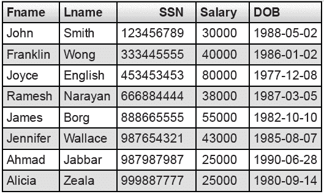
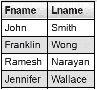
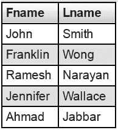
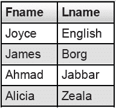
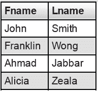

# SQL |介于&和运算符

之间

> 原文:[https://www.geeksforgeeks.org/sql-between-in-operator/](https://www.geeksforgeeks.org/sql-between-in-operator/)

**在**之间

“介于”条件允许您轻松测试表达式是否在一个值范围内(包括值)。这些值可以是文本、日期或数字。它可以用在 SELECT、INSERT、UPDATE 或 DELETE 语句中。“介于”条件将返回表达式在值 1 和值 2 范围内的记录。

**语法:**

```
SELECT column_name(s)
FROM table_name
WHERE column_name BETWEEN value1 AND value2;
```

示例:
考虑下面的员工表，



**查询**

*   **使用带数值的介于:**
    列出所有工资在 30000 到 45000 之间的员工姓名。

```
SELECT Fname, Lname
FROM Employee
WHERE Salary
BETWEEN 30000 AND 45000;
```

输出:



*   **使用带日期值的介于:**
    查找出生日期在 1985 年 1 月 1 日至 1990 年 12 月 12 日之间的所有员工。

```
SELECT Fname, Lname
FROM Employee
where DOB
BETWEEN '1985-01-01' AND '1990-12-30';
```

输出:



*   **使用 NOT 运算符和**之间的
    查找所有工资不在 30000 到 45000 范围内的员工姓名。

```
SELECT Fname, Lname
FROM Emplyoee
WHERE Salary
NOT BETWEEN 30000 AND 45000;
```

输出:



**输入**

运算符允许您轻松测试表达式是否匹配值列表中的任何值。它用于删除选择、插入、更新或删除中的多个或条件。您也可以使用“不输入”来排除列表中的行。我们应该注意，任何类型的重复条目都将被保留。
语法:

```
SELECT column_name(s)
FROM table_name
WHERE column_name IN (list_of_values);
```

**查询**

*   查找工资等于 30000、40000 或 25000 的员工的姓名。

```
SELECT Fname, Lname
FROM Employee
WHERE Salary IN (30000, 40000, 25000);
```

输出:



*   查找所有工资不等于 25000 或 30000 的员工的姓名。

```
SELECT Fname, Lname
FROM Employee
WHERE Salary NOT IN (25000, 30000);
```

输出:


本文由 [**Anuj Chauhan**](https://www.facebook.com/anuj0503) 供稿。如果你喜欢 GeeksforGeeks 并想投稿，你也可以使用[write.geeksforgeeks.org](https://write.geeksforgeeks.org)写一篇文章或者把你的文章邮寄到 review-team@geeksforgeeks.org。看到你的文章出现在极客博客主页上，帮助其他极客。

如果你发现任何不正确的地方，或者你想分享更多关于上面讨论的话题的信息，请写评论。