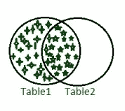
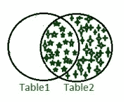
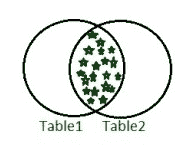
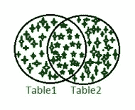

# SQL 概念和查询

> 原文:[https://www.geeksforgeeks.org/sql-concepts-and-queries/](https://www.geeksforgeeks.org/sql-concepts-and-queries/)

在本文中，我们将讨论 SQL 的概述，并将主要关注概念和查询，并通过示例来理解它们。我们一个一个来讨论。

**概述:**
[SQL](https://www.geeksforgeeks.org/sql-tutorial/) 是一种计算机语言，用于以结构化格式存储、操作和检索数据。这种语言是由 IBM 发明的。这里，SQL 代表结构化查询语言。通过将数据库与 SQL 查询进行交互，我们可以处理大量数据。有几个支持 SQL 的数据库服务器，比如 MySQL、 [PostgreSQL](https://www.geeksforgeeks.org/postgresql-tutorial/) 、sqlite3 等等。数据可以通过这些数据库服务器以安全和结构化的格式存储。SQL 查询通常更好地用于数据操作和业务洞察。

**SQL 数据库:**
在这里，我们将讨论查询，并借助示例进行理解。

**Query-1 :**
**展示现有数据库–**
让我们考虑现有的数据库，如 nformation _ schema、mysql、performance_schema、sakila、student、sys 和 world。如果您想显示现有的数据库，那么我们将使用如下所示的 show database 查询。

```
SHOW DATABASES;  
```

**输出:**

<figure class="table">

| 现有数据库名称 |
| --- |
| 信息模式 |
| 关系型数据库 |
| 性能 _ 架构 |
| 沙基拉 |
| 学生 |
| [计]系统复制命令（system 的简写） |
| 世界 |

**查询-2 :**
**删除数据库–**
假设我们要删除的数据库就是学生。

```
DROP DATABASE student;
SHOW DATABASES;  
```

<figure class="table">

| 数据库名称 |
| --- |
| 信息模式 |
| 关系型数据库 |
| 性能 _ 架构 |
| 沙基拉 |
| [计]系统复制命令（system 的简写） |
| 世界 |

</figure>

**查询-3 :**
**创建数据库–**
假设我们要创建一个数据库即银行。

```
CREATE DATABASE bank;
SHOW DATABASES;
```

<figure class="table">

| 数据库名称 |
| --- |
| 银行 |
| 信息模式 |
| 关系型数据库 |
| 性能 _ 架构 |
| 沙基拉 |
| [计]系统复制命令（system 的简写） |
| 世界 |

</figure>

**查询-4 :**
**使用数据库–**

```
USE bank;
```

**查询-5 :**
**创建表–**
这里的数据类型可以是 varchar、integer、date 等。

```
CREATE TABLE table_name (
   column1 datatype,
   column2 datatype,
  ....
);
```

**示例–**

```
CREATE TABLE IF NOT EXISTS Employee (
   EmployeeID int,
   FirstName varchar(55),
   LastName varchar(55),
   Email varchar(150),
   DOB date
);
```

**查询-6 :**
**显示同一数据库中的表–**

```
SHOW TABLES;
```

**查询-7 :**
**丢表–**

```
DROP TABLE table_name;
```

**查询-8 :**
**将值插入现有表–**

```
INSERT INTO Employee 
VALUES(1111,'Dipak','Bera','dipakbera@gmail.com','1994-11-22');
```

**查询-9 :**
**在表中取值–**

```
SELECT * FROM Employee;
```

**Query-10:**
**Not Null–**
我们可以指定在表中插入值(行)时，哪一列不接受 Null 值。它将在创建表时完成。

```
CREATE TABLE table_name (
  column1 datatype NOT NULL,
  column2 datatype,
 ....
);
```

**Query-11:**
**Unique–**
我们还可以指定特定列中的条目应该是唯一的。

```
CREATE TABLE table_name (
 column1 datatype UNIQUE,
 column2 datatype,
....
);
```

**示例–**

```
CREATE TABLE demo_table
(
EmployeeID int NOT NULL UNIQUE, 
FirstName varchar(55), 
LastName varchar(55)
);
```

**SQL 中的关键概念:**
在这里，我们将讨论一些重要的概念，如键、连接操作、拥有子句、排序依据等。我们一个一个来讨论。

*   **主键–**
    约束主键建议对应于指定列的条目既不能为空，也不能重复。

```
CREATE TABLE IF NOT EXISTS Customer(
CustID int NOT NULL,
FName varchar(55),
LName varchar(55),
Email varchar(100),
DOB date,
CONSTRAINT customer_custid_pk  PRIMARY KEY(CustID)
);
```

*   **外键–**
    外键用于在当前表和包含主键的上一个表之间建立连接。

```
CREATE TABLE Account(
AccNo int NOT NULL,
AType varchar(20),
OBal int,
OD date,
CurBal int,
CONSTRAINT customer_AccNo_fk  FOREIGN KEY(AccNo) REFERENCES Customer(CustID)
);
```

*   这里，“帐户”表中的“帐户号”列由“客户”表中的“客户标识”列引用。这里，帐户表是子表，客户表是父表。

**ORDER BY:**
**ORDER BY 关键字用于按升序或降序显示结果。默认情况下，它以升序排列。**

****语法–****

```
SELECT column1, column2, ...
FROM table_name
ORDER BY column1, column2, ... ASC|DESC;
```

*   ****场景-1 :**
    假设我们有如下的账表。**

<figure class="table">

| 真的吗 | 到类型 | 海岸 | 平均海面 | 路边 |
| --- | --- | --- | --- | --- |
| One thousand one hundred and eleven | 储蓄 | One thousand | 1990-11-09 | Six thousand |
| One thousand one hundred and fourteen | 目前的 | Two thousand | 1992-10-07 | One thousand |
| One thousand one hundred and thirteen | 目前的 | Seven thousand | 1992-11-03 | Four thousand |
| One thousand one hundred and twelve | 储蓄 | One thousand | 2003-12-12 | Three thousand |

</figure>

*   **现在，我们将按如下方式使用 Order By 命令。**

```
**SELECT * FROM Account ORDER BY CurBal; ** 
```

****输出:**
(默认为递增顺序)**

<figure class="table">

| 真的吗 | 到类型 | 海岸 | 平均海面 | 路边 |
| --- | --- | --- | --- | --- |
| One thousand one hundred and fourteen | 目前的 | Two thousand | 1992-10-07 | One thousand |
| One thousand one hundred and twelve | 储蓄 | One thousand | 2003-12-12 | Three thousand |
| One thousand one hundred and thirteen | 目前的 | Seven thousand | 1992-11-03 | Four thousand |
| One thousand one hundred and eleven | 储蓄 | One thousand | 1990-11-09 | Six thousand |

*   ****场景-2 :**
    **为降序:****

```
SELECT * FROM Account ORDER BY CurBal DESC;
```

****输出:****

<figure class="table">

| 真的吗 | 到类型 | 海岸 | 平均海面 | 路边 |
| --- | --- | --- | --- | --- |
| One thousand one hundred and eleven | 储蓄 | One thousand | 1990-11-09 | Six thousand |
| One thousand one hundred and thirteen | 目前的 | Seven thousand | 1992-11-03 | Four thousand |
| One thousand one hundred and twelve | 储蓄 | One thousand | 2003-12-12 | Three thousand |
| One thousand one hundred and fourteen | 目前的 | Two thousand | 1992-10-07 | One thousand |

</figure>

****分组依据:**
该关键字用于对结果进行分组。**

****示例–****

```
SELECT COUNT(AType) FROM Account GROUP BY AType;
```

****输出:****

<figure class="table">

| 到类型 | 计数(AType) |
| --- | --- |
| 储蓄 |         2 |
| 目前的 |         2 |

**[**【JOIN】**](https://www.geeksforgeeks.org/sql-join-set-1-inner-left-right-and-full-joins/)**CONCEPTS:**
**在这里，我们将对 join concept 进行如下讨论。****

*   ****LEFT JOIN:**
    LEFT JOIN 关键字返回左表(表 1)中的所有记录以及右表(表 2)中的匹配记录。
    **语法–****

```
SELECT column_name(s)
FROM table1
LEFT JOIN table2
ON table1.column_name = table2.column_name;
```

**

左连接** 

*   ****RIGHT JOIN:**
    RIGHT JOIN 关键字返回右表(表 2)中的所有记录以及左表(表 1)中的匹配记录。**
*   ****语法–****

```
SELECT column_name(s)
FROM table1
RIGHT JOIN table2
ON table1.column_name = table2.column_name;
```

**

右连接** 

*   ****INNER JOIN:**
    INNER JOIN 关键字返回两个表中所有匹配的记录。**
*   ****语法–****

```
SELECT column_name(s)
FROM table1
INNER JOIN table2
ON table1.column_name = table2.column_name;
```

**

内部连接** 

*   ****完全连接:**
    完全连接或完全外部连接关键字返回两个表中的所有记录。**
*   ****语法–****

```
SELECT column_name(s)
FROM table1
FULL OUTER JOIN table2
ON table1.column_name = table2.column_name;
```

**

完全连接** 

*   ****注意–** **这个关键词在 MySQL 最新版本中没有使用。而是使用关键字 UNION。这里的语法如下。****

```
**SELECT column_name(s) FROM table1
UNION
SELECT column_name(s) FROM table2;**
```

*   ******SELF JOIN :**
    这是同一个表的别名之间的常规连接。****
*   ******语法–******

```
**SELECT column_name(s)
FROM table1 T1, table1 T2
WHERE condition;**
```

******WHERE 子句:**
该子句用于过滤我们的数据。****

******语法–******

```
**SELECT column1, column2, ...
FROM table_name
WHERE condition;**
```

******示例–******

```
**SELECT  AccNo,CurBal FROM Account WHERE CurBal>=1000;**
```

******输出:******

<figure class="table">

| 真的吗 | 路边 |
| --- | --- |
| One thousand one hundred and eleven | Six thousand |
| One thousand one hundred and thirteen | Four thousand |
| One thousand one hundred and fourteen | One thousand |

******HAVING 子句:**
这是必需的，因为 WHERE 子句不支持诸如计数、最小值、最大值、平均值、总和等聚合函数。****

```
**SELECT column1, column2, ...
FROM table_name
HAVING condition;**
```

******示例–******

```
**SELECT  AccNo,CurBal FROM Account HAVING CurBal=MAX(CurBal);**
```

******输出:******

<figure class="table">

| 真的吗 | 路边 |
| --- | --- |
| One thousand one hundred and eleven | Six thousand |

</figure>

</figure>

</figure>

</figure>

</figure>