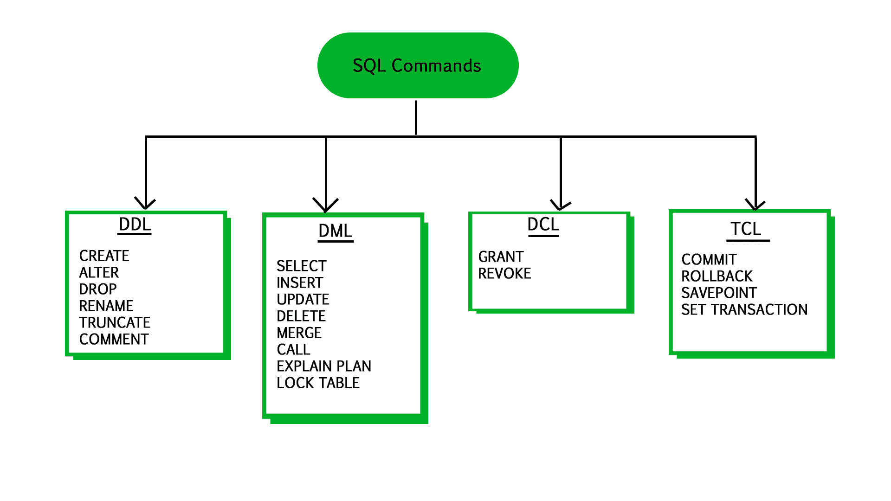

# SQL | DDL、DML、TCL、DCL

> 哎哎哎:# t0]https://www . geeksforgeeks . org/SQL-DDL-DML-TCL-DCL/

在本文中，我们将讨论数据定义语言、数据操作语言、事务控制语言和数据控制语言。


#### 数据定义语言:

数据定义语言用于定义数据库结构或模式。DDL 还用于指定数据的附加属性。数据库系统使用的存储结构和访问方法，由一组特殊类型的 DDL 语句组成，称为数据存储和定义语言。这些语句定义了数据库模式的实现细节，这些细节通常对用户是隐藏的。存储在数据库中的数据值必须满足某些一致性约束。
例如，假设大学要求某个部门的账户余额绝不能为负数。DDL 提供了指定这些约束的工具。每次更新数据库时，数据库系统都会检查这些约束。通常，约束可以是与数据库相关的任意谓词。然而，任意谓词对测试来说可能成本很高。因此，数据库系统实现了可以用最小开销测试的完整性约束。

1.  **域约束:**可能值的域必须与每个属性相关联(例如，整数类型、字符类型、日期/时间类型)。声明一个属性属于特定的域，作为它可以取值的约束。
2.  **参照完整性:**在某些情况下，我们希望确保一个值出现在给定属性集的一个关系中，也出现在另一个关系的某个属性集中，即参照完整性。例如，为每个课程列出的部门必须是实际存在的部门。
3.  **断言:**断言是数据库必须始终满足的任何条件。领域约束和完整性约束是断言的特殊形式。
4.  **授权:**我们可能希望区分用户，只要他们被允许访问数据库中的各种数据值。这些区别用授权来表示。最常见的是:
    *读取授权*——允许读取但不允许修改数据；
    *插入授权*–允许插入新数据，但不允许修改已有数据
    *更新授权*–允许修改，但不允许删除。

**一些命令:**

```
CREATE : to create objects in database
ALTER : alters the structure of database
DROP : delete objects from database
RENAME : rename an objects

```

以下语句定义了部门表:

```
create table department
(dept_name  char(20),
  building   char(15),
  budget     numeric(12,2));

```

执行上述 DDL 语句会创建具有三列的部门表——dept _ name、building 和 budget 每一个都有与之相关的特定数据类型。

#### 数据操作语言:

DML 语句用于管理模式对象中的数据。
DML 有两种类型–

1.  **程序性数据手册**:要求用户指定需要哪些数据以及如何获取这些数据。
2.  **Declerative DMLs** (also referred as **Non-procedural DMLs**) : require a user to specify what data are needed without specifying how to get those data.

    声明式 DML 通常比过程式 DML 更容易学习和使用。然而，由于用户不必指定如何获取数据，数据库系统必须找出访问数据的有效方法。

**一些命令:**

```
SELECT: retrieve data from the database
INSERT: insert data into a table
UPDATE: update existing data within a table
DELETE: deletes all records from a table, space for the records remain

```

查找历史系所有教师姓名的 SQL 查询示例:

```
select instructor.name
 from instructor
 where instructor.dept_name = 'History';

```

该查询指定必须检索表教师中 dept_name 为 History 的那些行，并且必须显示这些行的名称属性。

#### 事务控制语言:

事务控制语言命令用于管理数据库中的事务。这些用于管理 DML 语句所做的更改。它还允许将语句组合成逻辑事务。

TCL 命令示例–

```
COMMIT: Commit command is used to permanently save any transaction
            into the database.
ROLLBACK: This command restores the database to last committed state.
            It is also used with savepoint command to jump to a savepoint
            in a transaction.
SAVEPOINT: Savepoint command is used to temporarily save a transaction so
            that you can rollback to that point whenever necessary.
```

#### 数据控制语言:

数据控制语言是一种类似于计算机编程语言的语法，用于控制对存储在数据库中的数据的访问(授权)。特别是，它是结构化查询语言(SQL)的一个组件。

DCL 命令的示例:

```
GRANT: allow specified users to perform specified tasks.
REVOKE: cancel previously granted or denied permissions.
```

用户或角色可以被授予或撤销权限的操作适用于数据定义语言(DDL)和数据操作语言(DML)，并且可以包括连接、选择、插入、更新、删除、执行和使用。

在 Oracle 数据库中，执行 DCL 命令会发出隐式提交。因此，您不能回滚该命令。

参考文献:[卡卡博森](https://kakeboksen.td.org.uit.no/Database%20System%20Concepts%206th%20edition.pdf)