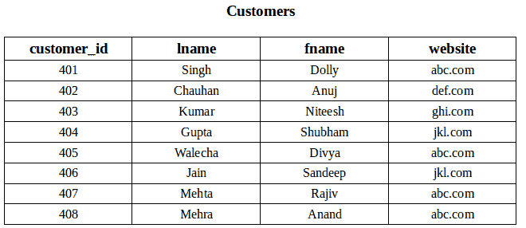
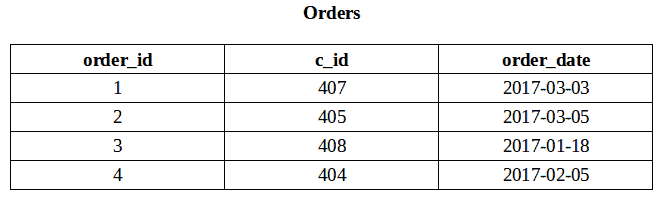
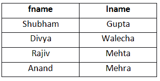
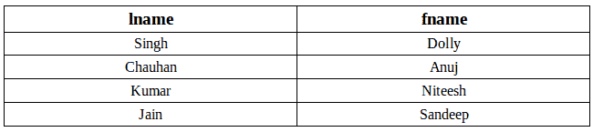
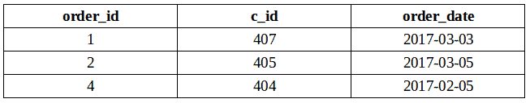
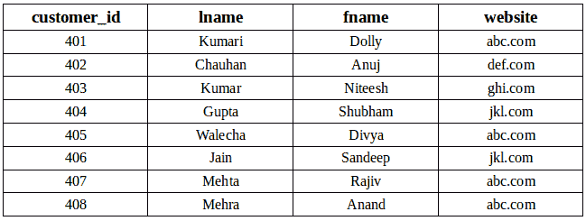

# SQL | EXISTS

> 原文:[https://www.geeksforgeeks.org/sql-exists/](https://www.geeksforgeeks.org/sql-exists/)

SQL 中的 EXISTS 条件用于检查相关嵌套查询的结果是否为空(不包含元组)。EXISTS 的结果是布尔值“真”或“假”。它可以用在 SELECT、UPDATE、INSERT 或 DELETE 语句中。

**语法:**

```
SELECT column_name(s) 
FROM table_name
WHERE EXISTS 
  (SELECT column_name(s) 
   FROM table_name
   WHERE condition);

```

示例:
考虑以下两种关系“客户”和“订单”。



**查询**

1.  **Using EXISTS condition with SELECT statement**
    To fetch the first and last name of the customers who placed atleast one order.

    ```
    SELECT fname, lname 
    FROM Customers 
    WHERE EXISTS (SELECT * 
                  FROM Orders 
                  WHERE Customers.customer_id = Orders.c_id);
    ```

    输出:
    

2.  **Using NOT with EXISTS**
    Fetch last and first name of the customers who has not placed any order.

    ```
    SELECT lname, fname
    FROM Customer
    WHERE NOT EXISTS (SELECT * 
                      FROM Orders 
                      WHERE Customers.customer_id = Orders.c_id);
    ```

    输出:
    

3.  **Using EXISTS condition with DELETE statement**
    Delete the record of all the customer from Order Table whose last name is ‘Mehra’.

    ```
    DELETE 
    FROM Orders
    WHERE EXISTS (SELECT *
                  FROM customers
                  WHERE Customers.customer_id = Orders.cid
                  AND Customers.lname = 'Mehra');
    ```

    ```
    SELECT * FROM Orders;
    ```

    Output:
    
4.  **Using EXISTS condition with UPDATE statement**
    Update the lname as ‘Kumari’ of customer in Customer Table whose customer_id is 401.

    ```
    UPDATE Customers
    SET lname = 'Kumari'
    WHERE EXISTS (SELECT *
                  FROM Customers
                  WHERE customer_id = 401);
    ```

    ```
    SELECT * FROM Customers;
    ```

    输出:
    

本文由 **[Anuj Chauhan](https://www.facebook.com/anuj0503)** 供稿。如果你喜欢 GeeksforGeeks 并想投稿，你也可以使用[contribute.geeksforgeeks.org](http://www.contribute.geeksforgeeks.org)写一篇文章或者把你的文章邮寄到 contribute@geeksforgeeks.org。看到你的文章出现在极客博客主页上，帮助其他极客。

如果你发现任何不正确的地方，或者你想分享更多关于上面讨论的话题的信息，请写评论。