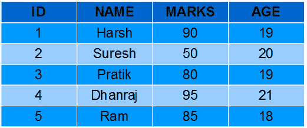

# SQL |函数(聚合和标量函数)

> 原文:[https://www . geesforgeks . org/SQL-functions-aggregate-scalar-functions/](https://www.geeksforgeeks.org/sql-functions-aggregate-scalar-functions/)

为了对数据进行操作，sql 有许多内置函数，它们被分为两类，并在每一类下进一步细分为不同的七个函数。这些类别是:

1.  **聚合函数:**
    这些函数用于对列的值进行运算，并返回单个值。
    1.  AVG()
    2.  COUNT()
    3.  第一次()
    4.  最后()
    5.  最大值()
    6.  最小()
    7.  SUM()
2.  **标量函数:**
    这些函数基于用户输入，这些也返回单个值。
    1.  UCASE()
    2.  LCASE()
    3.  MID()
    4.  LEN()
    5.  ROUND()
    6.  现在()
    7.  FORMAT()

学生-表
[](https://media.geeksforgeeks.org/wp-content/uploads/Screenshot-58.png)

**聚合函数**

*   **AVG()**: It returns average value after calculating from values in a numeric column.
    Syntax:

    ```
    SELECT AVG(column_name) FROM table_name;

    ```

    **查询:**

    1.  Computing average marks of students.

        ```
        SELECT AVG(MARKS) AS AvgMarks FROM Students; 

        ```

        输出:

        | **广告** |
        | Eighty |

    2.  Computing average age of students.

        ```
        SELECT AVG(AGE) AS AvgAge FROM Students; 

        ```

        输出:

        | 注意 |
        | Nineteen point four |

*   **COUNT(): **It is used to count the number of rows returned in a SELECT statement. It can’t be used in MS ACCESS.
    Syntax:

    ```
    SELECT COUNT(column_name) FROM table_name;

    ```

    查询:

    1.  Computing total number of students.

        ```
        SELECT COUNT(*) AS NumStudents FROM Stuents;

        ```

        输出:

        | 在学生中 |
        | five |

    2.  Computing number of students with unique/distinct age.

        ```
        SELECT COUNT(DISTINCT AGE) AS NumStudents FROM Students;

        ```

        输出:

        | 在学生中 |
        | four |

*   **FIRST(): **The FIRST() function returns the first value of the selected column.
    Syntax:

    ```
    SELECT FIRST(column_name) FROM table_name;

    ```

    查询:

    1.  Fetching marks of first student from the Students table.

        ```
        SELECT FIRST(MARKS) AS MarksFirst FROM Students;

        ```

        输出:

        | **标记第一个** |
        | Ninety |

    2.  Fetching age of first student from the Students table.

        ```
        SELECT FIRST(AGE) AS AgeFirst FROM Students;

        ```

        输出:

        | 年龄第一 |
        | Nineteen |

*   **LAST(): **The LAST() function returns the last value of the selected column. It can be used only in MS ACCESS.
    Syntax:

    ```
    SELECT LAST(column_name) FROM table_name;

    ```

    **查询:**

    1.  Fetching marks of last student from the Students table.

        ```
        SELECT LAST(MARKS) AS MarksLast FROM Students;

        ```

        输出:

        | **标记最后** |
        | Eighty-two |

    2.  Fetching age of last student from the Students table.

        ```
        SELECT LAST(AGE) AS AgeLast FROM Students;

        ```

        输出:

        | 年龄负荷 |
        | Eighteen |

*   **MAX():**MAX()函数返回所选列的最大值。
    语法:

```
SELECT MAX(column_name) FROM table_name;

```

**查询**:

1.  Fetching maximum marks among students from the Students table.

    ```
    SELECT MAX(MARKS) AS MaxMarks FROM Students;

    ```

    输出:

    | **最大标记** |
    | Ninety-five |

2.  Fetching max age among students from the Students table.

    ```
    SELECT MAX(AGE) AS MaxAge FROM Students;

    ```

    输出:

    | max age |
    | Twenty-one |

*   **MIN(): **The MIN() function returns the minimum value of the selected column.
    Syntax:

    ```
    SELECT MIN(column_name) FROM table_name;

    ```

    **查询:**

    1.  Fetching minimum marks among students from the Students table.

        ```
        SELECT MIN(MARKS) AS MinMarks FROM Students;

        ```

        输出:

        | **明马克** |
        | Fifty |

    2.  Fetching minimum age among students from the Students table.

        ```
        SELECT MIN(AGE) AS MinAge FROM Students;

        ```

        输出:

        | 地雷 |
        | Eighteen |

        *   **SUM(): **The SUM() function returns the sum of all the values of the selected column.
    Syntax:

    ```
    SELECT SUM(column_name) FROM table_name;

    ```

    **查询:**

    1.  Fetching summation of total marks among students from the Students table.

        ```
        SELECT SUM(MARKS) AS TotalMarks FROM Students;

        ```

        输出:

        | **总标记** |
        | four hundred |

    2.  Fetching summation of total age among students from the Students table.

        ```
        SELECT SUM(AGE) AS TotalAge FROM Students;

        ```

        输出:

        | 合计 |
        | Ninety-seven |

**标量函数**

*   **UCASE()**: It converts the value of a field to uppercase.
    Syntax:

    ```
    SELECT UCASE(column_name) FROM table_name;

    ```

    **查询:**

    1.  Converting names of students from the table Students to uppercase.

        ```
        SELECT UCASE(NAME) FROM Students;

        ```

        输出:

        | **名称** |
        | 严厉的 |
        | SURESH |
        | 我在练习 |
        | 达兰吉 |
        | 随机存取存储 |

*   **LCASE()**: It converts the value of a field to lowercase.
    Syntax:

    ```
    SELECT LCASE(column_name) FROM table_name;

    ```

    **查询:**

    1.  Converting names of students from the table Students to lowercase.

        ```
        SELECT LCASE(NAME) FROM Students;

        ```

        输出:

        | **名称** |
        | 严厉的 |
        | 苏雷什 |
        | 我在练习 |
        | 达兰吉 |
        | 公羊 |

*   **MID(): **The MID() function extracts texts from the text field.
    Syntax:

    ```
    SELECT MID(column_name,start,length) AS some_name FROM table_name;

    specifying length is optional here, and start signifies start position ( starting from 1 )

    ```

    **查询:**

    1.  Fetching first four characters of names of students from the Students table.

        ```
        SELECT MID(NAME,1,4) FROM Students; 

        ```

        输出:

        | **名称** |
        | 困难的 |
        | 当然 |
        | 傻瓜 |
        | DHAN |
        | 随机存取存储 |

*   **LEN(): **The LEN() function returns the length of the value in a text field.
    Syntax:

    ```
    SELECT LENGTH(column_name) FROM table_name;

    ```

    **查询:**

    1.  Fetching length of names of students from Students table.

        ```
        SELECT LENGTH(NAME) FROM Students;

        ```

        输出:

        | **名称** |
        | five |
        | six |
        | six |
        | seven |
        | three |

*   **ROUND(): **The ROUND() function is used to round a numeric field to the number of decimals specified.NOTE: Many database systems have adopted the IEEE 754 standard for arithmetic operations, which says that when any numeric .5 is rounded it results to the nearest even integer i.e, 5.5 and 6.5 both gets rounded off to 6.

    语法:

    ```
    SELECT ROUND(column_name,decimals) FROM table_name; 

    decimals- number of decimals to be fetched.

    ```

    **查询:**

    1.  Fetching maximum marks among students from the Students table.

        ```
        SELECT ROUND(MARKS,0) FROM table_name; 

        ```

        输出:

        | **标志** |
        | Ninety |
        | Fifty |
        | Eighty |
        | Ninety-five |
        | eighty-five |

*   **NOW(): **The NOW() function returns the current system date and time.
    Syntax:

    ```
    SELECT NOW() FROM table_name;

    ```

    **查询:**

    1.  Fetching current system time.

        ```
        SELECT NAME, NOW() AS DateTime FROM Students; 

        ```

        输出:

        | **名称** | **日期时间** |
        | 严厉的 | 2017 年 1 月 13 日下午 1:30:11 |
        | SURESH | 2017 年 1 月 13 日下午 1:30:11 |
        | 我在练习 | 2017 年 1 月 13 日下午 1:30:11 |
        | 达兰吉 | 2017 年 1 月 13 日下午 1:30:11 |
        | 随机存取存储 | 2017 年 1 月 13 日下午 1:30:11 |

*   **FORMAT(): **The FORMAT() function is used to format how a field is to be displayed.
    Syntax:

    ```
    SELECT FORMAT(column_name,format) FROM table_name; 

    ```

    **查询:**

    1.  Formatting current date as ‘YYYY-MM-DD’.

        ```
        SELECT NAME, FORMAT(Now(),'YYYY-MM-DD') AS Date FROM Students; 

        ```

        输出:

        | **名称** | **日期** |
        | 严厉的 | 2017-01-13 |
        | SURESH | 2017-01-13 |
        | 我在练习 | 2017-01-13 |
        | 达兰吉 | 2017-01-13 |
        | 随机存取存储 | 2017-01-13 |

本文由 **[Pratik Agarwal](https://www.facebook.com/Pratik.Agarwal01)** 供稿。如果你喜欢 GeeksforGeeks 并想投稿，你也可以使用[write.geeksforgeeks.org](https://write.geeksforgeeks.org)写一篇文章或者把你的文章邮寄到 review-team@geeksforgeeks.org。看到你的文章出现在极客博客主页上，帮助其他极客。

如果你发现任何不正确的地方，或者你想分享更多关于上面讨论的话题的信息，请写评论。