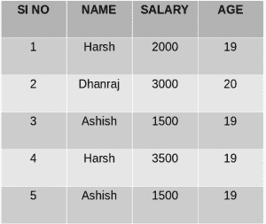
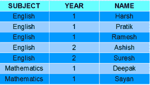
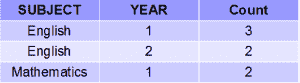

# SQL |分组依据

> 原文:[https://www.geeksforgeeks.org/sql-group-by/](https://www.geeksforgeeks.org/sql-group-by/)

SQL 中的 GROUP BY 语句用于在一些函数的帮助下将相同的数据排列成组。即，如果特定的列在不同的行中具有相同的值，那么它将把这些行排列成一组。

要点:

*   GROUP BY 子句与 SELECT 语句一起使用。
*   在查询中，GROUP BY 子句位于 WHERE 子句之后。
*   在查询中，GROUP BY 子句放在 ORDER BY 子句之前(如果使用的话)。

**语法**:

```
SELECT column1, function_name(column2)
FROM table_name
WHERE condition
GROUP BY column1, column2
ORDER BY column1, column2;

function_name: Name of the function used for example, SUM() , AVG().
table_name: Name of the table.
condition: Condition used.

```

样本表:

**员工**

[](https://media.geeksforgeeks.org/wp-content/uploads/table8.png)

**学生**

[](https://media.geeksforgeeks.org/wp-content/uploads/Screenshot-54.png) 
**例:**

*   **Group By single column**: Group By single column means, to place all the rows with same value of only that particular column in one group. Consider the query as shown below:

    ```
    SELECT NAME, SUM(SALARY) FROM Employee 
    GROUP BY NAME;

    ```

    上面的查询会产生下面的输出:
    [](https://media.geeksforgeeks.org/wp-content/uploads/table_out.png) 
    在上面的输出中可以看到，重名的行被分组在同一个 NAME 下，它们对应的 SALARY 就是重名行的 SALARY 之和。这里使用了 SQL 的 SUM()函数来计算总和。

*   **Group By multiple columns**: Group by multiple column is say for example, **GROUP BY column1, column2**. This means to place all the rows with same values of both the columns **column1** and **column2** in one group. Consider the below query:

    ```
    SELECT SUBJECT, YEAR, Count(*)
    FROM Student
    GROUP BY SUBJECT, YEAR;

    ```

    **输出** :
    [](https://media.geeksforgeeks.org/wp-content/uploads/Screenshot-55.png) 
    正如你在上面的输出中看到的，拥有相同主题和年份的学生被放在同一个组中。唯一主题相同但年份不同的人属于不同的群体。因此，这里我们根据两列或多列对表进行了分组。

**有条款**

我们知道 WHERE 子句用于在列上放置条件，但是如果我们想在组上放置条件呢？

这就是 HAVING 子句开始使用的地方。我们可以使用 HAVING 子句设置条件来决定哪个组将成为最终结果集的一部分。此外，我们不能使用像 SUM()，COUNT()等聚合函数。带 WHERE 子句。所以如果我们想在条件中使用这些函数，我们必须使用 HAVING 子句。

**语法**:

```
SELECT column1, function_name(column2)
FROM table_name
WHERE condition
GROUP BY column1, column2
HAVING condition
ORDER BY column1, column2;

function_name: Name of the function used for example, SUM() , AVG().
table_name: Name of the table.
condition: Condition used.

```

**例**:

```
SELECT NAME, SUM(SALARY) FROM Employee 
GROUP BY NAME
HAVING SUM(SALARY)>3000; 

```

**输出** :
[](https://media.geeksforgeeks.org/wp-content/uploads/Screenshot-56.png) 
正如您在上面的输出中所看到的，三个组中只有一个组出现在结果集中，因为它是唯一一个薪资总和大于 3000 的组。所以我们在这里使用了 HAVING 子句来放置这个条件，因为条件需要放在组中，而不是列中。

本文由 [**哈什·阿加瓦尔**](https://www.facebook.com/harsh.agarwal.16752) 供稿。如果你喜欢 GeeksforGeeks 并想投稿，你也可以使用[contribute.geeksforgeeks.org](http://www.contribute.geeksforgeeks.org)写一篇文章或者把你的文章邮寄到 contribute@geeksforgeeks.org。看到你的文章出现在极客博客主页上，帮助其他极客。

如果你发现任何不正确的地方，或者你想分享更多关于上面讨论的话题的信息，请写评论。