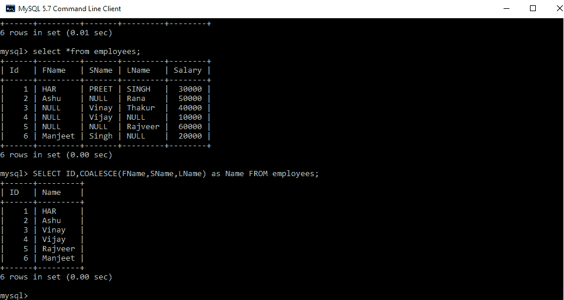
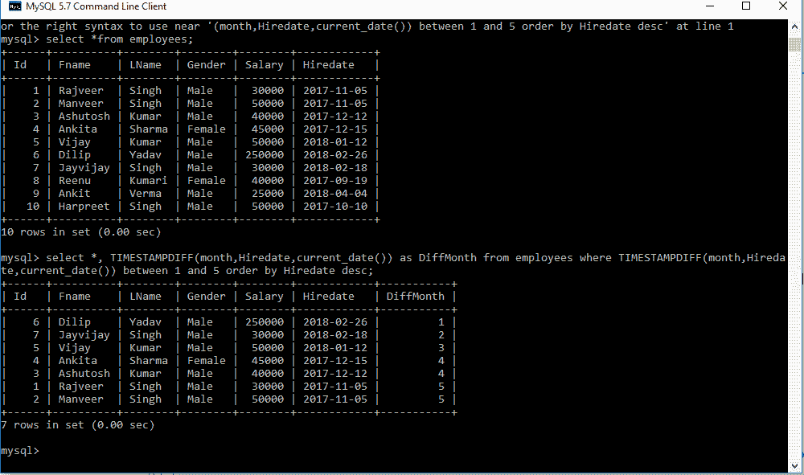
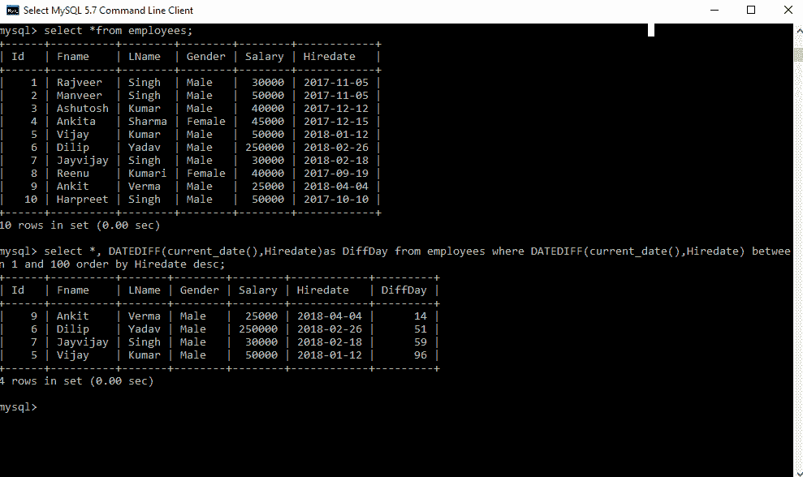
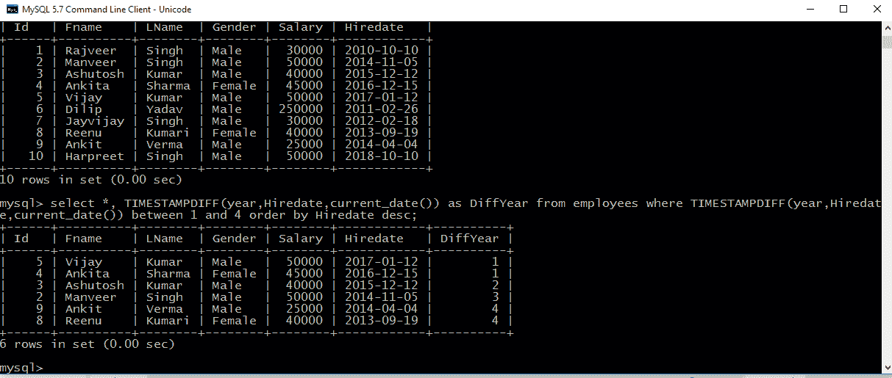

# SQL 面试问题|第二套

> 原文:[https://www . geesforgeks . org/SQL-面试-问题-集合-2/](https://www.geeksforgeeks.org/sql-interview-questions-set-2/)

1.  ****闭锁、闭锁和死锁的区别****
    *   **锁定:**当一个连接需要访问数据库中的一段数据时，就会发生锁定，并将其锁定以供特定使用，这样就没有其他事务能够访问它。
    *   **阻塞:**当一个事务试图获取另一个事务已经锁定的资源的不兼容锁时，就会发生阻塞。被阻止的事务保持被阻止，直到被阻止的事务释放锁。
    *   **死锁:**当两个或多个事务锁定了一个资源，并且每个事务都请求锁定另一个事务已经锁定的资源时，就会发生死锁。这里的两个事务都不能前进，因为每个事务都在等待另一个事务释放锁。
2.  ****Delete duplicate data from table so that only first data remains constant****

    **经理**

    | 身份 | 名字 | 薪水 |
    | one | 哈布雷 | Twenty thousand |
    | Two | 拉维河 | thirty thousand |
    | three | 维奈 | ten thousand |
    | four | 拉维河 | thirty thousand |
    | five | 哈布雷 | Twenty thousand |
    | six | 维奈 | ten thousand |
    | seven | 拉杰夫 | forty thousand |
    | eight | 维奈 | ten thousand |
    | nine | 拉维河 | thirty thousand |
    | Ten | 桑杰（男子名） | Fifty thousand |

    **查询:**

    ```
    DELETE M1 from managers M1, managers M2 where M2.Name=M1.Name AND M1.Id>M2.Id;

    ```

    **输出:**

    | 身份 | 名字 | 薪水 |
    | one | 哈布雷 | Twenty thousand |
    | Two | 拉维河 | thirty thousand |
    | three | 维奈 | ten thousand |
    | seven | 拉杰夫 | forty thousand | Ten | 桑杰（男子名） | Fifty thousand |

3.  **Find the Name of Employees where First Name, Second Name, and Last Name is given in the table. Some Name is missing such as First Name, Second Name and maybe Last Name. Here we will use [COALESCE()](https://www.geeksforgeeks.org/sql-general-functions-nvl-nvl2-decode-coalesce-nullif-lnnvl-nanvl/) function which will return first Non Null values.**

    ****员工****

    | 身份证明 | 姓氏 | 名称 | LName | 薪水 |
    | --- | --- | --- | --- | --- |
    | one | 海港咨询雷达 | 漂亮的 | 辛格 | thirty thousand |
    | Two | 阿苏 | 空 | 中国林蛙 | Fifty thousand |
    | three | 空 | 维奈 | 塔库尔 | forty thousand |
    | four | 空 | 维奈 | 空 | ten thousand |
    | five | 空 | 空 | 拉贾维尔 | Sixty thousand |
    | six | 曼吉耶 | 辛格 | 空 | Sixty thousand |

    ****查询:****

    ```
    SELECT ID, COALESCE(FName, SName, LName) as Name FROM employees;

    ```

    ****输出:****
    

4.  ****Find the Emloyees who were hired in the Last n months****
    Finding the Employees who have been hire in the last n months. Here we get desired output by using TIMESTAMPDIFF() mysql function
    ****Employees****

    | 身份证明 | 姓氏 | LName | 性别 | 薪水 | 你在说什么 |
    | --- | --- | --- | --- | --- | --- |
    | one | 拉贾维尔 | 辛格 | 男性的 | thirty thousand | 2017/11/05 |
    | Two | 曼维尔 | 辛格 | 男性的 | Fifty thousand | 2017/11/05 |
    | three | 阿舒特什 | 库马尔 | 男性的 | forty thousand | 2017/12/12 |
    | four | 安塔 | 夏尔马 | 女性的 | Forty-five thousand | 2017/12/15 |
    | five | 维杰 | 库马尔 | 男性的 | Fifty thousand | 2018/01/12 |
    | six | 迪利普 | 亚达夫 | 男性的 | Twenty-five thousand | 2018/02/26 |
    | seven | Jayvijay | 辛格 | 男性的 | thirty thousand | 2018/02/18 |
    | eight | 里努 | 活女神 | 女性的 | forty thousand | 2017/09/19 |
    | nine | 鸭子！鸭子 | 维尔马 | 男性的 | Twenty-five thousand | 2018/04/04 |
    | Ten | 哈布雷 | 辛格 | 男性的 | Fifty thousand | 2017/10/10 |

    ****查询:****

    ```
    Select *, TIMESTAMPDIFF(month, Hiredate, current_date()) as 
    DiffMonth from employees
    where TIMESTAMPDIFF(month, Hiredate, current_date()) between 
    1 and 5 order by Hiredate desc;

    ```

    **注意:**这里在查询 1 和 5 中是指示 1 到 n 个月，其显示过去 1 到 5 个月雇佣的员工。在这个查询中，DiffMonth 是我们理解的一个额外的列，它显示了第 n 个月。

    ****输出:****
    

5.  ****Find the Emloyees who hired in the Last n days****
    **Finding the Employees who have been hired in the last n days. Here we get desired output by using [DATEDIFF()](https://www.geeksforgeeks.org/sql-date-functions/) mysql function**

    ****员工****

    | 身份证明 | 姓氏 | LName | 性别 | 薪水 | 你在说什么 |
    | --- | --- | --- | --- | --- | --- |
    | one | 拉贾维尔 | 辛格 | 男性的 | thirty thousand | 2017/11/05 |
    | Two | 曼维尔 | 辛格 | 男性的 | Fifty thousand | 2017/11/05 |
    | three | 阿舒特什 | 库马尔 | 男性的 | forty thousand | 2017/12/12 |
    | four | 安塔 | 夏尔马 | 女性的 | Forty-five thousand | 2017/12/15 |
    | five | 维杰 | 库马尔 | 男性的 | Fifty thousand | 2018/01/12 |
    | six | 迪利普 | 亚达夫 | 男性的 | Twenty-five thousand | 2018/02/26 |
    | seven | Jayvijay | 辛格 | 男性的 | thirty thousand | 2018/02/18 |
    | eight | 里努 | 活女神 | 女性的 | forty thousand | 2017/09/19 |
    | nine | 鸭子！鸭子 | 维尔马 | 男性的 | Twenty-five thousand | 2018/04/04 |
    | Ten | 哈布雷 | 辛格 | 男性的 | Fifty thousand | 2017/10/10 |

    ****查询:****

    ```
    select *, DATEDIFF(current_date(), Hiredate)as 
    DiffDay from employees
    where DATEDIFF(current_date(), Hiredate) between
    1 and 100 order by Hiredate desc; 

    ```

    **注意:**这里在查询 1 和 100 中指示 1 到 n 天，其显示过去 1 到 100 天雇佣的员工。在这个查询中，DiffDay 是我们理解的一个额外的列，它显示了第 n 天。

    ****输出:****
    

6.  **Find the Employees who were hired in the Last n years**
    **Finding the Employees who have been hired in the last n years. Here we get desired output by using TIMESTAMPDIFF() MySQL function**

    ****员工****

    | 身份证明 | 姓氏 | LName | 性别 | 薪水 | 你在说什么 |
    | --- | --- | --- | --- | --- | --- |
    | one | 拉贾维尔 | 辛格 | 男性的 | thirty thousand | 2010/11/05 |
    | Two | 曼维尔 | 辛格 | 男性的 | Fifty thousand | 2017/11/05 |
    | three | 阿舒特什 | 库马尔 | 男性的 | forty thousand | 2015/12/12 |
    | four | 安塔 | 夏尔马 | 女性的 | Forty-five thousand | 2016/12/15 |
    | five | 维杰 | 库马尔 | 男性的 | Fifty thousand | 2017/01/12 |
    | six | 迪利普 | 亚达夫 | 男性的 | Twenty-five thousand | 2011/02/26 |
    | seven | Jayvijay | 辛格 | 男性的 | thirty thousand | 2012/02/18 |
    | eight | 里努 | 活女神 | 女性的 | forty thousand | 2013/09/19 |
    | nine | 鸭子！鸭子 | 维尔马 | 男性的 | Twenty-five thousand | 2017/04/04 |
    | Ten | 哈布雷 | 辛格 | 男性的 | Fifty thousand | 2017/10/10 |

    ****查询:****

    ```
    select *, TIMESTAMPDIFF(year, Hiredate, current_date()) as 
    DiffYear from employees
    where TIMESTAMPDIFF(year, Hiredate, current_date()) 
    between 1 and 4 order by Hiredate desc;

    ```

    **注意:**这里在查询 1 和 4 中是指示 1 到 n 年，其显示过去 1 到 4 年雇佣的员工。在这个查询中，DiffYear 是我们理解的一个额外的列，它显示了第 n 年。

    ****输出:****
    

7.  ****Select all names that start with a given letter****
    **Here we get desired output by using three different queries**

    ****员工****

    | 身份证明 | 姓氏 | LName | 性别 | 薪水 | 你在说什么 |
    | --- | --- | --- | --- | --- | --- |
    | one | 拉贾维尔 | 辛格 | 男性的 | thirty thousand | 2010/11/05 |
    | Two | 曼维尔 | 辛格 | 男性的 | Fifty thousand | 2017/11/05 |
    | three | 阿舒特什 | 库马尔 | 男性的 | forty thousand | 2015/12/12 |
    | four | 安塔 | 夏尔马 | 女性的 | Forty-five thousand | 2016/12/15 |
    | five | 维杰 | 库马尔 | 男性的 | Fifty thousand | 2017/01/12 |
    | six | 迪利普 | 亚达夫 | 男性的 | Twenty-five thousand | 2011/02/26 |
    | seven | Jayvijay | 辛格 | 男性的 | thirty thousand | 2012/02/18 |
    | eight | 里努 | 活女神 | 女性的 | forty thousand | 2013/09/19 |
    | nine | 鸭子！鸭子 | 维尔马 | 男性的 | Twenty-five thousand | 2017/04/04 |
    | Ten | 哈布雷 | 辛格 | 男性的 | Fifty thousand | 2017/10/10 |

    ****查询:****

    ```
    select *from employees where Fname like 'A%';

    select *from employees where left(FName, 1)='A';

    select *from employees where substring(FName, 1, 1)='A';

    ```

    **注意:**这里每个查询都会给出相同的输出，并且 FName 以字母 a 开头的员工列表

**相关文章:**

1.  [SQL 面试问题|第一套](https://www.geeksforgeeks.org/sql-interview-questions/)
2.  [常见数据库管理系统问题集 1](https://www.geeksforgeeks.org/commonly-asked-dbms-interview-questions/)
3.  [常见数据库管理系统问题集 2](https://www.geeksforgeeks.org/commonly-asked-dbms-interview-questions-set-2/)