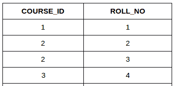
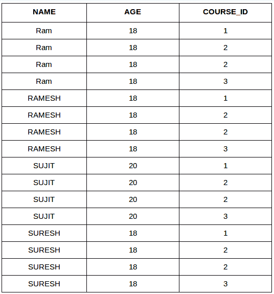
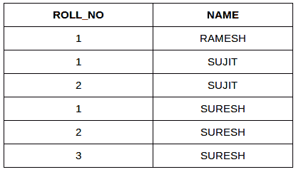

# SQL |连接(笛卡尔连接&自连接)

> 原文:[https://www . geesforgeks . org/SQL-join-cartesian-join-self-join/](https://www.geeksforgeeks.org/sql-join-cartesian-join-self-join/)

[SQL| JOIN(内部、左侧、右侧和完全联接)](https://www.geeksforgeeks.org/sql-join-set-1-inner-left-right-and-full-joins/)
在本文中，我们将讨论剩下的两个联接:

*   **笛卡尔连接**
*   **自加入**

考虑下面两张表:
[](https://media.geeksforgeeks.org/wp-content/cdn-uploads/table2.jpg)

**学生课程**

[](https://media.geeksforgeeks.org/wp-content/uploads/table51.png)

1.  **CARTESIAN JOIN**: The CARTESIAN JOIN is also known as CROSS JOIN. In a CARTESIAN JOIN there is a join for each row of one table to every row of another table. This usually happens when the matching column or WHERE condition is not specified.
    *   在没有 WHERE 条件的情况下，笛卡尔连接将表现得像笛卡尔乘积。即结果集中的行数是两个表的行数的乘积。
    *   在 WHERE 条件下，这个 JOIN 的功能类似于一个 INNER JOIN。
    *   一般来说，交叉连接类似于内部连接，其中连接条件的计算结果总是为真

    **语法:**

    ```
    SELECT table1.column1 , table1.column2, table2.column1...
    FROM table1
    CROSS JOIN table2;

    table1: First table.
    table2: Second table

    ```

**示例查询(笛卡尔连接):**

*   In the below query we will select NAME and Age from Student table and COURSE_ID from StudentCourse table. In the output you can see that each row of the table Student is joined with every row of the table StudentCourse. The total rows in the result-set = 4 * 4 = 16.

    ```
    SELECT Student.NAME, Student.AGE, StudentCourse.COURSE_ID
    FROM Student
    CROSS JOIN StudentCourse;

    ```

    **输出** :
    [](https://media.geeksforgeeks.org/wp-content/uploads/table_final.png)

2.  **SELF JOIN**: As the name signifies, in SELF JOIN a table is joined to itself. That is, each row of the table is joined with itself and all other rows depending on some conditions. In other words we can say that it is a join between two copies of the same table.**Syntax:**

    ```
    SELECT a.coulmn1 , b.column2
    FROM table_name a, table_name b
    WHERE some_condition;

    table_name: Name of the table.
    some_condition: Condition for selecting the rows.

    ```

    **示例查询(自连接):**

    ```
    SELECT a.ROLL_NO , b.NAME
    FROM Student a, Student b
    WHERE a.ROLL_NO < b.ROLL_NO;

    ```

    **输出:**
    [](https://media.geeksforgeeks.org/wp-content/uploads/tableeee1.png)

本文由 [**哈什·阿加尔瓦尔**](https://www.facebook.com/harsh.agarwal.16752) 供稿。如果你喜欢 GeeksforGeeks 并想投稿，你也可以使用[contribute.geeksforgeeks.org](http://www.contribute.geeksforgeeks.org)写一篇文章或者把你的文章邮寄到 contribute@geeksforgeeks.org。看到你的文章出现在极客博客主页上，帮助其他极客。

如果你发现任何不正确的地方，或者你想分享更多关于上面讨论的话题的信息，请写评论。