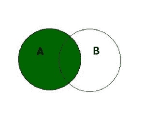

# SQL 左连接

> 原文:[https://www.geeksforgeeks.org/sql-left-join/](https://www.geeksforgeeks.org/sql-left-join/)

SQL 中的 LEFT JOIN 关键字返回所有**匹配的记录(或行)**和出现在**左表中但不在右表中的记录(或行)。**这意味着，如果某一行出现在左表中但不在右表中，结果将包括该行，但在右表的每一列中有一个空值。如果右表中的记录不在左表中，它将不会包含在结果中。



**左连接**

**左连接的语法是:**

```
SELECT column_name(s) 
FROM tableA 
LEFT JOIN tableB ON tableA.column_name = tableB.column_name;
```

**SQL 左连接示例:**

在本例中，我们将考虑两个表，雇员表包含在特定部门工作的雇员的详细信息，部门表包含部门的详细信息

**<u>员工表</u>**

<figure class="table">

| **emp_no** | **emp_name** | **年龄** | **工资** | **部门号** |
| E1 | 瓦隆·辛格 | Twenty-seven | Thirty thousand | D1 |
| E2 | 阿姆里塔·阿加尔瓦尔 | Twenty-eight | Twenty-five thousand | D2 |
| E3 | 哈罗阿南德 | Thirty | Thirty-four thousand | D1 |
| E4 | 妮汀健康 | Thirty-four | Fifty-four thousand | [空] |
| E5 | 麝香漱口 | Thirty-five | Sixty-five thousand | [空] |

**<u>司表</u>**T4】

| **部门号** | **部门名称** | **位置** |
| D1 | 信息技术 | 德里 |
| D2 | 人力资源（部） | 海得拉巴 |
| D3 | 金融 | 拉贾斯坦邦 |

为了对这两个表执行左连接，我们将使用以下 SQL 查询:

```
select emp_no ,emp_name , age, salary ,dept_name, location 
from employee 
left join department on employee.dept_no=department.dept_no;
```

我们将得到的输出如下:-

<figure class="table">

| **emp_no** | **emp_name** | **年龄** | **工资** | **部门名称** | **位置** |
| E1 | 瓦隆·辛格 | Twenty-seven | Thirty thousand | 信息技术 | 德里 |
| E3 | 哈罗阿南德 | Thirty | Thirty-four thousand | 信息技术 | 德里 |
| E2 | 阿姆里塔·辛格 | Twenty-eight | Twenty-five thousand | 人力资源（部） | 海得拉巴 |
| E4 | 妮汀健康 | Thirty-four | Fifty-four thousand | [空] | [空] |
| E5 | 麝香漱口 | Thirty-five | Sixty-five thousand | [空] | [空] |

因为左连接给出了匹配的行和出现在左表中但不在右表中的行。在本例中，我们看到不在特定部门工作的员工，即没有部门值为[空]的员工，在左连接后包含部门名称和位置的[空]值。

</figure>

</figure>