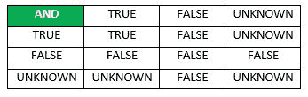
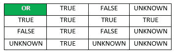
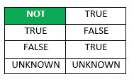
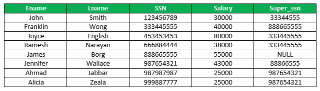
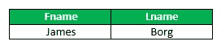

# SQL 空值

> 原文:[https://www.geeksforgeeks.org/sql-null-values/](https://www.geeksforgeeks.org/sql-null-values/)

在 SQL 中，表中可能有一些记录没有每个字段的值或数据。这是可能的，因为在数据输入时信息不可用。因此，SQL 支持一个称为空值的特殊值，用于表示可能未知或不适用于元组的属性值。在没有用户定义值的情况下，SQL 会在字段中放置一个空值。例如，地址的公寓号属性仅适用于公寓楼中的地址，而不适用于其他类型的住宅。

### **空值的重要性:**

*   理解空值不同于零值很重要。
*   空值用于表示缺失的值，但它通常有三种不同的解释之一:
    *   值未知(值存在但未知)
    *   值不可用(存在但被有意保留)
    *   属性不适用(对此元组未定义)
*   通常不可能确定哪个意思是有意的。因此，SQL 没有区分空值的不同含义。

### 空值原则:

*   当实际值未知或值没有意义时，设置空值是合适的。
*   如果数据类型是数字，空值不等于零值；如果数据类型是字符，空值不等于空格。
*   空值可以插入到任何数据类型的列中。
*   空值将在任何表达式中计算为空。
*   假设任何列都有空值，那么唯一、外键、检查约束将被 SQL 忽略。

通常，每个空值都被认为与数据库中的其他空值不同。当比较操作中涉及空值时，结果被认为是未知的。因此，SQL 使用三值逻辑，值为**真、假**和**未知。**因此，在使用逻辑连接词 AND、OR、NOT 时，有必要定义三值逻辑表达式的结果。

  

### 

**如何测试空值？**

SQL 允许检查属性值是否为空的查询。SQL 使用**为**，使用**为**，而不是使用=或将属性值与空值进行比较。这是因为 SQL 认为每个空值不同于其他空值，所以相等比较是不合适的。

现在，考虑下面的雇员表，



假设我们发现员工的名字没有超级用户名，那么查询将是:

**查询**

```
SELECT Fname, Lname FROM Employee WHERE Super_ssn IS NULL;
```

**输出:**



现在，如果我们找到拥有 Super_ssn 的员工数量的计数。

**查询:**

```
SELECT COUNT(*) AS Count FROM Employee WHERE Super_ssn IS NOT NULL;
```

**输出:**

