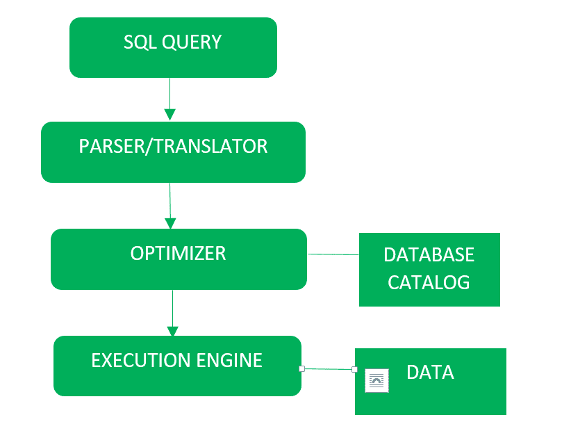
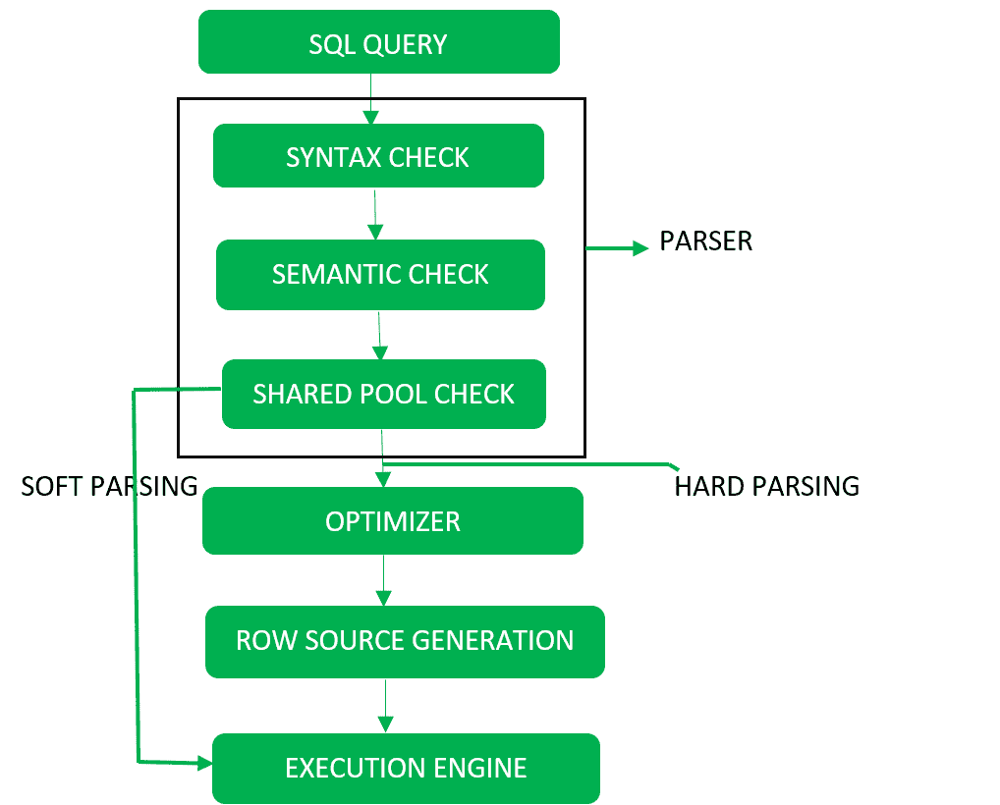

# SQL |查询处理

> 原文:[https://www.geeksforgeeks.org/sql-query-processing/](https://www.geeksforgeeks.org/sql-query-processing/)

**查询处理**包括将高层查询翻译成低层表达式，可用于文件系统的物理层、查询优化和查询的实际执行，以获得实际结果。

查询处理的框图如下:



详细示意图如下所示:



它通过以下步骤完成:

*   **Step-1:**
    **Parser:** During parse call, the database performs the following checks- Syntax check, Semantic check and Shared pool check, after converting the query into relational algebra.

    解析器执行以下检查(参考详细图表):

    1.  **Syntax check –** concludes SQL syntactic validity. Example:

        ```
        SELECT * FORM employee 
        ```

        这里的 FROM 的错误拼写是由这个检查给出的。

    2.  **语义检查–**判断语句是否有意义。示例:查询包含不存在的表名，该检查将检查该表名。
    3.  **共享池检查–**每个查询在执行过程中都有一个哈希代码。因此，该检查确定共享池中是否存在已编写的哈希代码。如果共享池中存在代码，则数据库不会采取额外的优化和执行步骤。

**硬解析和软解析–**
如果有一个新的查询，并且其哈希代码不存在于共享池中，则该查询必须通过称为硬解析的附加步骤，否则如果哈希代码存在，则查询不会通过附加步骤。它只是直接传递给执行引擎(参考详细的图表)。这就是所谓的软解析。
硬解析包括以下步骤——优化器和行源生成。

*   **Step-2:**
    **Optimizer:** During optimization stage, database must perform a hard parse atleast for one unique DML statement and perform optimization during this parse. This database never optimizes DDL unless it includes a DML component such as subquery that require optimization.

    这是一个过程，其中检查用于满足查询的多个查询执行计划，并且满足最有效的查询计划来执行。
    数据库目录存储执行计划，然后优化器传递最低成本的执行计划。

    **行源生成–**
    行源生成是一种软件，它从优化器接收最佳执行计划，并生成可供数据库其他部分使用的迭代执行计划。迭代计划是二进制程序，当由 sql 引擎执行时会产生结果集。

*   **步骤-3:**
    **执行引擎:**最终运行查询并显示所需结果。