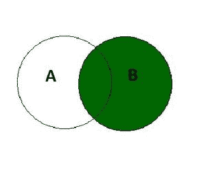

# SQL 右连接

> 原文:[https://www.geeksforgeeks.org/sql-right-join/](https://www.geeksforgeeks.org/sql-right-join/)

SQL 中的 RIGHT JOIN 关键字返回所有**匹配的记录(或行)**和**记录(或行)，它们出现在右表中但不在左表**中。这意味着，如果某一行出现在右表中但不在左表中，结果将包括该行，但在左表的每一列中有一个空值。如果左表中的记录不在右表中，它将不会包含在结果中。



**右连接**

右连接的语法是:-

```
SELECT column_name(s) 
FROM tableA 
RIGHT JOIN tableB ON tableA.column_name = tableB.column_name;
```

**SQL 右连接示例:**

在本例中，我们将考虑两个表格**员工**表格，包含在特定部门工作的员工的详细信息，以及**部门**表格，包含该部门的详细信息

**员工表:**

<figure class="table">

| **emp_no** | **emp_name** | **部门号** |
| E1 | 瓦隆·辛格 | D1 |
| E2 | 阿姆里塔·阿加尔瓦尔 | D2 |
| E3 | 哈罗阿南德 | D3 |

**部门表:**

<figure class="table">

| **部门号** | **d_name** | **位置** |
| D1 | 信息技术 | 德里 |
| D2 | 人力资源（部） | 海得拉巴 |
| D3 | 金融 | 浦那 |
| D4 | 测试 | 无聊死了 |
| D5 | 营销 | 马图拉 |

为了对这两个表执行右连接，我们将使用以下 SQL 查询:

```
select emp_no , emp_name ,d_name, location 
from employee 
right join dept on employee.dept_no = department.dept_no;
```

我们将得到的输出如下:

<figure class="table">

| emp_no | emp_name | d_name | 位置 |
| E1 | 瓦隆·辛格 | 信息技术 | 德里 |
| E2 | 阿姆里塔·阿加尔瓦尔 | 人力资源（部） | 海得拉巴 |
| E3 | 哈罗阿南德 | 金融 | 浦那 |
| [空] | [空] | 测试 | 无聊死了 |
| [空] | [空] | 营销 | 马图拉 |

因为右连接给出了匹配的行和出现在左表中但不在右表中的行。在本例中，我们看到，在执行正确的联接后，不包含任何员工的部门包含 emp_no 和 emp_name 的[空]值。

</figure>

</figure>

</figure>