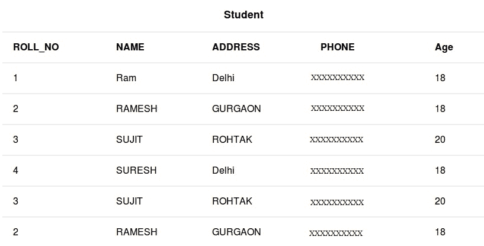

# SQL | SELECT TOP 子句

> 原文:[https://www.geeksforgeeks.org/sql-select-top-clause/](https://www.geeksforgeeks.org/sql-select-top-clause/)

SELECT TOP 子句用于从数据库中获取有限数量的行。这个子句在处理大型数据库时非常有用。

*   **基本语法:**

    ```
    SELECT TOP value column1,column2 FROM table_name;
    value: number of rows to return from top
    column1 , column2: fields in the table
    table_name: name of table

    ```

*   **语法使用百分比**

    ```
    SELECT TOP value PERCENT column1,column2 FROM table_name;
    value: percentage of number of rows to return from top
    column1 , column2: fields in the table
    table_name: name of table

    ```

[](https://media.geeksforgeeks.org/wp-content/cdn-uploads/table11.jpg)

**查询**

*   To fetch first two data set from Student table.

    ```
    SELECT TOP 2 * FROM Student; 

    ```

    输出:

    | **滚动 _ 否** | **名称** | **地址** | **PHONE** | **年龄** |
    | --- | --- | --- | --- | --- |
    | one | 随机存取存储器(random access memory 的缩写)ˌ随机访问内存(random-access memory 的缩写) | 德里 | XXXXXXXXXX | Eighteen |
    | Two | RAMESH | 古尔冈 | XXXXXXXXXX | Eighteen |

*   To fetch 50 percent of the total records from Student table.

    ```
    SELECT TOP 50 PERCENT * FROM Student; 

    ```

    输出:

    | **滚动 _ 否** | **名称** | **地址** | **PHONE** | **年龄** |
    | --- | --- | --- | --- | --- |
    | one | 随机存取存储器(random access memory 的缩写)ˌ随机访问内存(random-access memory 的缩写) | 德里 | XXXXXXXXXX | Eighteen |
    | Two | RAMESH | 古尔冈 | XXXXXXXXXX | Eighteen |
    | three | SUJIT | 罗塔克 | XXXXXXXXXX | Twenty |

**注意:**要在 MySQL 和 Oracle 数据库上获得相同的功能，基本语法有一点不同；

3.  对于 MySQL 数据库:

    ```
    SELECT column1,column2 FROM table_name LIMIT value;
    column1 , column2: fields int the table
    table_name: name of table
    value: number of rows to return from top

    ```

4.  For Oracle databases:

    ```
    SELECT column1,column2 FROM table_name WHERE ROWNUM <= value;
    column1 , column2: fields int the table
    table_name: name of table
    value: number of rows to return from top

    ```

    本文由 **[Pratik Agarwal](https://www.facebook.com/Pratik.Agarwal01)** 供稿。如果你喜欢 GeeksforGeeks 并想投稿，你也可以使用[contribute.geeksforgeeks.org](http://www.contribute.geeksforgeeks.org)写一篇文章或者把你的文章邮寄到 contribute@geeksforgeeks.org。看到你的文章出现在极客博客主页上，帮助其他极客。

    如果你发现任何不正确的地方，或者你想分享更多关于上面讨论的话题的信息，请写评论。