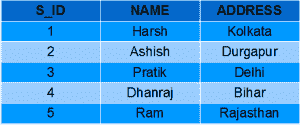
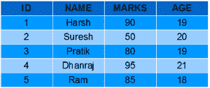
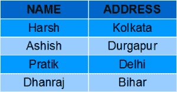
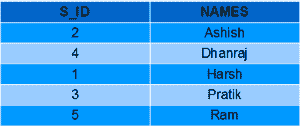
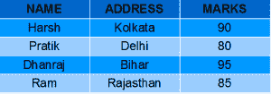
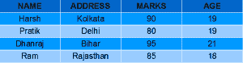
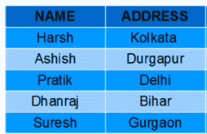

# SQL |视图

> 原文:[https://www.geeksforgeeks.org/sql-views/](https://www.geeksforgeeks.org/sql-views/)

SQL 中的视图是一种虚拟表。视图也有行和列，因为它们在数据库的真实表中。我们可以通过从数据库中的一个或多个表中选择字段来创建视图。视图可以包含表的所有行，也可以包含基于特定条件的特定行。

在本文中，我们将学习如何创建、删除和更新视图。
**样表**:

学生详细信息

[](https://media.geeksforgeeks.org/wp-content/uploads/Screenshot-57.png)

学生成绩

[](https://media.geeksforgeeks.org/wp-content/uploads/Screenshot-58.png)

**创建视图**

我们可以使用 **CREATE VIEW** 语句创建视图。可以从单个表或多个表创建视图。

**语法**:

```
CREATE VIEW view_name AS
SELECT column1, column2.....
FROM table_name
WHERE condition;

view_name: Name for the View
table_name: Name of the table
condition: Condition to select rows

```

**示例**:

*   **从单个表创建视图:**
    *   In this example we will create a View named DetailsView from the table StudentDetails.
        Query:

        ```
        CREATE VIEW DetailsView AS
        SELECT NAME, ADDRESS
        FROM StudentDetails
        WHERE S_ID < 5;

        ```

        要查看视图中的数据，我们可以像查询表一样查询视图。

        ```
        SELECT * FROM DetailsView;

        ```

        输出:
        [](https://media.geeksforgeeks.org/wp-content/uploads/Screenshot-571.png)

    *   In this example, we will create a view named StudentNames from the table StudentDetails.
        Query:

        ```
        CREATE VIEW StudentNames AS
        SELECT S_ID, NAME
        FROM StudentDetails
        ORDER BY NAME;

        ```

        如果我们现在将视图查询为，

        ```
        SELECT * FROM StudentNames;

        ```

        输出:
        [](https://media.geeksforgeeks.org/wp-content/uploads/Screenshot-64.png)

*   **Creating View from multiple tables**: In this example we will create a View named MarksView from two tables StudentDetails and StudentMarks. To create a View from multiple tables we can simply include multiple tables in the SELECT statement. Query:

    ```
    CREATE VIEW MarksView AS
    SELECT StudentDetails.NAME, StudentDetails.ADDRESS, StudentMarks.MARKS
    FROM StudentDetails, StudentMarks
    WHERE StudentDetails.NAME = StudentMarks.NAME;

    ```

    要显示视图标记视图的数据:

    ```
    SELECT * FROM MarksView;

    ```

    输出:
    [](https://media.geeksforgeeks.org/wp-content/uploads/Screenshot-591.png)

**删除视图**

我们已经了解了如何创建视图，但是如果不再需要已创建的视图怎么办？显然我们会想要删除它。SQL 允许我们删除现有的视图。我们可以使用 drop 语句删除视图。

**语法**:

```
DROP VIEW view_name;

view_name: Name of the View which we want to delete.

```

例如，如果我们想删除视图**标记视图**，我们可以这样做:

```
DROP VIEW MarksView;

```

**更新视图**

更新视图需要满足某些条件。如果这些条件中的任何一个是**而不是**，那么我们将不被允许更新视图。

1.  用于创建视图的 SELECT 语句不应包含 GROUP BY 子句或 ORDER BY 子句。
2.  SELECT 语句不应该有 DISTINCT 关键字。
3.  视图应该具有所有非空值。
4.  不应使用嵌套查询或复杂查询创建视图。
5.  应该从单个表创建视图。如果视图是使用多个表创建的，那么我们将不被允许更新视图。

*   我们可以使用 **CREATE 或 REPLACE VIEW** 语句在视图中添加或删除字段。
    **句法**:

```
CREATE OR REPLACE VIEW view_name AS
SELECT column1,coulmn2,..
FROM table_name
WHERE condition;

```

例如，如果我们想更新视图**标记视图**并将字段年龄从**学生标记**表添加到该视图中，我们可以这样做:

```
CREATE OR REPLACE VIEW MarksView AS
SELECT StudentDetails.NAME, StudentDetails.ADDRESS, StudentMarks.MARKS, StudentMarks.AGE
FROM StudentDetails, StudentMarks
WHERE StudentDetails.NAME = StudentMarks.NAME;

```

如果我们现在从 MarksView 获取所有数据，如下所示:

```
SELECT * FROM MarksView;

```

输出:
[](https://media.geeksforgeeks.org/wp-content/uploads/Screenshot-60.png)

*   **Inserting a row in a view**:
    We can insert a row in a View in a same way as we do in a table. We can use the INSERT INTO statement of SQL to insert a row in a View.**Syntax**:

    ```
    INSERT INTO view_name(column1, column2 , column3,..) 
    VALUES(value1, value2, value3..);

    view_name: Name of the View

    ```

    **示例** :
    在下面的示例中，我们将在视图详细信息视图中插入一个新行，该视图是我们在上面的“从单个表创建视图”示例中创建的。

    ```
    INSERT INTO DetailsView(NAME, ADDRESS)
    VALUES("Suresh","Gurgaon");

    ```

    如果我们现在从 DetailsView 中获取所有数据，

    ```
    SELECT * FROM DetailsView;

    ```

    输出:
    [](https://media.geeksforgeeks.org/wp-content/uploads/Screenshot-62.png)

    *   **Deleting a row from a View**:
    Deleting rows from a view is also as simple as deleting rows from a table. We can use the DELETE statement of SQL to delete rows from a view. Also deleting a row from a view first delete the row from the actual table and the change is then reflected in the view.**Syntax**:

    ```
    DELETE FROM view_name
    WHERE condition;

    view_name:Name of view from where we want to delete rows
    condition: Condition to select rows 

    ```

    **示例** :
    在本例中，我们将从视图 DetailsView 中删除最后一行，该视图是我们在上面插入行的示例中刚刚添加的。

    ```
    DELETE FROM DetailsView
    WHERE NAME="Suresh";

    ```

    如果我们现在从 DetailsView 中获取所有数据，

    ```
    SELECT * FROM DetailsView;

    ```

    输出:
    [](https://media.geeksforgeeks.org/wp-content/uploads/Screenshot-571.png)

    **带检查选项**

    SQL 中的 WITH CHECK OPTION 子句对于视图来说是一个非常有用的子句。它适用于可更新的视图。如果视图不可更新，那么在 CREATE VIEW 语句中包含这个子句就没有任何意义。

    *   WITH CHECK OPTION 子句用于防止在视图中插入不满足 CREATE VIEW 语句中 where 子句条件的行。
    *   如果我们在 CREATE VIEW 语句中使用了 WITH CHECK OPTION 子句，并且如果 UPDATE 或 INSERT 子句不满足条件，那么它们将返回一个错误。

    **示例** :
    在下面的示例中，我们使用带有检查选项子句的学生详细信息表创建了一个视图样本视图。

    ```
    CREATE VIEW SampleView AS
    SELECT S_ID, NAME
    FROM  StudentDetails
    WHERE NAME IS NOT NULL
    WITH CHECK OPTION;

    ```

    在此视图中，如果我们现在尝试在“名称”列中插入一个空值的新行，那么它将给出一个错误，因为该视图是在“名称”列的条件为“非空”的情况下创建的。
    例如，虽然视图是可更新的，但是下面对该视图的查询也是无效的:

    ```
    INSERT INTO SampleView(S_ID)
    VALUES(6);

    ```

    **注**:NAME 列默认值为*空*。

    **视图的用途:**
    由于给定的原因，一个好的数据库应该包含视图:

    1.  **限制数据访问–**
        视图通过限制对表的一组预定行和列的访问，提供了额外的表安全级别。
    2.  **隐藏数据复杂性–**
        视图可以隐藏多表连接中存在的复杂性。
    3.  **为用户简化命令–**
        视图允许用户从多个表中选择信息，而不需要用户实际知道如何执行连接。
    4.  **存储复杂查询–**
        视图可用于存储复杂查询。
    5.  **重命名列–**
        视图也可以用于重命名列，而不会影响基表，前提是视图中的列数必须与 select 语句中指定的列数相匹配。因此，重命名有助于隐藏基表的列名。
    6.  **多视图工具–**
        可以为不同的用户在同一张表上创建不同的视图。

    本文由 [**哈什·阿加瓦尔**](https://www.facebook.com/harsh.agarwal.16752) 供稿。如果你喜欢 GeeksforGeeks 并想投稿，你也可以使用[contribute.geeksforgeeks.org](http://www.contribute.geeksforgeeks.org)写一篇文章或者把你的文章邮寄到 contribute@geeksforgeeks.org。看到你的文章出现在极客博客主页上，帮助其他极客。

    如果你发现任何不正确的地方，或者你想分享更多关于上面讨论的话题的信息，请写评论。