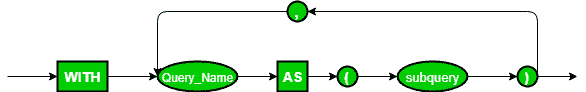

# SQL | WITH 子句

> 原文:[https://www.geeksforgeeks.org/sql-with-clause/](https://www.geeksforgeeks.org/sql-with-clause/)

SQL WITH 子句是由 Oracle 在 Oracle 9i 版本 2 数据库中引入的。SQL WITH 子句允许您给子查询块一个名称(这个过程也称为子查询重构)，它可以在主 SQL 查询的几个地方被引用。

*   子句用于定义临时关系，以便此临时关系的输出可用，并由与 with 子句关联的查询使用。
*   具有关联的 WITH 子句的查询也可以使用嵌套子查询编写，但是这样做会增加读取/调试 SQL 查询的复杂性。
*   不是所有数据库系统都支持 WITH 子句。
*   分配给子查询的名称被视为内联视图或表
*   SQL WITH 子句是由 Oracle 在 Oracle 9i 版本 2 数据库中引入的。

**语法:**

```
WITH temporaryTable (averageValue) as
    (SELECT avg(Attr1)
    FROM Table)
    SELECT Attr1
    FROM Table, temporaryTable
    WHERE Table.Attr1 > temporaryTable.averageValue;

```



在这个查询中，WITH 子句用于定义一个只有 1 个属性 averageValue 的临时关系 temporaryTable。averageValue 保存关系表中描述的列属性 1 的平均值。WITH 子句后面的 SELECT 语句将只生成那些关系表中属性 1 的值大于从 WITH 子句语句获得的平均值的元组。

**注意:**执行带有 with 子句的查询时，首先对子句中提到的查询进行求值，并将该求值的输出存储在临时关系中。接下来，最终执行与 with 子句相关联的主查询，该查询将使用生成的临时关系。

**查询**

**例 1:** 找出所有工资高于所有员工平均工资的员工。
关系名称:**员工**

<figure class="table">

| 员工 ID | 名字 | 薪水 |
| One hundred thousand and eleven | 史密斯（姓氏） | Fifty thousand |
| One hundred thousand and twenty-two | 账单 | Ninety-four thousand |
| One hundred thousand and twenty-seven | 萨姆（男子名） | Seventy thousand five hundred and fifty |
| One hundred thousand eight hundred and forty-five | 瓦尔登湖 | Eighty thousand |
| One hundred and fifteen thousand five hundred and eighty-five | 埃里克 | Sixty thousand |
| One million one hundred thousand and seventy | 凯特 | Sixty-nine thousand |

**SQL 查询:**

```
WITH temporaryTable(averageValue) as
    (SELECT avg(Salary)
    from Employee)
        SELECT EmployeeID,Name, Salary 
        FROM Employee, temporaryTable 
        WHERE Employee.Salary > temporaryTable.averageValue;
```

**<u>输出</u> :**

<figure class="table">

| 员工 ID | 名字 | 薪水 |
| One hundred thousand and twenty-two | 账单 | Ninety-four thousand |
| One hundred thousand eight hundred and forty-five | 瓦尔登湖 | Eighty thousand |

**说明:**全体员工平均工资 70591。因此，所有工资高于所得平均值的员工都存在产出关系。

**例 2:** 查找所有该航空公司所有飞行员总薪资高于数据库中所有飞行员总薪资平均值的航空公司。

关系名称:**飞行员**T2

<figure class="table">

| 员工 ID | 航空公司 | 名字 | 薪水 |
| Seventy thousand and seven | 空客 380 | 金姆（人名） | Sixty thousand |
| Seventy thousand and two | 波音 | 劳拉 | Twenty thousand |
| Ten thousand and twenty-seven | 空客 380 | 威尔(男子名) | Eighty thousand and fifty |
| Ten thousand seven hundred and seventy-eight | 空客 380 | 沃伦 | Eighty thousand seven hundred and eighty |
| One hundred and fifteen thousand five hundred and eighty-five | 波音 | 史密斯（姓氏） | Twenty-five thousand |
| One hundred and fourteen thousand and seventy | 空客 380 | 凯蒂 | Seventy-eight thousand |

**SQL 查询:**

```
WITH totalSalary(Airline, total) as
    (SELECT Airline, sum(Salary)
    FROM Pilot
    GROUP BY Airline),
    airlineAverage(avgSalary) as 
    (SELECT avg(Salary)
    FROM Pilot )
    SELECT Airline
    FROM totalSalary, airlineAverage
    WHERE totalSalary.total > airlineAverage.avgSalary;
```

**<u>输出</u> :**

<figure class="table">

| 航空公司 |
| 空客 380 |

**说明:**空客 380 全体飞行员工资总额= 298830，波音飞行员工资总额= 45000。表中所有飞行员的平均工资 Pilot = 57305。由于只有空客 380 所有飞行员的总工资大于获得的平均工资，所以空客 380 在于产出关系。

**要点:**

*   当与复杂的 SQL 语句而不是简单的语句一起使用时，SQL WITH 子句是很好的
*   它还允许您将复杂的 SQL 查询分解成更小的查询，这使得调试和处理复杂的查询变得容易。
*   SQL WITH 子句基本上是普通子查询的替代。

本文由 **Mayank Kumar** 供稿。如果你喜欢 GeeksforGeeks 并想投稿，你也可以使用[write.geeksforgeeks.org](https://write.geeksforgeeks.org)写一篇文章或者把你的文章邮寄到 review-team@geeksforgeeks.org。看到你的文章出现在极客博客主页上，帮助其他极客。

如果你发现任何不正确的地方，或者你想分享更多关于上面讨论的话题的信息，请写评论。

</figure>

</figure>

</figure>

</figure>