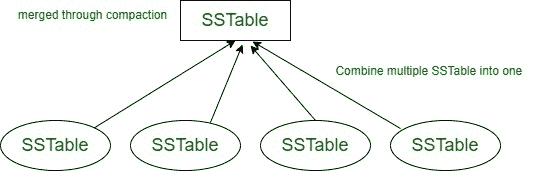

# 阿帕奇卡珊德拉的表

> 原文:[https://www.geeksforgeeks.org/sstable-in-apache-cassandra/](https://www.geeksforgeeks.org/sstable-in-apache-cassandra/)

在本文中，我们将讨论 SSTable，它是 [Cassandra](https://www.geeksforgeeks.org/apache-cassandra-nosql-database/) 和 SSTable 组件中的存储引擎之一，我们还将讨论 SSTable 中不同数据库文件中保存的信息类型。我们一个一个来讨论。

**表:**
它是 Apache Cassandra 中的存储引擎之一，即用于行存储的不可变数据文件的存储。在 Cassandra 中，用于将数据保存在磁盘上的表。

**Figure –** SSTable in Apache Cassandra

**要点:**

*   在 Apache Cassandra 中，您将检查数据是如何存储的，然后将表和表中的数据从内存表刷新到磁盘，或者从其他节点流式传输。
*   在 Cassandra 中，插入数据时，每次写入时都会包含时间戳。
*   在 Cassandra 中，压缩是一个概念，它将多个表组合成一个大的表，一旦新的表被写入，旧的表就可以被删除。
    只保留最新的时间戳。

**SSTable 的组件:**
在 Cassandra 中，SSTable 有多个组件，存储在多个文件中，如下所示。

*   **Data.db–**
    在 SSTable 中，data . db 存储实际数据，即行的内容。
*   **index . db–**
    它是 SSTable 的组成部分，其中索引从分区键到 Data.db 文件中的位置。它还可以包括分区内行的索引。
*   **Summary.db–**
    在 Cassandra 中，SSTable 组件 summary . db 对 Index.db 文件中的每 128 个条目进行采样(默认情况下)。
*   **Filter . db–**
    在 SSTable 中，它是分区键的 Bloom Filter。
*   **压缩信息数据库–**
    在表中，它是保存偏移元数据的组件。压缩信息数据库保存了数据数据库文件中压缩块的长度。
*   **statistics . db–**
    它是 SSTable 中保存数据统计的重要组件之一。在 Cassandra 中，它是一个表组件，存储关于表的元数据，包括时间戳、墓碑、群集密钥、压缩、修复、压缩、生存时间(TTL)值等信息。
*   **digest . crc32–**
    在 Cassandra 中，这个 SSTable 组件有一个 Data.db 文件的 CRC-32 摘要。
*   **TOC . txt–**
    在 Cassandra 中，这个 SSTable 组件有一个 SSTable 组件文件的纯文本列表。在表中，在 Data.db 文件中，行是按分区组织的。这些分区以令牌顺序存储，这样当 Mur 3 分区选择行时，通过分区键的散列，这些行以它们的聚类键的顺序存储。

**注意–**
在 [Apache Cassandra](https://www.geeksforgeeks.org/introduction-to-apache-cassandra/) 中，可以选择使用基于块的压缩来压缩表。