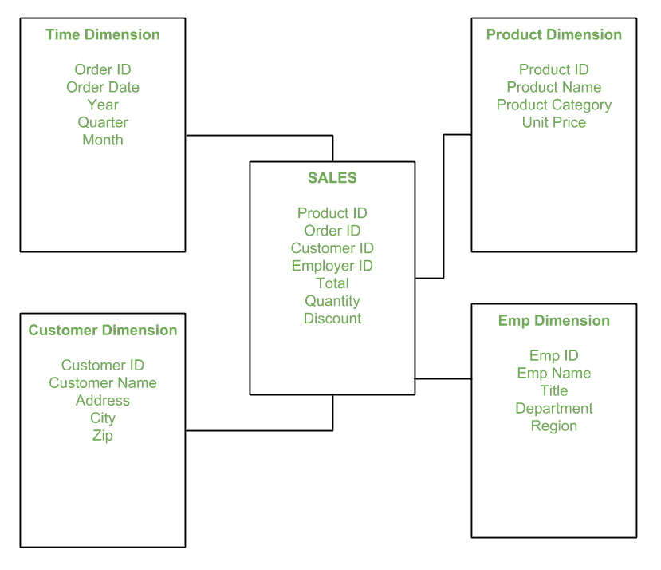

# 数据仓库建模中的星型模式

> 原文:[https://www . geesforgeks . org/star-schema-in-data warehouse-modeling/](https://www.geeksforgeeks.org/star-schema-in-data-warehouse-modeling/)

先决条件–[大数据介绍](https://www.geeksforgeeks.org/the-big-data-world-big-bigger-and-biggest/)、[大数据的好处](https://www.geeksforgeeks.org/benefits-big-data/)、
T5】星型模式是数据集市模式中的基础模式，也是最简单的。该模式被广泛用于开发或构建数据仓库和维度数据集市。它包括一个或多个索引任意数量维度表的事实表。星型模式是雪花模式的必然原因。它对于处理基本查询也很有效。

它被称为恒星，因为它的物理模型类似于恒星形状，在它的中心有一个事实表，在它的外围有维度表，代表恒星的点。下面是一个演示星型模式的示例:

在上面的演示中，SALES 是一个事实表，它具有引用维度表的属性(即产品标识、订单标识、客户标识、雇主标识、合计、数量、折扣)。**员工维度表**包含属性:员工标识、员工姓名、职称、部门和地区。*产品维度表*包含属性:产品标识、产品名称、产品类别、单价。*客户维度表*包含属性:客户标识、客户名称、地址、城市、邮编。*时间维度表*包含的属性有:订单 ID、订单日期、年份、季度、月份。

**星型模式的模型:**
在星型模式中，保存业务量化数据的业务流程数据分布在事实表和维度中，这些维度是与事实数据相关的描述性特征。销售价格、销售数量、距离、速度、重量和重量度量是星型模式中的几个事实数据示例。
通常，具有多个维度的星形模式被称为蜈蚣模式。很容易处理属性维数很少的星型模式。

**星型模式的优势:**

1.  **更简单的查询–**
    星型模式的连接逻辑与从高度规范化的事务模式中获取数据所需的其他连接逻辑相比，非常容易。
2.  **简化的业务报告逻辑–**
    与高度规范化的事务模式相比，星型模式简化了常见的业务报告逻辑，例如期初报告和跨期报告。
3.  **喂养立方体–**
    星型模式被所有 OLAP 系统广泛用于高效设计 OLAP 立方体。事实上，主要的 OLAP 系统提供了一种 r OLAP 操作模式，它可以使用星型模式作为源，而无需设计立方体结构。

**星型模式的缺点–**

1.  数据完整性没有得到很好的执行，因为在高度非规范化的模式状态下。
2.  如果分析需要作为规范化的数据模型，则不灵活。
3.  星型模式不会加强业务实体内部的多对多关系——至少不会经常如此。