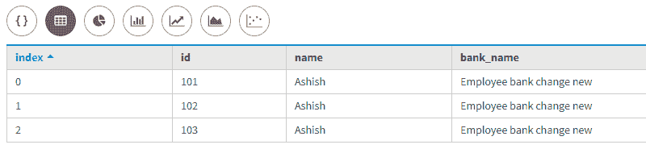
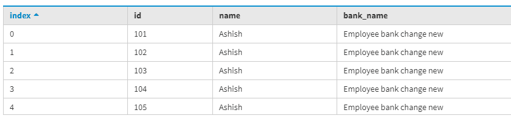

# 卡珊德拉中的静态类型

> 原文:[https://www.geeksforgeeks.org/static-type-in-cassandra/](https://www.geeksforgeeks.org/static-type-in-cassandra/)

在本文中，我们将讨论一个静态列，在其中我们将能够理解静态列是如何有用的，以及它的实际作用是什么。让我们看看。

**静态列:**
在[卡珊德拉查询语言(CQL)](https://www.geeksforgeeks.org/additional-functions-in-cql-cassandra-query-language/) 中，它是一个特殊的列，由一个分区的所有行共享。当我们想要共享具有单个值的列时，静态列非常有用。
在 Cassandra 查询语言中，静态列仅在给定分区内是静态的。静态列使用聚集列和非聚集列来声明表定义中的静态列。

让我们用一个例子来理解。
现在，首先，我们要定义表中的静态列。

```
create table bank_emp_record
(
Name text,
bank_name text static,
Id int,
primary key(Name, Id)
); 
```

现在，我们将向 bank_emp_record 表中插入数据。

```
Insert into bank_emp_record(Name, bank_name, Id) 
values('Ashish', 'Employee bank', 101);

Insert into bank_emp_record(Name, bank_name, Id) 
values('Ashish', 'Employee bank change', 102);

Insert into bank_emp_record(Name, bank_name, Id) 
values('Ashish', 'Employee bank change new', 103); 
```

**输出:**



在这里，Employee bank change new 将最后更新和共享的列值设置为相同的静态列。

现在，让我们考虑一下，如果我没有为 bank_name 插入任何值，那么默认情况下，它将共享相同的值。让我们来看看。

```
BEGIN BATCH
Insert into bank_emp_record(Name, Id) 
values('Ashish', 104);

Insert into bank_emp_record(Name, Id) 
values('Ashish', 105);
APPLY BATCH; 
```

在上面给出的 CQL 查询中，我们使用 BATCH 语句在表中插入更多的行。现在，让我们看看表的最终输出。

```
select * 
from bank_emp_record; 
```

**输出:**



要了解限制，请点击下面的链接，了解我们创建静态列时的限制类型以及如何正确使用[参考:数据税](https://docs.datastax.com/en/dse/5.1/cql/cql/cql_using/refStaticCol.html)