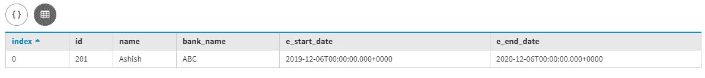
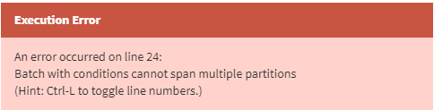
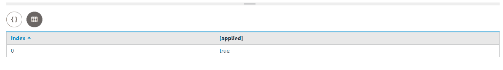
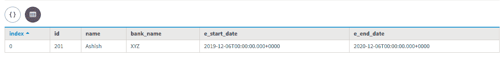

# 卡珊德拉使用批次的静态类型

> 原文:[https://www . geesforgeks . org/static-type-use-batch-in-Cassandra/](https://www.geeksforgeeks.org/static-type-using-batch-in-cassandra/)

先决条件–[卡珊德拉](https://www.geeksforgeeks.org/introduction-to-apache-cassandra/)
在本文中，我们将讨论使用 BATCH 语句的静态列，以及它如何与 BATCH 语句一起工作。静态列可用于使用批处理语句的条件更新。让我们看看。

让我们考虑 bank_emp_details 是表名，Id、name、Bank_name、E_start_date 和 E_end_date 是字段，其中 Id 是主键，Name 是聚类键。

```
CREATE TABLE bank_emp_details(
Id int,
Name text,
Bank_name text static,
E_start_date date static,
E_end_date date,
primary key(Id, Name)
); 
```

现在，我们使用批处理语句来更新静态列。让我们来看看。

```
BEGIN BATCH 
INSERT INTO bank_emp_details(Id, Name, E_start_date, E_end_date) 
values (201, 'Ashish', '2019-12-06', '2020-12-06');

UPDATE bank_emp_details SET Bank_name = 'ABC'  
where Id = 201 IF Bank_name = NULL;
APPLY BATCH; 
```

让我们看看插入的数据和更新的静态列的输出。

```
SELECT * 
from bank_emp_details; 
```

**输出:**



现在，我们试图用条件批处理更新静态列，但它会给出一条错误消息“带条件批处理不能跨多个分区”。让我们来看看。

```
BEGIN BATCH 
INSERT INTO bank_emp_details(Id, Name, E_start_date, E_end_date) 
values (202, 'Ashish', '2019-12-06', '2022-12-06');

UPDATE bank_emp_details SET Bank_name = 'XYZ' 
where Id = 201 IF Bank_name = 'ABC';
APPLY BATCH; 
```

上面的查询将返回下面给出的错误消息。

**输出:**



现在，这里我们将使用条件批处理来更新静态列值，这将很好地工作。让我们来看看。

```
BEGIN BATCH 
UPDATE bank_emp_details SET Bank_name = 'XYZ' 
where Id = 201 IF Bank_name = 'ABC';
APPLY BATCH; 
```

上面的查询将返回下面给出的输出。

**输出:**



让我们看看使用静态列的条件批处理的最终输出。让我们看看。

```
SELECT * 
from bank_emp_details; 
```

**输出:**

