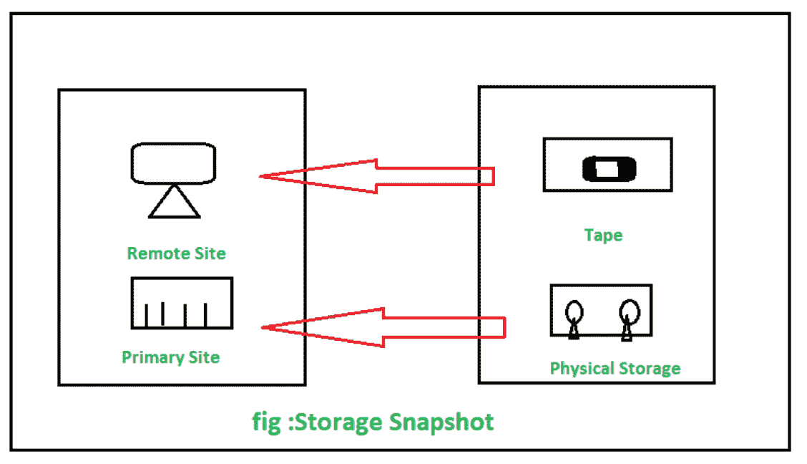

# 存储快照技术

> 原文:[https://www.geeksforgeeks.org/storage-snapshot-technology/](https://www.geeksforgeeks.org/storage-snapshot-technology/)

**存储:**
存储定义为通过计算技术将数字数据保存在数据存储设备中的过程/过程。存储是使计算机能够暂时或永久保留数据的技术。

**快照:**
快照是系统在特定时间点的状态。它可以指系统状态的实际副本或某些系统提供的功能。快照在摄影中经常使用，它也是一个计算术语，指的是在特定时刻由磁盘驱动器制作的副本。快照对于以不同的时间间隔备份数据非常有用，这允许在不同的管理级别从不同的时间段恢复信息。

**存储快照:**
存储快照在数据存储模块中提供了其有效的首选项，因为它还提供了数据保护以及数据挖掘和数据克隆。许多购买圆形存储硬件及其相关软件的商家正在提供快照技术支持，因为它提供了高级数据保护，这对任务关键型业务非常重要。存储快照提供零影响备份，应用程序停机时间最少或为零，因为它占用了频繁的备份。它有助于减少数据恢复时间，因为它以高效的方式备份大量数据，从快照中获得即时恢复。存储快照是在特定时间点创建的备份副本。

**分类:**
存储快照可以分为三种类型，分别是:

**1。写入时拷贝–**
在这种情况下，数据被拷贝到分配的存储池中。这种方法的主要局限性是它会影响现有原始数据的性能。

*   存储卷的快照是使用预先指定的快照空间设计的。首次生成快照时，仅复制关于原始数据存储位置的元数据。
*   在生成快照时，没有数据的实体拷贝。因此，快照的创建几乎是即时的。
*   然后，在执行写入原始卷时，快照拷贝会跟踪原始卷上的修改块。
*   要写入的原始数据将被复制到指定的存储池中，该存储池在原始数据被覆盖之前预留用于快照，因此称为“写入时复制”。

**2。写入时重定向–**
这有点类似于写入时复制。它在性能和空间方面提供了高效的快照，因为它不处理双重写入。

*   这种技术非常类似于写入时拷贝方法，没有双重写入损失，并且它提供了存储空间和性能高效的快照。
*   当前对原始卷的写入被转移到为快照预留的另一个位置。重定向写入的首要作用是只发生一次写入，而写入时复制会发生两次写入(一次将原始数据复制到存储空间，另一次复制已更改的数据)。
*   尽管使用这种机制，原始拷贝可以容纳时间点数据，即快照，而更改的数据驻留在快照存储上。发出快照时，必须将快照存储中的数据协调回原始卷。
*   此外，由于设计了不同的快照，因此访问原始数据、跟踪快照和原始卷中的数据以及在快照删除时进行协调变得更加复杂。
*   快照受制于数据的主拷贝，主数据集可能很快变成碎片。

**3。分割镜像–**
在这种技术中，物理克隆由驻留在不同存储空间的数据组成。

*   分割镜像将正在为其创建快照的存储实体(如文件系统、卷或逻辑单元号)物理克隆到另一个同类且大小完全相同的实体上。
*   原始卷的全部内容被复制到单独的卷上。克隆拷贝大部分是可用的，因为它们是驻留在不同存储空间上的原始卷的精确副本。尽管由于数据拷贝，此类快照无法即时创建。另一方面，也可以通过将卷的现有镜像“拆分”为两个来使克隆立即可用，其副作用是原始卷少了一个同步镜像。
*   这种快照机制需要与每个快照的原始数据一样多的存储空间。该方法具有并发写入镜像副本的性能开销。