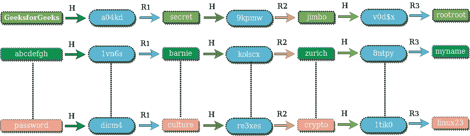

# 如何在数据库中存储密码？

> 原文:[https://www.geeksforgeeks.org/store-password-database/](https://www.geeksforgeeks.org/store-password-database/)

大多数网络应用程序要求用户通过询问用户名和密码来验证自己。他们将用户提供的凭据与其数据库中存储的数据进行比较，如果凭据匹配，则授予用户访问权限。听起来不错！但是，如果网站存储您密码的数据库遭到破坏，会发生什么呢？
本文介绍了在数据库中存储密码的各种技术。

根据[裸安全](https://nakedsecurity.sophos.com/2013/04/23/users-same-password-most-websites/)显示，55%的网络用户对大部分网站使用同一个密码！这意味着，如果以明文形式存储您的密码的网站遭到破坏，黑客不仅能够访问您在该网站上的帐户，还能访问您使用相同密码的所有社交媒体、电子邮件、论坛等帐户！

嗯，很多人一定在想，如果数据库暴露给黑客，那该怎么办？黑客可以获得所有信息。错了！！对于黑客来说，从数据库中检索密码的过程可以通过多种方式变得很麻烦。即使这样，开发人员也倾向于忽略基本准则，以纯文本形式存储密码。有超过 30%的网站以纯文本形式存储您的密码(也包括一些知名网站)。如果网站以纯文本存储您的密码，那么无论您选择多强的密码，您都不安全！

 ***在数据库中存储纯文本密码是一种罪过。*** 

人们可能还会认为，如果不是纯文本，那么我们必须加密密码然后存储。这也是一个可怕的想法。加密函数在输入和输出之间提供一对一的映射，并且它们总是可逆的。如果黑客得到了密钥，他将能够解密密码。更好的方法是使用单向加密散列函数。哈希函数提供了输入和输出之间的多对一映射，实际上不可能反转输出。一个好的加密散列函数具有较少的[冲突](https://en.wikipedia.org/wiki/Collision_(computer_science))(即对于该函数的不同输入值，很难获得相同的输出)。由于[鸽子洞原理](https://en.wikipedia.org/wiki/Pigeonhole_principle)，碰撞无法完全避免。对于散列密码，我们可以假设散列函数将生成唯一的输出，即对于没有两个不同的密码，我们将获得相同的散列值。

一些流行的加密散列函数是 [MD5](https://en.wikipedia.org/wiki/MD5) 和 [SHA1](https://en.wikipedia.org/wiki/SHA-1) 。一种方法是存储密码的散列，而不是将纯文本密码存储在数据库中。您可能会想，如果我们无法从哈希中获得实际密码，那么我们将如何验证用户输入的凭据？很简单，对用户输入的密码应用相同的哈希函数，然后将其与存储在数据库中的哈希进行比较。如果两个散列匹配，则用户被认证(因为相同输入的散列将给出相同的输出)。现在，如果攻击者能够访问数据库，他将只能查看哈希输出，而不能查看实际密码。

***使用密码哈希函数比存储纯文本密码*要好。**

黑客是聪明的家伙，一旦他们知道开发人员正在存储哈希密码，他们就会预先计算大量单词的哈希(来自流行的单词列表或字典单词)。他们创建了一个单词表和相应的哈希表。这张桌子被称为[彩虹桌](https://en.wikipedia.org/wiki/Rainbow_table)，网上很容易买到。他们可以使用该表通过比较从数据库中获得的哈希来反向查找实际密码。因此拥有一个**强密码**是非常重要的，因为你的密码出现在单词列表中的可能性变小了。

简单地存储密码的散列将不再有帮助。随着图形处理器和 CUDA、OpenCL 库的引入，处理能力大幅提高。一个快速的图形处理器可以在一秒钟内生成数百万个 MD5/SHA1 哈希。因此，黑客可以通过暴力强制各种可能的组合来轻松生成大量散列，并可以将其与存储在数据库中的散列进行比较，以提取实际密码。

**即使是散列密码也不安全！惊讶吗？** 

不要松希望！开发人员仍然可以做一些事情来防止黑客窥探您的密码。给密码加点盐，让密码变得美味！对，没错..！加一[盐](https://en.wikipedia.org/wiki/Salt_(cryptography))。salt 是随机数据，它在作为哈希函数的输入发送之前与您的密码连接在一起。

**比如** :
如果你的密码是 *abc* ，盐是*！ZaP0#8* ，结果 ***有函数(' abc！ZaP0#8')*** 将存储在数据库中，而不是***has function(【ABC】)***。
因此彩虹表攻击现在不会有效，因为彩虹表包含*ABC 的哈希的概率！ZaP0#8'* 是贫乏的(因为通常彩虹表是由常用词、词典词等构成的)。Salt 不存储在数据库中，只存在于外部世界无法访问的应用程序配置文件中。访问源文件比访问数据库更难。

以上腌制方法为静态。我们有一个固定的密码。要验证用户身份，首先将固定 salt 与用户提供的输入(密码)连接起来，然后将该值传递给哈希函数，并将其与数据库中存储的值进行比较。然而，这种方法仍然容易受到暴力攻击，如果攻击者能够获得静态 salt，他可以使用旧的攻击方法，在每个单词中串联 salt。

更好的方法是使用动态盐。对于每个用户，一个新的 salt 是由密码强随机字符串生成器生成的。用户输入的密码与随机生成的 salt 和静态 salt 连接在一起。串联字符串作为哈希函数的输入传递。获得的结果存储在数据库中。动态 salt 需要存储在数据库中，因为不同用户的动态 salt 不同。当要验证用户时，首先从数据库中获取该用户的动态 salt 值，将其与用户提供的输入和静态 salt 连接起来。将结果与存储在数据库中的哈希进行比较。

如果数据库遭到破坏，黑客不仅会得到你的密码哈希，还会得到你使用的动态 salt。你可能会想，如果攻击者有动态盐，那么动态盐比静态盐有什么优势？即使攻击者拥有动态 salt，他也需要为数据库中的每个用户创建一个新的哈希表(或彩虹表)(根据动态 salt)。这比只为所有用户创建一个表要昂贵得多。

以上的做法对于减缓一个黑客来说是相当不错的。但是建议使用*加密*和*加密*等算法，而不是 MD5/SHA1。Bcrypt 是一种基于 Blowfish 的哈希算法。它要求您指定成本/工作系数。工作因素会使整个过程变慢，因此生成哈希表所需的时间会增加数倍。

**参考文献:**
[https://下体安全. sophos . com/2013/11/20/严重-安全-如何存储您的用户-密码-安全/](https://nakedsecurity.sophos.com/2013/11/20/serious-security-how-to-store-your-users-passwords-safely/)

本文由 **[Saket Kumar](https://www.facebook.com/saketkumar95)** 供稿。如果你喜欢 GeeksforGeeks 并想投稿，你也可以使用[contribute.geeksforgeeks.org](http://www.contribute.geeksforgeeks.org)写一篇文章或者把你的文章邮寄到 contribute@geeksforgeeks.org。看到你的文章出现在极客博客主页上，帮助其他极客。

如果你发现任何不正确的地方，或者你想分享更多关于上面讨论的话题的信息，请写评论。