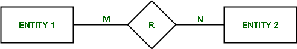
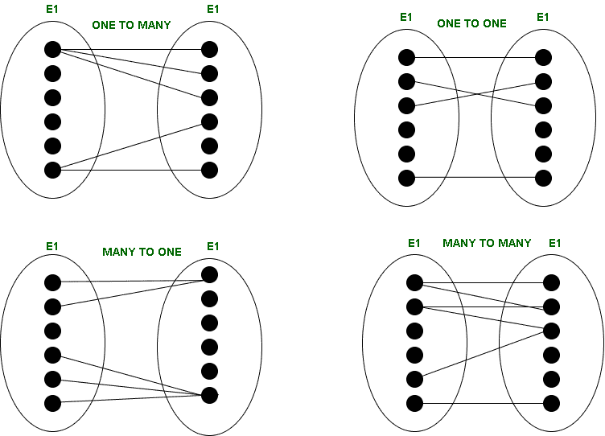
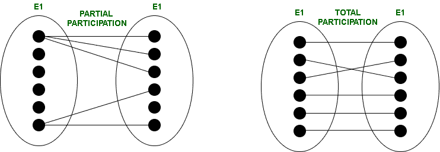

# ER 模型中关系的结构约束

> 原文:[https://www . geesforgeks . org/er-model 中关系的结构约束/](https://www.geeksforgeeks.org/structural-constraints-of-relationships-in-er-model/)

先决条件–[ER 模型](https://www.geeksforgeeks.org/introduction-of-er-model/)
要理解结构约束，我们必须了解基数比率和参与约束。

**关系的基数比:**
实体用矩形表示，关系用菱形表示。

在连接关系和实体的线上写有数字(用 M 和 N 表示)。这些称为基数比。这些表示可以通过关系相互关联的实体的最大数量

**基数类型:**
可以有 4 种基数类型–

1.  **一对一(1:1)–**
    当每个实体集内的一个实体最多参与一次关系时，基数为一对一。
2.  **一对多(1:N)–**
    如果第一个实体集的实体最多参与一次关系集，第二个实体集的实体参与多次(至少两次)，则称基数为一对多。
3.  **多对一(N:1)–**
    如果第一个实体集的实体多次(至少两次)参与关系集，而第二个实体集的实体最多参与一次，则称基数为多对一。
4.  **多对多(N:N)–**
    如果两个实体集内的实体多次(至少两次)参与关系集，则基数被称为多对多。

**参与约束:**
参与约束告诉我们，关系中的参与可以是全部的，也可以是部分的。

当一个实体集的每个实体参与一个关系时，称为*总参与*。但是，当给定实体集内的所有实体都不参与关系时，称为*部分参与*。

**结构约束:**
结构约束也称为数据库管理系统(DBMS)的结构属性。基数比率和参与约束合在一起称为结构约束。名称约束是指必须对数据施加这样的限制，这样数据库管理系统才能符合要求。

结构约束由**最小-最大符号**表示。这是出现在实体及其关系之间的连接线上的一对数字(m，n)。一个实体在关系中出现的最小次数由 m 表示，而它可用的最大时间由 n 表示。如果 m 为 0，则表示该实体部分参与了关系，而如果 m 大于或等于 1，则表示该实体的全部参与。

**注意–**
实体参与关系的次数与实体在元组中的出现次数相同。