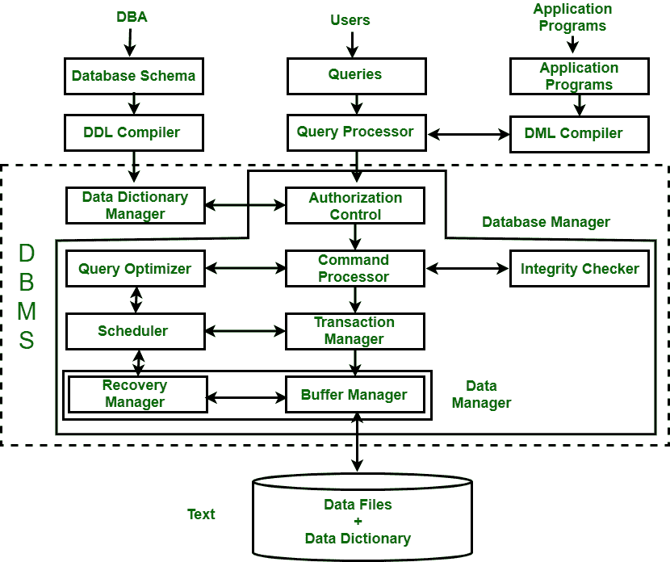

# 数据库管理系统的结构

> 原文:[https://www . geesforgeks . org/数据库管理系统结构/](https://www.geeksforgeeks.org/structure-of-database-management-system/)

[数据库管理系统(DBMS)](https://www.geeksforgeeks.org/introduction-of-dbms-database-management-system-set-1/) 是一款允许访问数据库中存储的数据的软件，提供了一种简单有效的方法–

*   定义信息。
*   存储信息。
*   操纵信息。
*   保护信息免受系统崩溃或数据盗窃。
*   区分不同用户的访问权限。

数据库系统分为三个组件:查询处理器、存储管理器和磁盘存储。这些解释如下。

**1。查询处理器:**
它将最终用户通过应用程序收到的请求(查询)解释为指令。它还执行从 DML 编译器接收的用户请求。
查询处理器包含以下组件–

*   **DML 编译器–**
    它把 DML 语句处理成低级指令(机器语言)，以便执行。

*   **DDL 解释器–**
    它将 DDL 语句处理成一组包含元数据(关于数据的数据)的表。

*   **嵌入式 DML 预编译器–**
    它将应用程序中嵌入的 DML 语句处理成过程调用。

*   **查询优化器–**
    它执行 DML 编译器生成的指令。

**2。存储管理器:**
存储管理器是一个程序，它在数据库中存储的数据和收到的查询之间提供接口。它也被称为数据库控制系统。它通过应用约束来维护数据库的一致性和完整性，并执行 [DCL](https://www.geeksforgeeks.org/sql-ddl-dql-dml-dcl-tcl-commands/) 语句。它负责更新、存储、删除和检索数据库中的数据。
包含以下组件–

*   **授权管理器–**
    它确保基于角色的访问控制，即。检查特定的人是否有特权执行请求的操作。

*   **完整性管理器–**
    它在修改数据库时检查完整性约束。

*   **事务管理器–**
    它通过以接收事务的预定方式执行操作来控制并发访问。因此，它确保数据库在事务执行前后保持一致的状态。

*   **文件管理器–**
    它管理文件空间和用于表示数据库中信息的数据结构。

*   **缓冲区管理器–**
    它负责缓存内存以及辅助存储器和主存储器之间的数据传输。

**3。磁盘存储:**
它包含以下组件–

*   **数据文件–**
    它存储数据。

*   **数据字典–**
    它包含任何数据库对象的结构信息。它是管理元数据的信息库。

*   **索引–**
    它提供了更快的数据项检索。