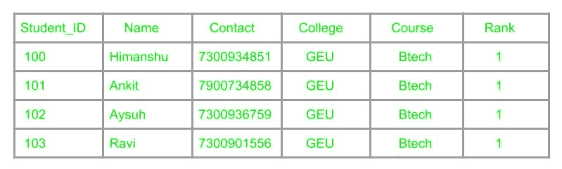
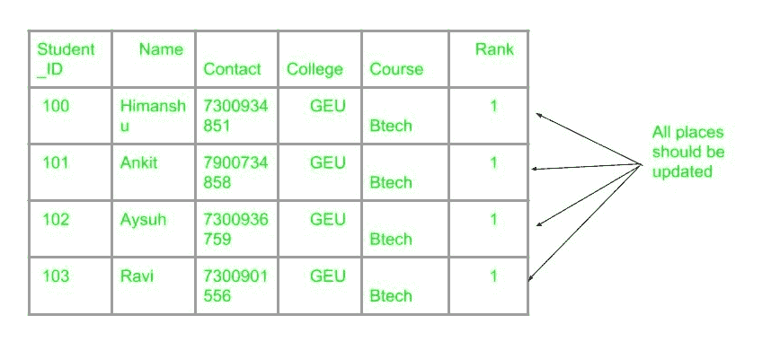

# 数据库的冗余问题

> 原文:[https://www . geesforgeks . org/数据库冗余问题/](https://www.geeksforgeeks.org/the-problem-of-redundancy-in-database/)

**冗余**是指数据库中有相同数据的多个副本。当数据库没有规范化时，就会出现这个问题。假设一个学生详细信息属性表是:学生证、学名、学院名、学院排名、选择的课程。

可以观察到，属性学院名称、学院排名、课程的值被重复，这可能导致问题。冗余引起的问题有:插入异常、删除异常和上升异常。

**1。插入异常–**
如果必须插入课程尚未确定的学生详细信息，则在为学生确定时间课程之前，无法插入。

如果不在记录中添加一些不相关的数据，就不可能插入数据记录，就会出现这个问题。

**2。删除异常–**
如果删除了本表中的学生详细信息，那么大学的详细信息也会被删除，这是常识所不应该出现的。
当删除数据记录导致一些不相关的信息丢失时，就会发生这种异常，这些信息是作为从表中删除的记录的一部分存储的。
如果不丢失表格中的其他信息，就不可能删除某些信息。

**3。更新异常–**
假设如果学院的排名发生变化，那么这些变化将必须遍布整个数据库，这将非常耗时，并且计算成本很高。

如果更新没有在所有地方发生，那么数据库将处于不一致的状态。

参考–[practice.geeksforgeeks.org](https://practice.geeksforgeeks.org/problems/what-are-the-different-issues-which-may-arise-due-to-redundancy-in-a-database-relation)T2】