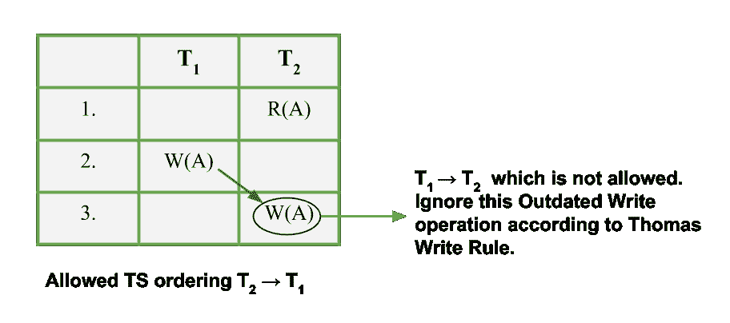

# 托马斯在数据库管理系统中写规则

> 原文:[https://www.geeksforgeeks.org/thomas-write-rule-in-dbms/](https://www.geeksforgeeks.org/thomas-write-rule-in-dbms/)

[时间戳排序协议](https://www.geeksforgeeks.org/dbms-introduction-timestamp-deadlock-prevention-schemes/)规定，如果 R i (X)和 W j (X)是冲突的操作，那么当且仅当 TS(TI)<TS(Tj时，R i (X)先于 W j (X)被处理。每当时间表不遵循时间戳的可序列化顺序时，用户通常会拒绝它并回滚事务。另一方面，有些操作是无害的，可以允许。

托马斯写规则允许这样的操作，并且是对基本时间戳排序协议的修改。在托马斯书写规则中，用户*忽略过时的书写*。此外，在已经讨论的所有并发协议中，*并发是强加在调度*上的，*是冲突可串行化的*，在托马斯写规则中，最重要的改进是用户可以*通过视图可串行化调度*实现并发。

首先，让我们说明什么是托马斯写规则，然后它在[基本 TO 协议](https://www.geeksforgeeks.org/dbms-concurrency-control-protocols-timestamp-ordering-protocols/)上成功的修改和改进是什么。

**托马斯写规则–**
托马斯写规则不强制*冲突*可串行化，但通过修改 W_item(X)
的检查操作，拒绝较少的写操作

1.  如果 **R_TS(X) > TS(T)** ，则中止并回滚 T 并拒绝该操作。
2.  如果 **W_TS(X) > TS(T)** ，则不执行写操作，继续处理。这是一个*过时或写得过时*的案例。请记住，过期写入在托马斯写入规则中被忽略，但遵循基本目标协议的事务将中止此类事务。
3.  如果 1 或 2 中的条件都没有出现，则执行 T 的 W_item(X)操作，并将 W_TS(X)设置为 TS(T)

**过时写入示例–**
托马斯写入规则的主要更新是忽略过时写入操作。这样做是因为时间戳大于 TS(T)的某个事务(即 TS 排序中 T 之后的事务)已经写入了 X 的值。因此，逻辑上用户可以忽略 T 的 Write(X)操作，该操作已经过时。让我们通过一个例子来看这一点:

假设用户有一个时间表，其中两个事务 T 1 和 T 2 。现在，**TS(T2)<TS(T1)**。这意味着 T 1 在 T 2 之后到达，因此具有比 T 2 更大的 TS 值。这意味着允许的时间表的可串行化是**T2–>T1**。考虑下面给出的部分时间表:

**图像–**过时写入示例

因此，根据 2 和协议，在该规则中忽略过时写入。这似乎更符合逻辑，因为用户跳过了重启整个事务的不必要过程。该协议只是对基本 to 协议的修改。

**基本 TO 协议 v/s Thomas Write Rule–**
假设用户有一个时间表，其中两个事务 T 1 和 T 2 。现在，**TS(T2)<TS(T1)**。这意味着允许的日程可串行化是**T2–>T1**。考虑这两个协议，让我们看看它们允许和不允许什么类型的操作。 **R i (A)** 表示读操作， **W i (A)** 表示写操作。现在，让我们看看基本 TO 和 Thomas Write Rule 中允许的部分调度的类型，您将理解这两个协议的操作差异。用户区分两个协议中允许和不允许的操作。

<figure class="table">

|   |   |
| 

**基本至协议**

*   **不允许**
    *   R 1 (X) W 2 (X)
    *   W 1 (X) R 2 (X)
    *   W 1 (X) W 2 (X)
*   **允许**
    *   T 2 发生在 T 1 之前的所有操作。
    *   R 1 (X) R 2 (X)

 | 

**托马斯书写规则**

*   **不允许**
    *   R 1 (X) W 2 (X)
    *   W 1 (X) R 2 (X)
*   **允许**
    *   T 2 发生在 T 1 之前的所有操作。
    *   **过时写** : W 1 (X) W 2 (X)
    *   R 1 (X) R 2 (X)

 |

因此，从上面的列表来看，与基本 to 协议相比，托马斯写规则中使用了这种修改。

<u>参考</u>:数据库系统概念，第五版【西尔伯沙茨，考尔思，苏达山】，第 16 章

</figure>