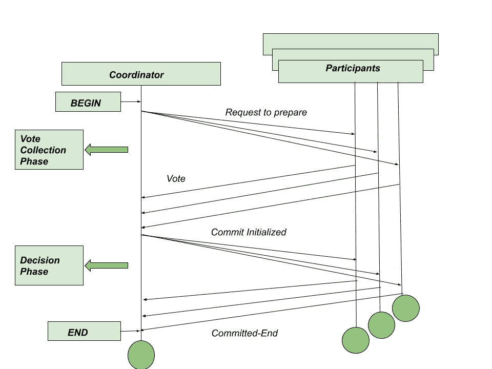
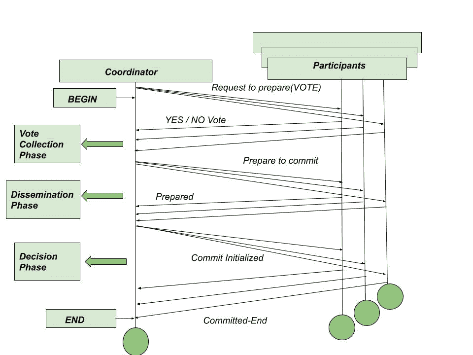

# 三阶段提交协议

> 原文:[https://www.geeksforgeeks.org/three-phase-commit-protocol/](https://www.geeksforgeeks.org/three-phase-commit-protocol/)

**三阶段提交(3PC)协议**是两阶段提交(2PC)协议的扩展，在一定假设下避免了阻塞问题。特别地，假设没有网络分区发生，并且失败的站点不超过 k 个，其中我们假设‘k’是预定的数字。根据上述假设，协议通过引入额外的第三阶段来避免阻塞，在第三阶段中，多个站点参与提交决策。

***协调器*** 首先确保至少“k”个其他站点知道它打算提交事务，而不是直接在其持久存储中记录提交决定。

在协调器失败的情况下，剩余的站点必须首先选择新的协调器。这个新的协调器从剩余的站点检查协议的状态。如果协调者已经决定提交，它通知的至少一个其他“k”站点将会启动，并将确保提交决定得到尊重。如果任何其他站点知道旧协调器打算提交事务，则新协调器重新启动协议的第三阶段。否则，新的协调器将中止事务。

**三阶段提交协议的缺点:**
虽然 3PC 协议具有除非‘k’个站点失败否则不阻塞的期望属性，但是它具有网络分区可能看起来与多于‘k’个站点失败相同的缺点，这将导致阻塞。该协议还必须小心实施，以确保网络分区不会导致不一致，即事务在一个分区中提交，而在另一个分区中中止。由于其开销，3PC 协议没有得到广泛应用。

三相控制协议和两相控制协议的区别可以通过下图来理解。

图 1 该图代表两阶段提交协议

图 2 该图代表三相控制协议

**传播阶段:**
上面介绍的它帮助用户处理提交阶段参与者失败或者协调者和参与者节点都失败的情况。

恢复协调器在前两阶段提交协议的第 2 阶段协调器故障后接管工作时，新的附加阶段如下所示。

**注意–**
在查询参与者时，如果它得知某些节点处于提交阶段，那么它会假设崩溃前的协调器已经决定提交。
因此它可以引导协议提交。类似地，如果一个参与者回应说它没有收到准备提交，那么新的协调器可以假设前一个协调器甚至在它开始准备提交阶段之前就失败了。因此，它可以安全地假设没有其他参与者会提交任何更改，因此它现在可以安全地中止事务。