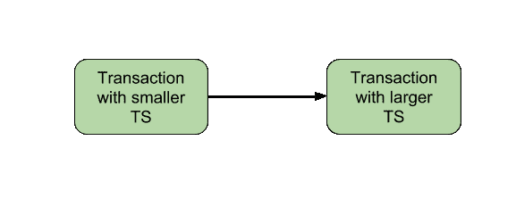

# 基于时间戳的并发控制

> 原文:[https://www . geesforgeks . org/基于时间戳的并发控制/](https://www.geeksforgeeks.org/timestamp-based-concurrency-control/)

并发控制可以通过[不同的方式](https://www.geeksforgeeks.org/dbms-concurrency-control-protocols-lock-based-protocol/)实现。一种实现方式是使用[锁](https://www.geeksforgeeks.org/dbms-concurrency-control-protocols-lock-based-protocol/)。现在，让我们讨论时间戳排序协议。

如前所述，**时间戳**是由数据库管理系统创建的唯一标识符，用于识别事务。它们通常按照提交给系统的顺序进行分配。交易的时间戳 *T* 为*T5【TS(T)*。时间戳的基础知识，可以参考这里的。

**时间戳排序协议–**
该协议的主要思想是根据事务的时间戳对事务进行排序。事务参与的时间表是可序列化的，并且唯一允许的*等效串行时间表*按照事务的时间戳值的顺序排列事务。简而言之，时间表相当于对应于交易时间戳的*顺序的特定*序列顺序*。算法必须确保，对于计划中*冲突操作*访问的每个项目，项目的访问顺序不违反顺序。为确保这一点，请使用与每个数据库项目相关的两个时间戳值 **X** 。*

*   **W _TS(X)** 是成功执行 **write(X)** 的任何事务的最大时间戳。
*   **R_TS(X)** 是成功执行 **read(X)** 的任何事务的最大时间戳。

**基本时间戳排序–**
根据事务进入系统的时间，为每个事务分配一个时间戳。假设，如果旧的事务 T i 具有时间戳 TS(T i ，则新的事务 T j 被分配时间戳 TS(T j ，使得**TS(TI)<TS(Tj)**。该协议管理并发执行，使得时间戳确定可串行化顺序。时间戳排序协议确保任何冲突的读写操作都按照时间戳顺序执行。每当某些事务 *T* 试图发出 R_item(X)或 W_item(X)时，基本 to 算法会将 *T* 的时间戳与 **R_TS(X) & W_TS(X)** 进行比较，以确保不违反时间戳顺序。这在以下两种情况下描述了基本 TO 协议。

1.  Whenever a Transaction *T* issues a **W_item(X)** operation, check the following conditions: 
    *   如果 ***R_TS(X) > TS(T)*** 或如果 ***W_TS(X) > TS(T)*** ，则中止并回滚 T 并拒绝该操作。否则，
    *   执行 T 的 W_item(X)操作，并将 W_TS(X)设置为 TS(T)。
2.  Whenever a Transaction *T* issues a **R_item(X)** operation, check the following conditions: 
    *   如果 ***W_TS(X) > TS(T)*** ，那么中止并拒绝 T 并拒绝操作，否则
    *   如果 W_TS(X) <= TS(T), then execute the R_item(X) operation of T and set R_TS(X) to the larger of TS(T) and current R_TS(X). 

每当基本至算法检测到两个以不正确顺序发生的冲突操作时，它都会通过中止发出操作的事务来拒绝后一个操作。基本 TO 生成的计划保证是*冲突可串行化的*。已经讨论过，使用时间戳可以确保我们的日程将是 [*无死锁*](https://www.geeksforgeeks.org/dbms-introduction-timestamp-deadlock-prevention-schemes/) 。

基本 TO 协议的一个缺点是**级联回滚**仍然是可能的。假设我们有一个事务 T 1 和 T 2 使用了一个由 T 1 写的值。如果 T 1 中止并重新提交给系统，那么 T 也必须中止并回滚。因此级联中止的问题仍然普遍存在。

让我们总结一下基本 TO 协议的优缺点:

*   时间戳排序协议确保了可串行化，因为优先图的形式为:

**图像–**TS 排序的优先图

*   时间戳协议确保没有死锁，因为没有事务等待。
*   但是时间表可能*不是级联自由*，甚至可能无法恢复。

**严格的时间戳排序–**
基本时间表的一个变体称为**严格时间表**确保时间表既严格又冲突可序列化。在此变体中，发出 R_item(X)或 W_item(X)的事务 T 使得 TS(T) > W_TS(X)的读或写操作被延迟，直到写入 X 值的事务 **T '** 已经提交或中止。

**相关的 GATE 问题–**

1.  [GATE | GATE CS 2010 |第 20 题](https://www.geeksforgeeks.org/gate-gate-cs-2010-question-20/)
2.  [GATE | GATE-CS-2017(第 1 集)|第 46 题](https://www.geeksforgeeks.org/gate-gate-cs-2017-set-1-question-46/)
3.  [GATE | GATE-IT-2004 |第 21 题](https://www.geeksforgeeks.org/gate-gate-it-2004-question-21/)