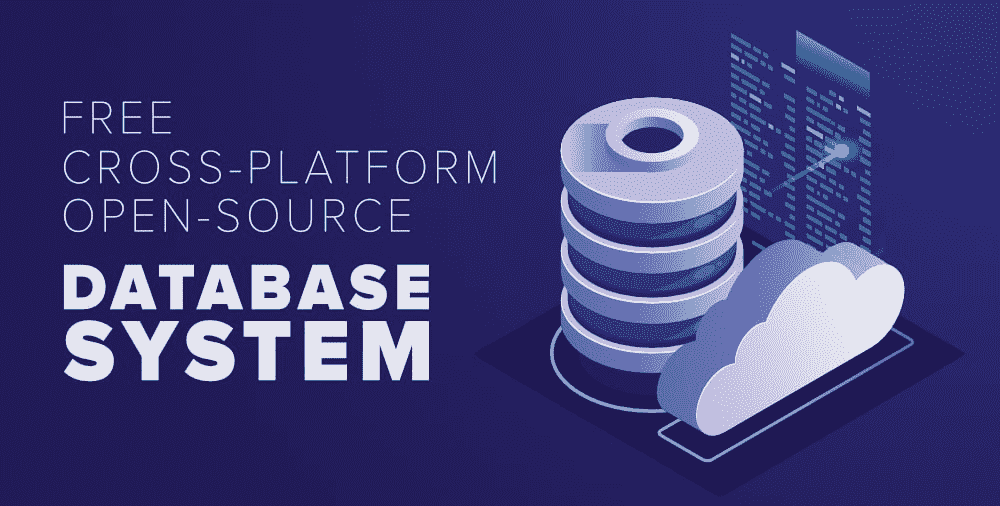

# 2020 年免费、跨平台、开源数据库系统前 5 名

> 原文:[https://www . geesforgeks . org/top-5-免费-跨平台-开源-数据库-系统-in-2020/](https://www.geeksforgeeks.org/top-5-free-cross-platform-and-open-source-database-system-in-2020/)

数据是 21 世纪最有价值和最重要的东西。这个虚拟世界完全是用大量数据构建和运行的。如果没有对如此大量的数据进行适当的管理，每一个系统都会崩溃和崩溃。现在救世主来了，一个存储、组织和管理大量信息的软件，数据库管理系统。

一个 [**数据库管理系统**](https://www.geeksforgeeks.org/introduction-of-dbms-database-management-system-set-1/) 与最终用户和应用程序交互，以捕获和分析数据，并提供一种规范的方法来使数据管理更加容易。由于全世界技术的快速发展，对开源和数据库的需求日益增长。在本文的下面，有五个最受欢迎的开源数据库，它们是绝对免费的，您可以在任何计算平台上实现它们，如视窗、苹果或 Linux。

### **1。MySQL**

它是一个跨平台的、领先的开源和免费的关系数据库管理系统，在过去的 25 年里一直主导着软件行业。目前稳定的 8.0 版本是最成功的开源项目之一。根据 StackOverflow 的开发人员调查，它在其他数据库管理系统中保持榜首。MySQL 由 Oracle 公司开发，用 [C](https://www.geeksforgeeks.org/c-programming-language/) 和 [C++](https://www.geeksforgeeks.org/c-plus-plus/) 编写，有大量的支持和文档。几乎每个主要的科技巨头都在使用 MySQL，如脸书、谷歌、推特、YouTube 等。

*   它超级快而且容易使用，
*   大型数据库的高性能(一个表中超过 5000 万行)，
*   它具有高度的可扩展性，并拥有多个存储引擎，如 InnoDB、CSV、NDB 等来存储数据，
*   它运行在 Mac OS X、Windows、Linux 和各种 UNIX 变体上。
*   它非常安全，
*   它支持 SQL 和 ODBC 接口连接器

**最适用于:** MySQL 最适用于大容量网站、打包软件和关键业务系统。

### **2。PostgreSQL**

它是一个功能强大、最先进的开源对象关系数据库系统，经过 20 多年的积极开发，在可靠性、功能健壮性和性能方面享有盛誉。它用 C 语言编写，由 [PostgreSQL](https://www.geeksforgeeks.org/what-is-postgresql-introduction/) 全球开发集团开发，在大多数 Unix OS、Windows 和其他几个系统中运行。苹果、思科、Skype 和 IMDb 等许多科技巨头都使用 PostgreSQL。

*   它具有高度可伸缩性和复杂的锁定机制
*   它有许多用户界面和预定义的功能
*   支持用于链接到其他数据存储的 json
*   成熟的服务器端编程功能
*   支持多级并发控制(多版本并发控制)。

**最适用于:** PostgreSQL 是一个高度可靠的[关系数据库管理系统](https://www.geeksforgeeks.org/rdbms-full-form/)，几乎没有数据扩展问题，在银行和基于产品的行业中最有用。

### **3。SQLite**

SQLite 是一个 C 语言库，它实现了一个轻量级、高可靠性和全功能的 SQL 数据库引擎。它是一个跨平台、无服务器、零配置、事务性的 SQL 数据库引擎，是世界上最广泛部署的数据库，可免费用于任何目的，无论是商业目的还是私人目的。与大多数其他 SQL 数据库不同，SQLite 没有单独的服务器进程 SQLite 是一个嵌入式的 SQL 数据库引擎。

*   重量轻且易于实施，
*   无需安装或配置即可随时使用，
*   不需要任何专用服务器来存储数据库，一切都存储在硬盘上，
*   由于基于文件的系统，非常便携，
*   几乎与所有编程语言高度兼容

**最适用于:** SQLiten 最适合不需要那么多特性的小规模测试和开发。

### **4。**蒙戈布

在这个云时代，MongoDB 是一个通用的、基于文档的分布式数据库，为现代应用程序而构建，被数百万开发人员用于世界上最具创新性的产品和服务。MongoDB 将数据存储在类似 JSON 的文档中，这比传统的行列模型更具表现力和功能。虽然 MongoDB 是一个 NoSQL 数据库，但它拥有关系数据库的所有功能，甚至更多。它有一种强大的查询语言，允许您根据任何字段进行筛选和排序，无论它在文档中的嵌套程度如何。它还支持聚合和其他现代用例，如基于地理的搜索、图形搜索和文本搜索。

*   通过 API 调用轻松扩展、调配和管理复杂的多节点集群
*   在全球范围内创建分布式集群，以便在多个云上运行您的数据库
*   为您的数据提供全自动连续云备份
*   性能优化、按需扩展和数据库指标的实时可见性。
*   通过身份验证、授权、加密等为您的数据提供高级别的安全性。

**最适用于:** MongoDB 适用于大数据项目，如电子商务业务的产品目录、社交网站以及高速日志和缓存。

### [5。mariadb〔t1〕](https://mariadb.org/)

马里亚数据库服务器是最受欢迎的免费开源关系数据库之一，由 MySQL 的原始开发人员制作，并保证保持开源。它可以用于各种各样的应用程序，从银行到具有改进的查询优化器和前沿功能的网站。表中有动态列，最新版本支持 JSON 和 GIS。

*   MySQL 之外的附加功能，
*   提供最好的数据处理设施，
*   跨平台支持多种编程语言，
*   提供 Galera 集群技术，
*   更快、更透明的安全发布。

**最适合:**最适合有查询语言知识和编程技能的团队和自由职业者。

如果您是开发人员，您必须在开发过程中的某个时间使用数据库。为了轻松执行管理任务，一个好的数据库管理系统对于每个软件行业的快速发展都非常重要。没有数据库管理系统，我们可能不得不手动进行数据管理，这确实是一项非常繁忙且几乎不可能的任务。现在市场上有很多数据库管理软件，每个数据库管理系统都有其优缺点。因此，根据公司或您的项目要求明智地选择完美的是很重要的。