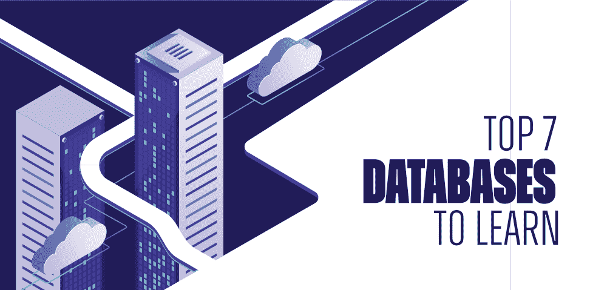
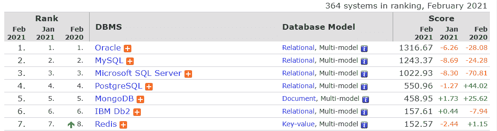

# 2021 年最值得学习的 7 大数据库

> 原文:[https://www . geesforgeks . org/top-7-2021 年要学习的数据库/](https://www.geeksforgeeks.org/top-7-databases-to-learn-in-2021/)

***数据库就像办公室里的一个房间*** 所有与项目相关的文件和重要信息都可以存放在这里。每个公司都需要一个数据库来存储和组织信息。我们存储的信息可能非常敏感，因此在访问或操作数据库中的信息时，我们总是必须小心。

要构建不同类型的应用程序，如网络、企业、嵌入式系统、实时系统、人工智能、多种语言、高性能计算、区块链、物联网等，您可能需要选择一个或多个数据库。多年来，程序员和行业专家已经表现出对满足他们需求的数据库的热爱。

选择合适的数据库也取决于项目的目的。大约 20-25 年前，为应用程序选择数据库并不是一项具有挑战性的任务。大多数时候，开发人员更喜欢使用关系数据库来配置他们的应用程序。但是今天，由于应用的进步，它已经成为一项具有挑战性的任务。

现代软件开发(基于微服务、云、分布式应用程序、全局扩展、半结构化数据、大数据、快速数据、低延迟数据构建的应用程序)需要传统数据库与各种 NoSQL 数据库、新闻数据库和云数据库相结合。

今天，科技世界中有超过 343 个数据库，这是一个非常庞大的数字。要选择合适的数据库，您需要熟悉一些流行数据库的优缺点。如果你的目标是成为一名软件或技术架构师(当然是他们做出选择正确技术的决定)，那么尽可能多地获得关于这些数据库的知识是很好的。

在这个博客中，让我们讨论一些你在 2021 年应该学习或熟悉的关键数据库。在此之前，让我们快速查看一下最受欢迎的数据库的排名根据[数据库引擎](https://db-engines.com/en/ranking)下面是列表…

如果我们看一下前一年的调查，下面是 [StackOverflow](https://insights.stackoverflow.com/survey/2020#technology-databases-all-respondents4) 上的可用数据

### 1.神谕

甲骨文是由软件工程师拉里·埃里森(现任甲骨文公司首席技术官)于 1979 年创建的。Oracle 是用汇编语言 C、C++和 Java 编写的领先的商业 RDBMS 系统。21c 是该数据库的最新版本，具有许多创新功能。

甲骨文位于数据库的顶端。它是总体上使用最广泛的关系数据库管理系统。它占用的空间更少，并且可以快速处理数据，您还可以从 SQL 中找到一些新的好特性，比如 JSON。该数据库的其他一些特性如下…

*   ACID 交易担保。如果我们谈论 CAP，那么它提供了作为单个服务器的即时一致性。
*   它支持结构化数据、半结构化数据、空间数据和 RDF 存储。此外，它还根据特定的数据模型提供了各种访问模式。
*   支持 OLTP 和 OLAP 工作负载。
*   满足高可用性、性能、可扩展性、数据仓库等需求。
*   甲骨文为云、文档存储、键值存储、图形数据库管理系统、PDF 存储和博客提供功能。

### 2.关系型数据库

MySQL 是科技界最受欢迎和使用最广泛的数据库，尤其是在 web 应用程序中。它是在 1995 年由两位软件工程师[迈克尔·威得纽斯](https://en.wikipedia.org/wiki/Michael_Widenius)和[大卫·阿克马克](https://en.wikipedia.org/wiki/David_Axmark)引入的。该数据库主要关注健壮性、稳定性和成熟度。该数据库最常见的用途是用于 web 应用程序。

MySQL 使用结构化查询语言，并且是用 C 和 C++编写的。这个数据库的最新版本是 MySQL 8.0，它有更好的恢复选项。对于不同的版本，MySQL 有不同的特性。下面给出了一些关键特性…

*   MySQL 是开源的，有两种许可模式:免费的社区服务器和专有的企业服务器。
*   它带有 ACID 事务保证，在 CAP 定理中，它提供了即时一致性。
*   MySQL 提供了水平分区(分片)。如果您的软件建立在这个数据库上，那么您肯定会获得高可用性和低延迟的高吞吐量。
*   MySQL 支持大多数编程语言，如 C、C++、Python、Java、PHP 和用于客户端编程的 Tcl。
*   MySQL 集群提供多主 ACID 事务。
*   MySQL 支持大型数据库，一个表中最多有 5000 万行或更多。

### 3.微软 SQL 服务器

MS SQL server 是 [Sybase SQL serve](https://en.wikipedia.org/wiki/Adaptive_Server_Enterprise) r 的变种，由微软开发，该数据库于 1989 年推出。MS SQL Server 和 Sybase SQL Server 有很多共同的特性。MS SQL Server 是用 C 和 C++编写的。

该数据库拥有微软为内部部署和云提供的出色工具支持。它在 Windows 和 Linux 平台上都可用。像其他现代数据库一样，微软 SQL 没有那么创新或先进，但多年来它经历了重大的更新和大修。

这个数据库有很多版本，比如 Azure SQL Database(基于云的版本)、compact 版、enterprise 版(大多数公司都比较喜欢)、developer 版。下面给出了它的一些特性。

*   独立于平台，具有高性能。
*   ACID 交易担保。在 CAP 定理中，它提供了直接的一致性。
*   支持许多服务器端语言，如 T-SQL，。NET 语言、R 语言、Python 语言和 Java 语言。
*   支持结构化数据(SQL)、半结构化数据(JSON)、空间数据。
*   它可以与非关系源集成，如 [Hadoop](https://www.geeksforgeeks.org/hadoop-introduction/)
*   它使用行级安全性、动态数据屏蔽、透明数据加密和强大的审计。
*   附带定制的图形集成，为用户节省了大量时间。
*   它允许您在没有语法的情况下创建各种设计、表格和视图数据。

### 4.一种数据库系统

这个开源数据库是 1996 年由迈克尔·拉尔夫·斯通布拉克 **引入的。** PostgreSQL 起源于 Ingres 数据库， **Michael** 是 Ingres 团队的领导者。该数据库最初被命名为 POSTGRES。迈克尔还因为在 PostgreSQL 中的工作获得了图灵奖。

PostgreSQL 是用 C 语言编写的，它被需要处理大量数据的公司使用。许多游戏应用程序、数据库自动化工具和域注册中心都使用这个数据库。它的一些特点如下…

*   ACID 交易担保。在 CAP 定理中，它提供了即时一致性。
*   虽然它是一个对象关系型数据库管理系统，但用户可以自由创建 NoSQL 数据库。您可以将该数据库与 SQL 数据库的事务性保证和 NoSQL 数据库的横向扩展一起使用。您可以在需要分布式 SQL 的地方使用这个数据库。
*   更高级的索引像部分索引，布隆过滤器。它允许您在 PostgreSQL 中创建非阻塞索引。
*   高可扩展性，预定义功能，轻松的数据可移植性，多接口。
*   支持结构化数据、半结构化数据、键值、空间数据。
*   具有高级可靠性和灾难恢复功能。

### 5.MongoDB

说到使用 NoSQL 数据库，MongoDB 是企业的重中之重。使用面向对象的编程语言很难将数据加载和访问到关系数据库管理系统中。您将不得不进行额外的应用程序级映射。

MongoDB 解决了这个问题，尤其是处理文档数据。MongoDB 是一个简单的、面向对象的、动态的、可扩展的数据库。您不需要像传统数据库那样处理列和行。您可以将数据对象作为单独的文档存储在集合中。

10gen 软件公司在 2009 年发布了这个数据库，在过去的十年里，这个数据库经历了许多改进和创新。它是用 C、C++和 JavaScript 编写的。您可以将该数据库用于移动应用程序、实时分析和物联网，并可以为您的所有数据提供实时视图。下面给出了它的一些特性。

*   快速、易用、部署灵活、高性能、高可用性和易扩展性。使用自动分割，您可以轻松地进行水平缩放。它通过主-辅助节点提供内置复制。
*   在 CAP 模型中，它是一致的和分区容忍的。
*   带有快照隔离的 ACID 事务(分布式多文档)。
*   支持图形搜索、地理搜索、地图缩减查询和文本搜索。
*   MongoDB Inc .提供全文搜索引擎(Atlas Search)和数据湖(Atlas Data Lake)。
*   查询可以很容易地优化输出。

### 6.IBM DB2

1983 年，IBM 发布了第一个商业关系数据库产品——IBM DB2。最初它是在大型机上发布的，但在 1987 年，IBM 发布了适用于 Windows、Linux 和 Unix 系统的 DB2 LUW。DB2 的最新版本是 11.5，它运行查询的速度更快。

数据库支持关系模型，但是最近几年它有了很大的发展，并没有扩展到支持对象关系特性和非关系结构，比如 JSON 和 XML。它的一些特点如下…

*   支持私有和云环境。
*   ACID 交易担保。
*   支持结构化数据(SQL)、半结构化数据(JSON)和图形数据。
*   它也可以作为一个主数据库。它通过 IBM BLU 加速提供强大的 OLAP 支持。
*   它提供了人工智能专用的功能，旨在管理和构建复杂的数据。
*   通过 Db2 pureScale 可以实现水平可伸缩性。

### 7.Redis

Redis(远程词典服务器)是由意大利开发者 Salvatore Sanfilippo 推出的。他在创业时创建了这个数据库，他面临着传统数据库的可伸缩性问题。他想开发一个实时日志分析器。他创建了 Redis 作为分布式内存键值存储。

Redis 很快得到普及，现在它在行业中被广泛使用。下面给出了它的一些特性。

*   用作分布式内存键值数据库。Redis 还可以用作分布式缓存和消息代理，具有可选的持久性，
*   支持多种数据结构，如字符串、哈希、列表、集合、位图、超级日志、带范围查询的排序集合以及带半径查询的地理空间索引。
*   在 CAP 定理中，它支持 CP(一致和分区容忍)。
*   通过内置复制、自动故障转移和通过 Redis 集群进行分片，实现高可扩展性。
*   适用于实时用例，例如库存系统。

### 最后说明

我们展示了 2021 年要使用的 7 个数据库。除了这 7 个数据库之外，其他将在行业中大量使用的数据库还有 Elasticsearch、Cassandra、MariaDB 和 Firebase。

MySQL 和 PostgreSQL 是开源和免费数据库的领导者。如果我们谈论商业数据库，甲骨文越来越受欢迎。在 NoSQL 数据库中，MongoDB、Redis 和 Cassandra 是领导者。根据项目要求，行业正在使用它。希望这有助于为您提供 2021 年顶级数据库的高级概述。