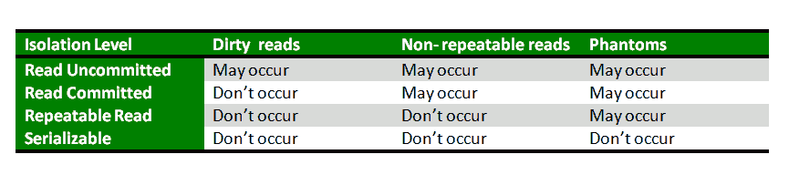

# 数据库管理系统中的事务隔离级别

> 原文:[https://www . geesforgeks . org/transaction-isolation-levels-DBMS/](https://www.geeksforgeeks.org/transaction-isolation-levels-dbms/)

**先决条件–**[数据库管理系统中的并发控制](https://www.geeksforgeeks.org/concurrency-control-introduction/)、[数据库管理系统中的酸性属性](https://www.geeksforgeeks.org/acid-properties-in-dbms/)

我们知道，为了保持数据库的一致性，它遵循 ACID 属性。在这四个属性(原子性、一致性、隔离性和持久性)中，隔离决定了事务完整性对其他用户和系统的可见性。这意味着一个事务应该以这样一种方式在系统中发生，即它是访问数据库系统中资源的唯一事务。
隔离级别定义事务必须与数据库系统中任何其他事务所做的数据修改隔离的程度。事务隔离级别由以下现象定义–

*   **脏读–**脏读是指事务读取尚未提交的数据的情况。例如，假设事务 1 更新一行并使其保持未提交状态，同时，事务 2 读取更新的行。如果事务 1 回滚更改，事务 2 将读取被认为从未存在过的数据。
*   **不可重复读取–**当事务读取同一行两次，每次获得不同的值时，就会发生不可重复读取。例如，假设事务 T1 读取数据。由于并发性，另一个事务 T2 更新相同的数据并提交，现在如果事务 T1 重新读取相同的数据，它将检索不同的值。
*   **幻影读取–**当执行两个相同的查询，但是两个查询检索的行不同时，就会出现幻影读取。例如，假设事务 T1 检索一组满足某些搜索条件的行。现在，事务 T2 生成一些符合事务 T1 搜索标准的新行。如果事务 T1 重新执行读取行的语句，它这次会获得一组不同的行。

基于这些现象，SQL 标准定义了四个隔离级别:

1.  **未提交读取–**未提交读取是最低隔离级别。在此级别，一个事务可能读取其他事务尚未提交的更改，从而允许脏读。在这个层次上，事务不是相互隔离的。
2.  **Read Committed–**此隔离级别保证任何数据读取都在读取时提交。因此，它不允许脏读。事务持有当前行的读或写锁，因此阻止其他事务读取、更新或删除它。
3.  **可重复读取–**这是最严格的隔离级别。事务在其引用的所有行上持有读锁，并在其插入、更新或删除的所有行上写入锁。由于其他事务不能读取、更新或删除这些行，因此它避免了不可重复的读取。
4.  **可序列化–**这是最高隔离级别。一个*可串行化的*执行保证是可串行化的。可串行化执行被定义为操作的执行，其中并发执行的事务看起来是串行执行的。

下表清楚地描述了隔离级别、读取现象和锁定之间的关系:

异常可串行化与可串行化不一样。也就是说，Serializable 计划应该没有所有三种现象类型是必要的，但还不够。

**参考资料–**
[隔离–维基百科](https://en.wikipedia.org/wiki/Isolation_(database_systems))
[事务隔离级别–docs . Microsoft](https://docs.microsoft.com/en-us/sql/odbc/reference/develop-app/transaction-isolation-levels)