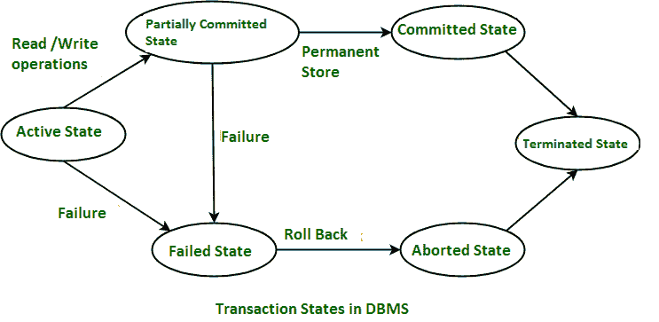

# 交易管理

> 原文:[https://www.geeksforgeeks.org/transaction-management/](https://www.geeksforgeeks.org/transaction-management/)

**事务在 [DBMS](https://www.geeksforgeeks.org/dbms/) :**
事务是用于执行一组逻辑工作的一组操作。事务通常意味着数据库中的数据已经改变。数据库管理系统的主要用途之一是保护用户的数据免受系统故障的影响。这是通过确保在崩溃后重新启动计算机时，所有数据都恢复到一致的状态来实现的。事务是数据库管理系统中用户程序的任何一次执行。多次执行同一个程序会产生多个事务。

**示例–**
从自动柜员机门厅提取现金的交易。

**操作集:**
考虑如下交易操作示例。

**示例-ATM 交易步骤。**

*   交易开始。
*   插入您的自动柜员机卡。
*   为您的交易选择语言。
*   选择储蓄账户选项。
*   输入您要提取的金额。
*   输入您的密码。
*   等待一段时间进行处理。
*   收下你的现金。
*   交易完成。

一个事务中可以执行三个操作，如下所示。

1.  读取/访问数据。
2.  写入/更改数据(W)。
3.  提交。

**示例–**
将 50₹从账户 a 转移到账户 b。最初 A= 500₹，B= 800₹.这些数据从硬盘被带到内存中。

```
R(A) -- 500     // Accessed from RAM.
A = A-50        // Deducting 50₹ from A.
W(A)--450       // Updated in RAM.
R(B) -- 800     // Accessed from RAM.
B=B+50          // 50₹ is added to B's Account.
W(B) --850      // Updated in RAM.
commit          // The data in RAM is taken back to Hard Disk.

```

**注–**
账户 a 的更新值= 450₹，账户 b 的更新值= 850₹.

提交前的所有指令都处于部分提交状态，并存储在内存中。当读取提交时，数据被完全接受并存储在硬盘中。

如果数据在提交之前在任何地方失败，我们必须返回并从头开始。我们不能从同一个状态继续下去。这就是所谓的回滚。

**交易管理的用途:**

*   数据库管理系统用于同时调度数据访问。这意味着用户可以从数据库中访问多个数据，而不会相互干扰。事务用于管理并发性。
*   它也用于满足酸性。
*   用于解决读/写冲突。
*   它用于实现可恢复性、可串行化和级联。
*   事务管理也用于并发控制协议和数据锁定。

**[事务状态](https://www.geeksforgeeks.org/transaction-states-in-dbms/) :**
事务可以使用 SQL 查询和 Server 实现。在下面给出的图表中，您可以看到事务状态是如何工作的。

[](https://media.geeksforgeeks.org/wp-content/uploads/20201101105449/Transaction_state.png)

交易状态

**使用交易的劣势:**

*   最终用户可能很难更改交易数据库中的信息。
*   我们需要始终回滚并从头开始，而不是从以前的状态继续。