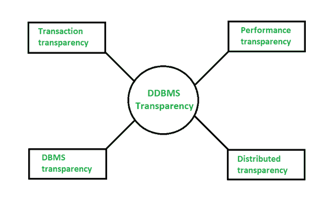

# 驾驶员侧车门模块系统中的透明度

> 原文:[https://www.geeksforgeeks.org/transparencies-in-ddbms/](https://www.geeksforgeeks.org/transparencies-in-ddbms/)

[**【分布式数据库管理系统】**](https://www.geeksforgeeks.org/distributed-database-system/) **:**
分布式数据库本质上是一个不局限于至少一个系统的数据库，它覆盖不同的站点，即在多台计算机上或通过计算机网络。分布式数据库系统存在于各种不共享物理组件的站点上。当全球不同用户必须访问特定数据库时，这可能是必需的。必须为用户这样管理它。就像一个单一的数据库。

**什么是透明？**
DDBMS 中的透明是指从系统向用户透明地分发信息。它有助于隐藏用户要实现的信息。比方说，在正常的数据库管理系统中，数据独立性是一种透明的形式，有助于向用户隐藏数据的定义&组织中的变化。但是，他们都有相同的总体目标。这意味着像使用集中式数据库一样使用分布式数据库。

在分布式数据库管理系统中，有以下四种类型的透明胶片

*   交易透明度
*   性能透明度
*   数据库管理系统透明度
*   分发透明度

分布式数据库管理系统中的透明度

1.  **事务透明度-**
    这种透明度确保所有分布式事务保持分布式数据库的完整性和规律性。此外，要理解的是，分发事务访问是存储在多个位置的数据。另一件需要注意的事情是，DDBMS 负责维护每个子事务的原子性(这里，我们的意思是要么整个事务直接发生，要么根本不发生)。由于使用了数据库管理系统的分片、分配和复制结构，因此非常复杂。

2.  **性能透明性-**
    这种透明性要求分布式数据库管理系统的工作方式如同集中式数据库管理系统一样。此外，系统的架构是分布式的，因此性能不应有任何下降。同样，一个分布式数据库管理系统必须有一个分布式查询处理器，它可以将一个数据请求映射到本地数据库的有序操作序列中。这需要考虑另一个复杂性，即数据库管理系统的碎片化、复制和分配结构。

3.  **DBMS 透明度-**
    该透明度仅适用于异构类型的 DDBMS(具有不同站点并使用不同操作系统、产品和数据模型的数据库)，因为它隐藏了本地 DBMS 可能不同的事实。这种透明度是最复杂的透明度之一，可以作为一种概括来使用。

4.  **分发透明-**
    分发透明帮助用户将数据库识别为单一事物或逻辑实体，如果一个 DDBMS 显示分发数据透明，那么用户不需要知道数据是碎片化的。
    分布透明度有 5 种类型，讨论如下

*   **碎片透明度-**
    在这种类型的透明度中，用户不必知道碎片数据，因此，这导致了数据库访问基于全局模式的原因。这几乎有点像 SQL 视图的用户，用户可能不知道他们使用的是表的视图，而不是表本身。
*   **位置透明度-**
    如果这种类型的透明度是由 DDBMS 提供的，那么用户有必要知道数据是如何被分段的，但是知道数据的位置不是必须的。
*   **复制透明-**
    在复制透明中，用户不知道片段的复制。复制透明性与并发透明性和故障透明性相关。每当用户修改数据项时，更新都会反映在表的副本中。然而，用户不应该知道这个操作。
*   **本地映射透明度-**
    在本地映射透明度中，用户需要定义片段名称和数据项的位置，同时考虑可能存在的任何重复。对于用户来说，这是一个更加困难和费时的查询。
*   **命名透明-**
    我们已经知道 DBMS 和 DDBMS 是集中式数据库系统的类型。这意味着该数据库中的每个项目必须由唯一的名称组成。这进一步意味着，分布式数据库管理系统必须确保没有两个站点正在创建同名的数据库对象。因此，要解决命名透明的问题，有两种方法，要么我们可以创建一个中央名称服务器来创建系统中对象的唯一名称，或者，不同的是，以创建者站点的标识符开始添加一个对象。