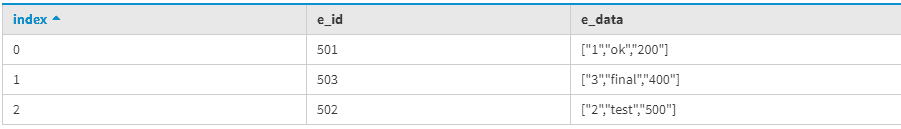
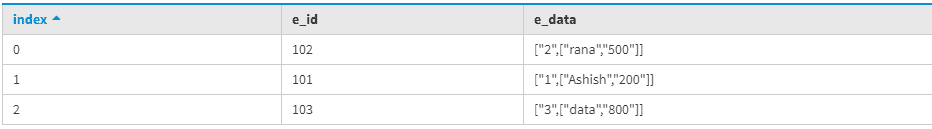

# 卡珊德拉中的元组类型

> 原文:[https://www.geeksforgeeks.org/tuple-type-in-cassandra/](https://www.geeksforgeeks.org/tuple-type-in-cassandra/)

在本文中，我们将讨论由[卡珊德拉查询语言](https://www.geeksforgeeks.org/additional-functions-in-cql-cassandra-query-language/)支持的元组数据类型，在其中我们可以根据需要轻松定义数据。它是[用户定义数据类型](https://www.geeksforgeeks.org/overview-of-user-defined-type-udt-in-cassandra/)的替代。

当我们需要容纳许多字段时，元组数据类型非常有用，我们最多可以容纳 32768 个字段。让我们用一个例子来理解元组数据类型。

在这里，我们首先要创建一个表，例如 Emp_data 是一个表名，E_id 是表的主键，E_data 字段是下面给定表中的元组类型。让我们来看看。

```
CREATE TABLE Emp_data (
  E_id int PRIMARY KEY,
  E_data tuple<int, text, int>
); 
```

现在，我们将使用以下 CQL 查询在 Emp_data 表中插入一些数据。

```
INSERT INTO Emp_data (E_id, E_data) 
VALUES(501, (1, 'ok', 200));

INSERT INTO Emp_data (E_id, E_data) 
VALUES(502, (2, 'test', 500));

INSERT INTO Emp_data (E_id, E_data) 
VALUES(503, (3, 'final', 400)); 
```

现在，为了查看输出 Emp_data 表，使用了以下 CQL 查询。

```
SELECT * FROM Emp_data; 
```

**输出:**



现在，为了应用过滤器，我们将在元组数据类型的 E_data 字段上创建[索引](https://www.geeksforgeeks.org/concept-of-indexing-in-apache-cassandra/)。

```
CREATE INDEX on Emp_data (E_data); 
```

我们可以在 where 子句中使用元组类型字段来过滤数据。

```
SELECT * 
FROM Emp_data 
WHERE E_data = (2, 'test', 500); 
```

**输出:**


元组类型也可以用于嵌套目的。我们将再次为嵌套目的创建一个新表。

```
CREATE TABLE nested_Emp_data
(
E_id int PRIMARY KEY, 
E_data tuple<int, tuple< text, int>> 
); 
```

现在，使用以下 CQL 查询将数据插入嵌套的 Emp 数据表。

```
INSERT INTO nested_Emp_data (E_id, E_data) 
VALUES (101, (1, ('Ashish', 200)));

INSERT INTO nested_Emp_data (E_id, E_data) 
VALUES (102, (2, ('rana', 500)));

INSERT INTO nested_Emp_data (E_id, E_data) 
VALUES (103, (3, ('data', 800))); 
```

要查看输出，请使用以下 CQL 查询。

```
select * 
from nested_Emp_data; 
```

