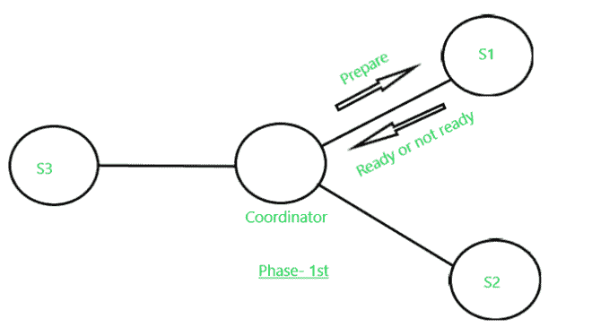
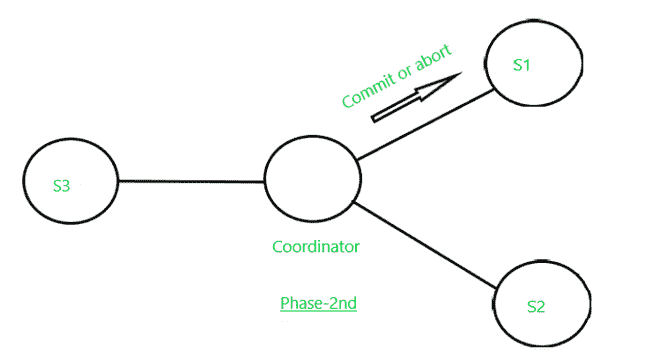

# 两阶段提交协议(分布式事务管理)

> 原文:[https://www . geesforgeks . org/两阶段-提交-协议-分布式-事务-管理/](https://www.geeksforgeeks.org/two-phase-commit-protocol-distributed-transaction-management/)

假设我们有一组杂货店，其中所有商店的负责人都想查询所有商店的可用消毒剂库存，以便将库存从一个商店转移到另一个商店，从而平衡所有商店的消毒剂库存数量。该任务通过单个交易 **T** 执行，即在 **n th** 商店的组件**TnT5，以及与经理所在的 **T 0** 相对应的商店 **S 0** 。由 **T** 执行的下列活动顺序如下:**

**a)** 交易组件 **( T ) T 0** 在总部(总公司)创建。

**b) T 0** 向所有商店发送消息，要求他们创建组件 **T i 。**

**c)** 每隔**TIT5【在店内】**I**执行一次查询，以发现可用消毒剂库存数量，并将该数量报告给 **T o 。****

**d)** 各门店收到指令，更新库存水平，并在需要时发货至其他门店。

**但是在这个过程的执行过程中，我们可能会面临一些问题:**

**1)** 原子性属性可能被违反，因为任何**商店(S n )** 可能被指示两次发送可能使数据库处于不一致状态的库存。为了确保原子性，属性事务**必须在所有站点提交，或者必须在所有站点中止。**

**2)** 但是**TnT5】店的系统可能会死机，来自**T0T9】的指令由于任何网络问题和任何其他原因**TnT13】都不会收到。那么问题来了，分布式事务运行时会发生什么，是中止还是提交？是否恢复？******

**<u>两阶段提交协议</u> :** 该协议设计的核心意图是解决上述问题，假设我们有多个分布式数据库，这些数据库从不同的服务器(站点)运行假设 **S 1 ，S 2 ，S 3 ，…。S n 。**其中每一个 **S i** 对所有相应的活动和转换进行单独的日志记录 **T** 也被分为子转换 **T 1 ，T 2 ，T 3 ，…。，** **T n** 和各 **T i** 被分配给 **S i 。**所有这些都由每个 **S i 的独立事务管理器维护。**我们指派任何人作为**协调员。**

**关于本协议需要考虑的几点:**

**a)** 在两阶段提交中，我们假设每个站点记录该站点的操作，但没有全局日志。

**b)****协调器(CI)**在确认分布式事务将中止还是提交方面起着至关重要的作用。

**c)** 在这个**协议中**消息在**协调器(C i )** 和其他**站点之间发送。**发送每条消息时，都会在每个发送站点记录其日志，以便在必要时进行恢复。

**本协议的两个阶段如下:**

**<u>一期</u>—**T5】

**a)首先，协调人(C i )** 将一个日志记录 **<准备 T >** 放在其现场的日志记录上。

**b)** 然后，**协调器(C i )** 向执行交易(T)的所有站点发送**准备 T** 消息。

**c)** 每个站点的事务管理器在收到此消息时**准备 T** 决定是提交还是中止其组件(部分)T。如果组件尚未完成其活动，站点可以延迟，但最终必须发送响应。

**d)** 如果站点不想提交，那么必须在**日志记录上写< no T >，**本地事务管理器发送消息**中止 T** 到 **C i 。**

**e)** 如果站点要提交，必须在日志记录上写 **< ready T >** ，本地事务管理器发送消息 **ready T** 给 **C i 。一旦 C i 处的**就绪 **T 消息被发送**后，除了**协调器(C i 之外，没有什么可以阻止它提交其部分**事务 T** 。**

**第一阶段的消息传递**

**<u>二期</u>—**T5】

**第二阶段开始于**从所有协同**执行事务 T**的站点接收到**协调器(C i 的响应中止 T 或提交 T。然而，有可能某些站点没有响应；它可能已关闭，或者已被网络断开。在这种情况下，在给出一个合适的超时时间后，它会将该站点视为已经发送了**中止测试**。交易的结果取决于以下几点:**

a)如果协调器从 T 的所有参与站点接收到**就绪 T** ，则它决定**提交 T** 。然后，协调器在其站点日志记录中写入 **<提交测试>** ，并向测试中涉及的所有站点发送消息**提交测试**

b)如果某个站点收到**提交 T** 消息，则该站点提交 T 的组件，并将其写入日志记录 **<提交 T >** 中。

c)如果站点收到**中止 T** 的消息，则中止 T 并写入日志记录 **<中止 T >。**

d)然而，如果协调器已经从一个或多个站点接收到**中止 T** ，则它在其站点记录 **<中止 T >** ，然后将**中止 T** 消息发送到事务 T 中涉及的所有站点

**第二阶段消息传递**

**T1】劣势:T3**

**a)** 两阶段提交协议的主要缺点是当协调器站点故障可能导致阻塞时，因此提交或中止**事务(T)** 的决定可能必须推迟，直到协调器恢复。

**b) <u>阻塞问题</u> :** 考虑一个场景，如果一个**事务(T)** 持有活动站点数据项的锁，但是在执行过程中，如果协调器出现故障，并且活动站点除了 **<之外没有保留额外的日志记录，则像 **<一样重新读取 T >** 中止>** 或 **<提交>。**所以，就变得无法确定做出了什么决定(是否 **<提交> / <中止>** )。因此，在这种情况下，最终决定被延迟，直到**协调器**被恢复或修复。在某些情况下，这可能需要一天或很长时间才能恢复，在此期间，锁定的数据项对于其他**事务仍然不可访问(T i )。**这个问题被称为**阻塞问题。**