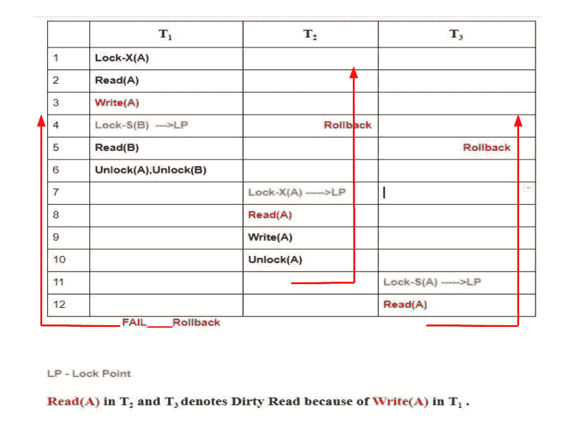

# 两相锁定协议

> 原文:[https://www.geeksforgeeks.org/two-phase-locking-protocol/](https://www.geeksforgeeks.org/two-phase-locking-protocol/)

我们已经简要讨论了[第一类并发控制协议](https://www.geeksforgeeks.org/dbms-concurrency-control-protocols-lock-based-protocol/)，即基于锁的协议。

现在，回想我们上次停止的地方，有两种类型的锁可用**共享 S(a)** 和**独占 X(a)** 。实现这个没有任何限制的锁系统给了我们简单的基于锁的协议(或者*二进制锁*，但是它有它自己的缺点，它们确实**不能保证可串行化**。计划可能遵循前面的规则，但可能会导致不可序列化的计划。

为了保证可串行化，我们必须遵循一些附加协议*，涉及锁定和解锁操作*在每个事务中的定位。这就是两相锁定(2-PL)的概念出现的地方，2-PL 确保了可串行化。现在，让我们深入挖掘！

### 两相锁定–

如果锁定和解锁可以分两个阶段完成，则称事务遵循两阶段锁定协议。

1.  **生长阶段:**可以获取数据项上的新锁，但不能释放。
2.  **收缩阶段:**可以释放现有锁，但不能获取新锁。

**注意–**如果允许锁转换，那么在生长阶段允许锁升级(从 S(a)到 X(a))，在收缩阶段必须进行锁降级(从 X(a)到 S(a))。

让我们看看一个实现 2-PL 的事务。

<figure class="table">

|   | T <sub>1</sub> | T <sub>2</sub> |
| one | 锁-安全(A) |   |
| Two |   | 锁-安全(A) |
| three | 锁-十(乙) |   |
| four | ……. | …… |
| five | 解锁(一) |   |
| six |   | 锁定-X(C) |
| seven | 解锁(乙) |   |
| eight |   | 解锁(一) |
| nine |   | 解锁(丙) |
| Ten | ……. | …… |

这只是一个框架事务，展示了解锁和锁定如何与 2-PL 一起工作。注:
**交易 T <sub>1</sub>** :

*   成长阶段从步骤 1-3 开始。
*   收缩阶段从步骤 5-7 开始。
*   锁定点在 3

**交易 T<sub>2</sub>T3:**

*   成长阶段从步骤 2-6 开始。
*   收缩阶段从步骤 8-9 开始。
*   6 点锁定点

嘿，等等！
什么是**锁定点？**成长阶段结束的时间点，即当事务获得继续工作所需的最终锁时。现在看看时间表，你一定会明白的。

我说过 2-PL 保证了可串行化，但是 2-PL 还是有一些缺点。让我们来看看缺点:

*   [级联回滚](https://www.geeksforgeeks.org/dbms-recoverability-of-schedules/)在 2-PL 下是可以的。
*   [死锁](https://www.geeksforgeeks.org/deadlock-in-dbms/)和[饥饿](https://www.geeksforgeeks.org/starvation-in-dbms/)是可能的。

**2-PL 中的级联回滚–**
让我们看看下面的时间表:



花点时间分析一下时间表。是的，你是对的，因为分别在第 8 行和第 12 行的 T <sub>2</sub> 和 T <sub>3</sub> 中的脏读，当 T <sub>1</sub> 失败时，我们也要回滚其他的。因此，**级联回滚在 2-PL 中是可能的。**我举了骨架时间表作为例子，因为保持简单的时候很容易理解。当用具有许多变量的实时事务问题来解释时，它变得非常复杂。

**2-PL 中的死锁–**
考虑一下这个简单的例子，就会很容易理解。假设我们有两个交易 T <sub>1</sub> 和 T <sub>2</sub> 。

```
Schedule:   Lock-X1(A)   Lock-X2(B)  Lock-X1(B)  Lock-X2(A)
```

绘制优先图，您可以检测到循环。所以死锁在 2-PL 中也是可能的。

两阶段锁定还可能会限制计划中发生的并发量，因为事务在使用某个项目后可能无法释放它。这可能是因为协议和其他限制，我们可能会把时间表，以确保可串行化，死锁自由，以及其他因素。这是我们必须付出的代价，以确保可序列化性和其他因素，因此它可以被视为并发性和维护 ACID 属性之间的一个交易。

上述类型的 2-PL 称为**基本 2PL** 。综上所述，它保证了冲突可串行化，但是 ***没有*** 防止级联回滚和死锁。此外，我们将研究其他三种类型的 2PL，严格的 2PL，保守的 2PL 和严格的 2PL。

**GATE 相关问题:**

1.  [GATE CS 2016-2 |第 61 题](https://www.geeksforgeeks.org/gate-gate-cs-2016-set-2-question-61/)
2.  [GATE CS 1999 |问题 31](https://www.geeksforgeeks.org/gate-gate-cs-1999-question-31/)

</figure>