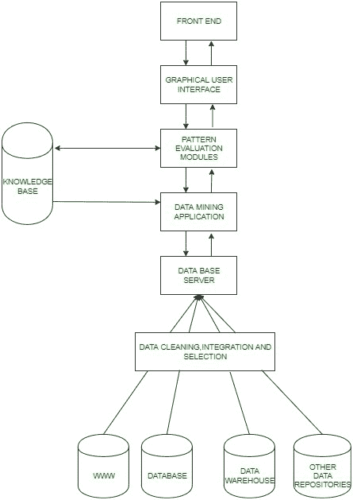

# 数据挖掘架构的类型和部分

> 原文:[https://www . geesforgeks . org/type-and-part-of-data-mining-architecture/](https://www.geeksforgeeks.org/types-and-part-of-data-mining-architecture/)

[数据挖掘](https://www.geeksforgeeks.org/data-mining/)是指从已经收集的数据中**检测和提取**新模式。数据挖掘是统计和计算机科学领域的融合，旨在发现难以置信的大数据集中的模式，然后将它们转换成可理解的结构供以后使用。

**数据挖掘架构:**

**基本工作:**

1.  这一切都是从用户提出某些数据挖掘请求开始的，然后这些请求被发送到数据挖掘引擎进行模式评估。
2.  这些应用程序试图使用已经存在的数据库找到查询的解决方案。
3.  然后提取的元数据被发送到数据挖掘引擎进行适当的分析，数据挖掘引擎有时会与模式评估模块交互以确定结果。
4.  然后，使用合适的接口，以易于理解的方式将该结果发送到前端。

数据挖掘体系结构部分的详细描述如下所示:

1.  **数据源:**
    数据库、[万维网(WWW)](https://www.geeksforgeeks.org/world-wide-web-www/) 和[数据仓库](https://www.geeksforgeeks.org/data-warehousing/)是数据源的一部分。这些来源中的数据可能是纯文本、电子表格或照片或视频等其他形式的媒体。万维网是最大的数据来源之一。
2.  **数据库服务器:**
    数据库服务器包含准备处理的实际数据。它根据用户的请求执行处理数据检索的任务。
3.  **数据挖掘引擎:**
    它是数据挖掘架构的核心组件之一，执行各种数据挖掘技术，如关联、分类、表征、聚类、预测等。
4.  **模式评估模块:**
    它们负责在数据中寻找感兴趣的模式，有时它们还与数据库服务器交互，以产生用户请求的结果。
5.  **图形用户界面:**
    由于用户无法完全理解数据挖掘过程的复杂性，因此图形用户界面有助于用户与数据挖掘系统进行有效沟通。
6.  **知识库:**
    知识库是数据挖掘引擎的重要组成部分，对于指导结果模式的搜索相当有益。数据挖掘引擎有时也可能从知识库中获取输入。该知识库可能包含来自用户体验的数据。知识库的目标是使结果更加准确和可靠。

**数据挖掘架构的类型:**

1.  **无耦合:**
    无耦合数据挖掘架构从特定数据源检索数据。它不使用数据库来检索数据，否则这是一种非常有效和准确的方法。数据挖掘的无耦合架构很差，仅用于执行非常简单的数据挖掘过程。
2.  **松耦合:**
    在松耦合架构中，数据挖掘系统从数据库中检索数据，并将数据存储在这些系统中。这种挖掘是针对基于内存的数据挖掘架构。
3.  **半紧密耦合:**
    它倾向于使用数据仓库系统的各种有利特性。它包括排序、索引、聚合。在这种体系结构中，中间结果可以存储在数据库中，以获得更好的性能。
4.  **紧耦合:**
    在这个架构中，数据仓库被认为是其最重要的组件之一，其特征被用于执行数据挖掘任务。该体系结构提供了可扩展性、性能和集成信息

**数据挖掘的优势:**

*   通过准确预测未来趋势，帮助防范未来的对手。
*   有助于做出重要决定。
*   将数据压缩成有价值的信息。
*   提供新趋势和意想不到的模式。
*   有助于分析庞大的数据集。
*   帮助公司寻找、吸引和留住客户。
*   帮助公司改善与客户的关系。
*   帮助公司根据某一产品的受欢迎程度优化生产，从而为公司节省成本。

**数据挖掘的缺点:**

*   过度的工作强度需要高效的团队和员工培训。
*   大量投资的要求也可以被认为是一个问题，因为有时数据收集会消耗许多资源，而这些资源的成本很高。
*   缺乏安全性也可能使数据面临巨大风险，因为数据可能包含私人客户的详细信息。
*   不准确的数据可能导致错误的输出。
*   庞大的数据库很难管理。