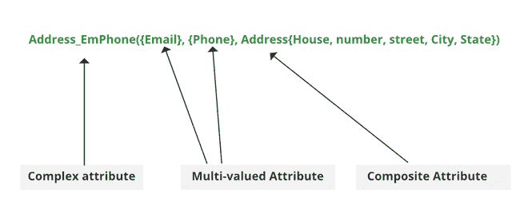

# ER 模型中的属性类型

> 原文:[https://www . geesforgeks . org/type-of-attributes-in-er-model/](https://www.geeksforgeeks.org/types-of-attributes-in-er-model/)

先决条件–[引入 ER 模型](https://www.geeksforgeeks.org/introduction-of-er-model/)

属性是实体的属性或特征。一个实体可以包含任意数量的属性。其中一个属性被认为是主键。在实体-关系模型中，属性以椭圆形表示。

*示例*:学生有姓名、年龄、卷号等属性。为了唯一地识别学生，我们使用主键作为卷号，因为它不重复。属性还可以细分为另一组属性。

有五种这样的属性类型:简单、复合、单值、多值和派生属性。还有一个属性是它们的，即复杂属性，这是很少使用的属性。

### **简单属性:**

不能进一步细分为组件的属性是简单属性。
**例:**学生的学号，员工的身份证号。

### **复合属性:**

可以拆分成组件的属性是复合属性。

**例:**地址可以进一步拆分为门牌号、门牌号、城市、州、国家、pin 码，姓名也可以拆分为名中名、姓。

### **单值属性:**

每个实体实例只占用一个值的属性是单值属性。

**例:**学生的年龄。

### **多值属性:**

为每个实体实例占用多个值的属性是多值属性。

**例:**学生电话:座机和手机。

### **派生属性:**

可以从其他属性派生的属性是派生属性。

**举例:**一个学生的总分和平均分。

### **复杂属性:**

那些可以由复合属性和多值属性嵌套而成的属性称为“*复杂属性*”。这些属性很少在数据库管理系统中使用。这就是它们不那么受欢迎的原因。

#### **表示:**

复杂属性是两个或多个复合和多值属性的嵌套。因此，这些多值和复合属性被称为复杂属性的“组件”。

这些组件分组在括号“()”和花括号“{ }”之间的多值属性之间，组件用逗号“，”分隔。

例如 **:** 让我们考虑一个人有多个电话号码、电子邮件和一个地址。

这里，电话号码和电子邮件是多值属性的示例，地址是复合属性的示例，因为它可以分为门牌号、街道、城市和州。

复杂属性

#### **组件:**

电子邮件、电话号码、地址(全部用逗号分隔，多值组件用大括号表示)。

**复杂属性:** Address_EmPhone(可以选择任意名称)。