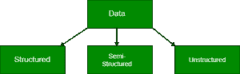
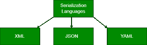

# 大数据类型

> 原文:[https://www.geeksforgeeks.org/types-of-big-data/](https://www.geeksforgeeks.org/types-of-big-data/)

用户每天产生 250 亿字节的数据。Statista 的预测表明，到 2021 年底，互联网将产生 74 兆字节(74 万亿千兆字节)的数据。管理如此空洞且常年的数据外包越来越困难。因此，为了管理如此庞大复杂的数据，大数据应运而生，它涉及到将庞大复杂的数据提取为传统方法无法提取或分析的有意义的数据。

所有数据不能以相同的方式存储。在确定数据类型后，可以准确评估数据存储方法。像微软 Azure 这样的云服务，是存储各种数据的一站式目的地；blobs、队列、文件、表、磁盘和应用程序数据。然而，即使在云中，也有特殊的服务来处理特定的数据子类别。
*例如*，Azure SQL 和 Azure Cosmos DB 等 Azure 云服务有助于处理和管理种类稀少的数据。

应用程序数据是由应用程序创建、读取、更新、删除或处理的数据。这些数据可以通过网络应用程序、安卓应用程序、iOS 应用程序或任何其他应用程序生成。由于所使用的数据种类多种多样，因此确定存储方法有点微妙。

## 大数据的类型



### 结构数据

结构化数据可以粗略地定义为驻留在记录内固定字段中的数据。它受某个模式的约束，因此所有数据都有相同的属性集。结构化数据也称为关系数据。它被拆分成多个表，通过创建一条记录来描述一个实体，从而增强数据的完整性。关系是通过表约束的应用来实现的。

需要一种*结构化查询语言(SQL)* 来将数据集合在一起。结构化数据易于输入、查询和分析。所有数据都遵循相同的格式。然而，强制一个一致的结构也意味着数据的任何更改都太难了，因为每个记录都必须更新以符合新的结构。*结构化数据的示例*包括数字、日期、字符串等。电子商务网站的业务数据可以认为是结构化数据。

<figure class="table">

| 名字 | 班级 | 部分 | 卷号 | 级别 |
| --- | --- | --- | --- | --- |
| 极客 1 | Eleven | A | one | A |
| 极客 2 | Eleven | A | Two | B |
| 极客 3 | Eleven | A | three | A |

#### 结构化数据的缺点

1.  结构化数据只能在预定义功能的情况下使用。这意味着结构化数据的灵活性有限，只适用于某些特定的用例。
2.  结构化数据存储在具有严格约束和明确模式的数据仓库中。需求的任何变化都意味着更新所有的结构化数据以满足新的需求。就资源和时间管理而言，这是一个巨大的缺点。

### 半结构化数据

半结构化数据不受任何用于数据存储和处理的严格模式的约束。数据不是关系格式，也没有像电子表格那样整齐地组织成行和列。但是，有一些特性，如键值对，有助于区分不同的实体。由于半结构化数据不需要结构化查询语言，所以一般称为 *NoSQL 数据*。数据序列化语言用于跨系统交换半结构化数据，这些系统甚至可能具有不同的底层基础架构。

数据以纯文本的形式创建，因此可以使用不同的文本编辑工具来得出有价值的见解。由于格式简单，数据序列化读取器可以在处理资源和带宽有限的硬件上实现。

#### 数据序列化语言

软件开发人员使用**序列化语言**将基于内存的数据写入文件、传输、存储和解析。发送方和接收方不需要知道另一个系统。只要使用相同的序列化语言，两个系统都能轻松理解数据。有三种主要使用的序列化语言。



**1。XML**–XML 代表*可扩展标记语言*。它是一种基于文本的标记语言，旨在存储和传输数据。几乎在所有流行的开发平台中都可以找到 XML 解析器。它是人类和机器可读的。XML 有明确的模式、转换和显示标准。它是自我描述的。下面是一个用 XML 描述程序员细节的例子。

## 可扩展标记语言

```
<ProgrammerDetails>
    <FirstName>Jane</FirstName>
    <LastName>Doe</LastName>
    <CodingPlatforms>
        <CodingPlatform Type="Fav">GeeksforGeeks</CodingPlatform>
        <CodingPlatform Type="2ndFav">Code4Eva!</CodingPlatform>
        <CodingPlatform Type="3rdFav">CodeisLife</CodingPlatform>
   </CodingPlatforms>
</ProgrammerDetails>

<!--The 2ndFav and 3rdFav Coding Platforms are imaginative because Geeksforgeeks is the best!-->
```

</figure>