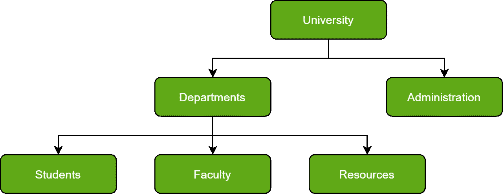
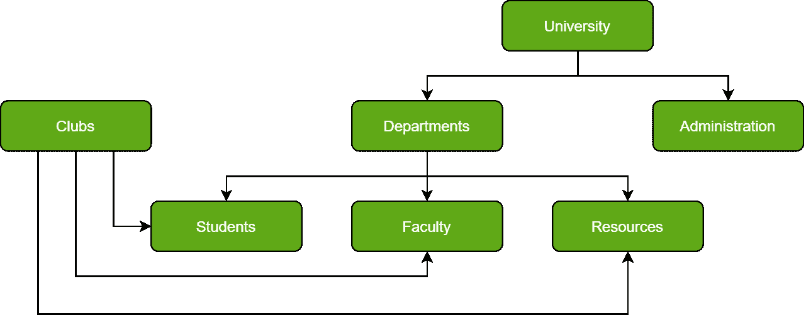
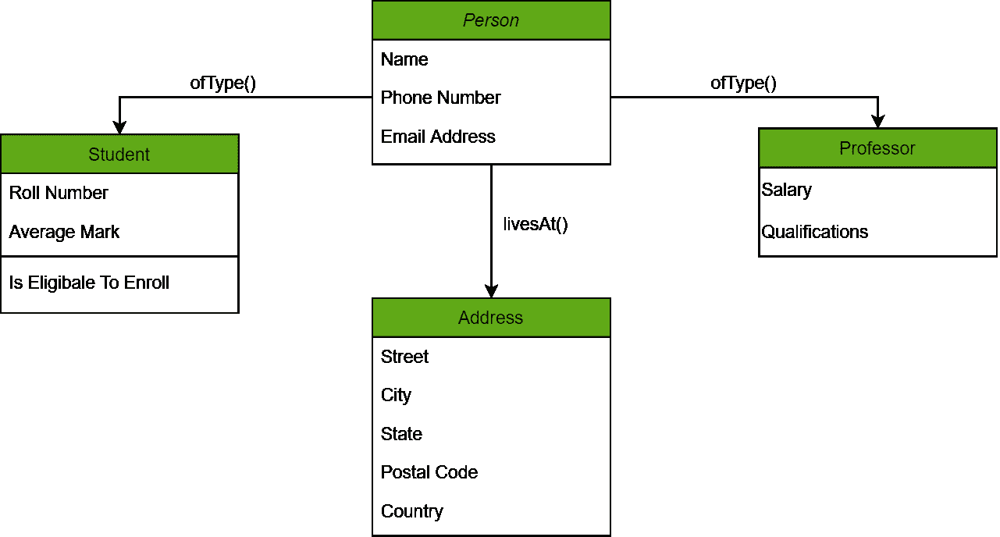
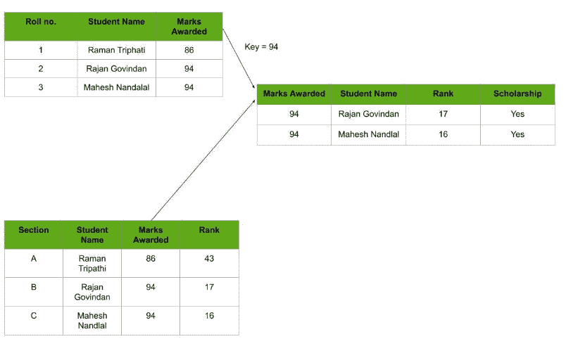

# 数据库类型

> 原文:[https://www.geeksforgeeks.org/types-of-databases/](https://www.geeksforgeeks.org/types-of-databases/)

快速回顾一下当前存储与多个相关或不相关类别相关的大量数据的需求，就会发现数据库必须在它们的设计用途上非常有效。

这不仅是因为我们正在处理的数据量不断被修改或修正；它的动态不再是唯一感兴趣的。这是因为每个人都赋予了他们社会价值:数据库是客户生活方式或企业价值的支柱。

设计不同类型的数据库是它们为用户提供的功能的核心。因为数据是一个动态的实体，所以它的存储方式变化很大。这也是公司根据自己的需求设计自己的数据库类型的原因。

在本文中，我们将研究最常用的数据库。它们是:

*   分级数据库
*   网络数据库
*   面向对象数据库
*   关系数据库
*   NoSQL 数据库

**1。** [**【分层数据库】**](https://practice.geeksforgeeks.org/problems/compare-a-hierarchical-and-network-database-model) **:**
正如在任何分层结构中一样，该数据库遵循按等级或级别分类的数据的进展，其中数据基于公共链接点进行分类。因此，两个数据实体的等级会较低，而共性会呈现较高的等级。参考下图:

请注意，院系和行政部门完全不同，但却属于大学的范畴。它们是形成这种层次结构的元素。

另一种观点建议可视化以父子关系组织的数据，在添加多个数据元素后，这将类似于一棵树。子记录使用字段链接到父记录，因此允许父记录有多个子记录。然而，反之亦然是不可能的。

请注意，由于这样的结构，分层数据库不容易销售；添加数据元素需要在数据库中进行冗长的遍历。

**2。网络数据库:**
通俗地说，网络数据库是一个分层数据库，但有一个重大的调整。子记录可以自由地与多个父记录相关联。因此，可以观察到由多线程链接的数据库文件组成的网络。请注意“学生”、“教师”和“资源”元素都有双亲记录，即“部门”和“俱乐部”。

当然，一个复杂的框架，网络数据库更能代表双向关系。此外，概念上的简单有利于使用更简单的数据库管理语言。

缺点在于由于其复杂性而不能改变结构，并且高度依赖于结构。

**3。** 【面向对象】 [**【数据库】**](https://www.geeksforgeeks.org/definition-and-overview-of-odbms/) **:**
那些熟悉面向对象编程范式的人将能够轻松地与这种数据库模型相关联。存储在数据库中的信息能够被表示为对象，该对象作为数据库模型的实例进行响应。因此，可以毫无困难地引用和调用该对象。因此，数据库的工作量大大减少。

在上图中，我们使用方法将不同的对象相互链接起来；人们可以使用 livesAt()方法获取该人(由 Person 对象表示)的地址。此外，这些对象的属性实际上是需要在数据库中定义的数据元素。

这种模型的一个例子是伯克利数据库软件库，它使用相同的概念背景对嵌入式数据库的数据库查询提供快速高效的响应。

**4。** [**关系数据库**](https://www.geeksforgeeks.org/relational-model-in-dbms/) **:**
被认为是所有数据库中最成熟的，这些数据库及其管理系统在生产线上处于领先地位。在这个数据库中，每条信息都与其他信息有关系。这是因为数据库中的每个数据值都具有记录形式的唯一标识。

请注意，所有数据都在该模型中制成表格。因此，数据库中的每一行数据都使用主键与另一行链接。同样，每个表都使用外键与另一个表链接。

参考下图，注意“键”的概念是如何用来链接两个表的。

由于引入了表来组织数据，它变得非常流行。因此，它们被广泛集成到 Web-Ap 接口中，作为用户数据的理想存储库。使它更有趣的是易于掌握，因为用于与数据库交互的语言很简单(在这种情况下是 SQL)并且容易理解。

同样值得注意的是，在关系数据库中，与层次数据库相比，扩展和遍历数据是一项非常轻的任务。

**5。**[**【NoSQL 数据库】**](https://www.geeksforgeeks.org/introduction-to-nosql/)**:**
NoSQL 最初指的是非 SQL 或非关系数据库，是一种提供数据存储和检索机制的数据库。这些数据是用关系数据库中使用的表格关系以外的方式建模的。

NoSQL 数据库包括简单的设计、更简单的机器集群水平扩展以及对可用性的更好控制。NoSQL 数据库使用的数据结构不同于关系数据库中默认使用的数据结构，这使得 NoSQL 的一些操作更快。给定 NoSQL 数据库的适用性取决于它应该解决的问题。NoSQL 数据库使用的数据结构有时也被认为比关系数据库表更灵活。

MongoDB 属于基于 NoSQL 文档的数据库。

**NoSQL 的优势–**
使用 MongoDB、Cassandra 等 NoSQL 数据库有很多优势。主要优点是高可扩展性和高可用性。

**NoSQL 的劣势–**
NoSQL 有以下劣势。

*   NoSQL 是一个开源数据库。
*   图形用户界面不可用
*   备份是一些 NoSQL 数据库(如 MongoDB)的弱点。
*   大文件尺寸。

这些只是数据库结构的几种类型，它们代表了行业中广泛使用的基本概念。然而，如前所述，客户倾向于专注于创建适合自己需求的数据库；以展示基于其蓝图的可变功能的模式存储数据。因此，数据库和数据库管理系统的发展空间是光明的。