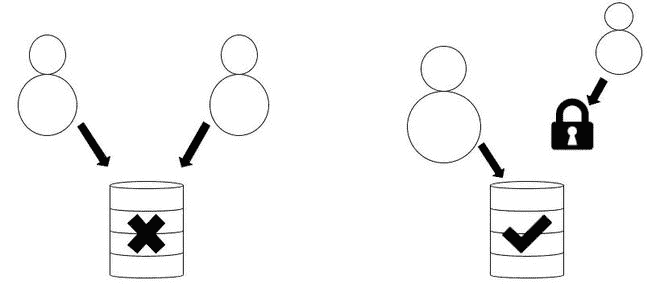
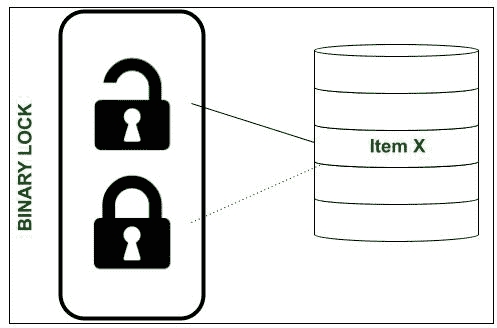
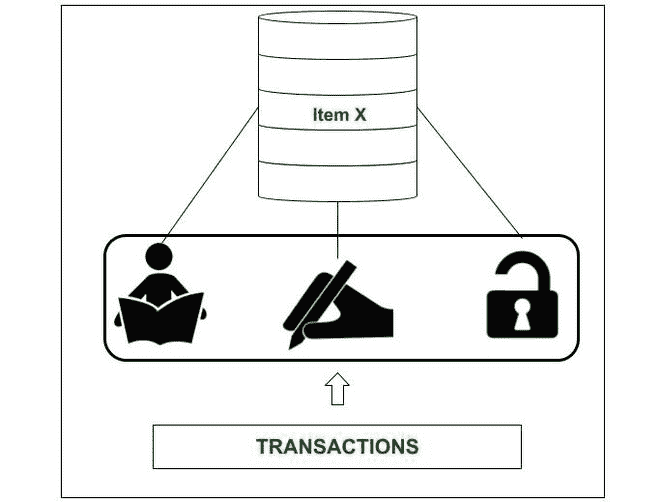
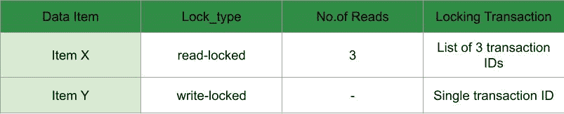
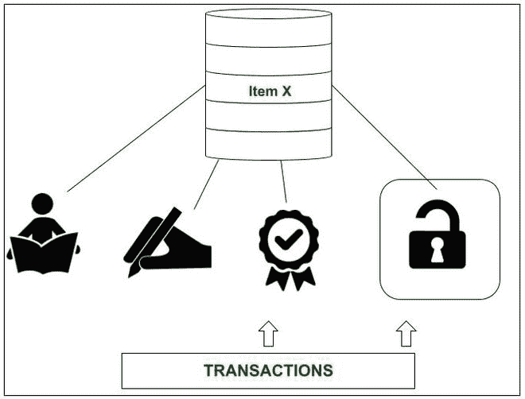
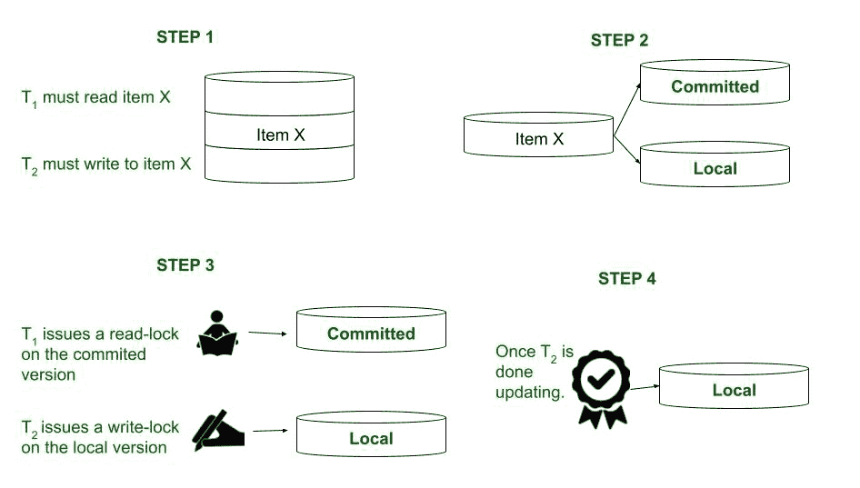
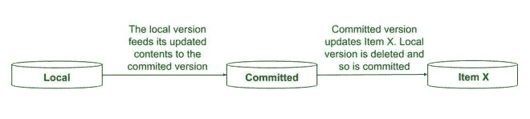

# 并发控制中的锁类型

> 原文:[https://www . geesforgeks . org/并发控制锁的类型/](https://www.geeksforgeeks.org/types-of-locks-in-concurrency-control/)

对确保流畅功能和高效运行时服务器的商业需求，使得数据库设计人员非常有必要设计出系统和代码，巧妙地避免多用户事务中的任何类型的不一致，如果不是怀疑读重、写重和所有此类商业数据库中的内存管理标准的话。本文将充分介绍为数据库开发人员社区提出和实现的经典锁定体系结构。

我们应该尽量忽略一般的锁定技术，即基于数据库的[粒度](https://www.geeksforgeeks.org/multiple-granularity-locking-in-dbms/)或级别。这就是为什么我们在考虑锁类型的可行性时可能会单独处理它。

**定义:**
锁的正式定义如下:

> 锁是分配给任何数据项的变量，以便跟踪该数据项的状态，从而确保并发事务期间的隔离和不干扰。

基本上，数据库锁的存在是为了防止两个或多个数据库用户同时对同一数据项进行任何更改。因此，将这种技术解释为同步访问的一种方式是正确的，这与其他协议集(如使用时间戳和多版本时间戳的协议)形成了鲜明的对比。用外行人的话来说，这可以进一步简化为放在数据项上的隐喻性的“锁”，使得没有其他用户可以解锁执行任何更新查询的能力。



情况 1:不允许同时访问事务。案例 2:锁定其他事务是可行的

在上面描述的情况 2 中，如果右边的用户/会话尝试更新，将会遇到**锁定等待**状态，或者是**停止**状态，直到对数据项的访问被解锁。在某些情况下，如果停顿超过时间限制，会话将被终止并返回一条错误语句。

我们将看看这些锁作为事务并发解决方案在行业中引入的多种方式。

**二进制锁:**
记住锁本质上是一个保存值的变量。二进制锁是一个只能保存两个可能值的变量，即 **1(描述锁定状态)**或 **0(描述解锁状态)**。该锁通常与数据库中的每个数据项相关联(可能在表级、行级甚至整个数据库级)。



如果项目 X 被解锁，那么相应的对象锁(X)将返回值 0。因此，当用户/会话开始更新项目 X 的内容时，锁(X)被设置为值 1。因此，在更新查询持续期间，任何其他用户都不能访问项目 X，甚至不能对其进行读取或写入！

有两种操作用于实现二进制锁。它们是 lock_data()和 unlock_data()。下面讨论了算法(由于数据库管理系统脚本的多样性，只考虑了算法):

**锁定操作:**

```
lock_data(X):
label:    if lock(X) == 0
        {
            then lock(X) = 1;
        }
        else //when lock(X) == 1 or item X is locked
        {            
            wait (until item is unlocked or lock(X)=0) //wait for the user to finish the update query
            go to label
        }
```

请注意，'**标签:** ' 字面上是该行的标签，可以在后面的步骤中引用该标签来转移执行。else 块中的“等待”命令基本上将所有其他想要访问 X 的事务放在一个队列中。由于它监视或保持其他事务被调度，直到对项目的访问被解锁，所以它通常被认为在 lock_data(X)操作之外，即在外部定义。

**解锁操作:**

```
unlock_data(X):
    lock(X) = 0 //we unlock access to item X
    if (transactions are in queue)
    {    
        then grant access or 'wake' the next transaction in line;
    }
```

**二进制锁的优点:**

*   它们易于实现，因为它们实际上是互斥的，并且完美地建立了隔离。
*   二进制锁对系统的要求较低，因为系统必须只保留锁定项目的记录。该系统是**锁管理器子系统**，这是当今所有数据库管理系统的一个特征。

**二进制锁的缺点:**

*   二进制锁的限制性很强。
*   它们甚至不允许阅读第十项的内容。因此，它们不被商业使用。

**共享锁或排他锁:**
管理这些类型锁的动机是二进制锁的限制性。这里我们看一下允许其他事务进行读查询的锁，因为**读查询是不冲突的**。但是，如果一个事务要求对项目 X 进行写查询，那么该事务必须被授予对项目 X 的独占访问权。因此，我们需要一种**多模式锁**，这就是共享/独占锁。它们也被称为读/写锁。

与二进制锁不同，读/写锁可以设置为 3 个值，即**共享**、**独占**或**解锁**。因此，我们的锁，即锁(X)，可能反映以下任一值:

1.  **READ-LOCKED–**
    如果事务只需要读取项目 X 的内容，并且锁只允许读取。这也被称为*共享锁*。
2.  **WRITE-LOCKED–**
    如果事务需要更新或写入项目 X，锁必须限制所有其他事务，并提供对当前事务的独占访问。因此，这些锁也被称为*专属锁*。
3.  **解锁–**
    一旦事务完成了读取或更新操作，就不会持有锁，数据项也会解锁。在这种状态下，任何排队的事务都可以访问该项。



共享/排他锁可以保持三种状态中的任何一种。

实现这些锁的最流行的方法是引入一个锁表，它跟踪数据项上的读锁数量和不同项上的写锁事务。该表描述如下。



请注意，如果一个项目是写锁定的，它在逻辑上应该没有读操作，因为它现在是独占的。因此，“锁定事务”列只保存一个值——当前事务的事务标识。如果一个项目被读锁定，它被多个事务共享，因此，“锁定事务”列列出了所有事务的事务标识。由于锁可以保持 3 种状态，因此必须有 3 个操作来执行对这些状态的更改。这些措施如下:

**读锁定操作–**

```
read_lock(X):
label:  if lock(X) = "unlocked"
        {
            then lock(X) = "read-locked";
            no_of_reads = 1; //since only the first transaction in queue is now able to read item X
        }
        else if lock(X) = "read-locked"
        {
            then no_of_reads +=1; //simply increment as a new transaction is now reading the item X
        }
        else //lock(X) write-locked
        {
            wait (until lock(X) is "unlocked");//transactions observe a LOCK WAIT during this time
            go to label;
        }
```

当锁(X)被设置为“写锁定”(在最后的 else 子句中)时，该项目被事务独占访问。为了让其他事务访问它， **LOCK WAIT** 必须结束(更新过程必须完成)并且 lock(X) =“解锁”。这是我们在下一行等待的。

**写锁定操作–**

```
write_lock(X):
label: if lock(X) = "unlocked"
        {
            then lock(X) = "write-locked"
        }
        else //if a read-lock is issued to item X
        {
            wait (until lock(X) is "unlocked"); //so that the lock manager may wake up the next transaction
            go to label;
        }
```

如果一个项目被解锁，我们只需对其进行写锁定，以授予对当前事务的独占访问权限。现在，锁管理器系统必须将所有其他事务放入队列中。如果项目处于读锁定状态，则不能直接发出写锁定。必须先解锁该项目，然后才能对其进行写锁定。这样，锁管理器系统也唤醒排队的事务。

**解锁操作–**

```
unlock(X):
    if lock(X) = "write-locked"
    {
        then lock(X) = "unlocked";
        //the transactions in queue, if any, may now access item X in the manner they demand
    }
    else if lock(X) = "read-locked"
    {
        then
            no_of_reads-=1; //the transaction is done reading.
            if no_of_reads == 0 //no transactions reading the item
            {
                lock(X) = "unlocked";
                //transactions in queue, if any, may now access item X in the manner they demand
            }
    }
```

第一种情况很简单。但是，在第二种情况下，我们必须检查不再有共享或读取项目 X 的当前事务的条件。如果项目 X 正在被读取，我们将保持这种情况，并简单地减少 _of_reads，因为最后一个事务已经终止。这里的要点是，只有在以下情况下，项目才可以“解锁”:

*   “写”操作终止或完成
*   所有“读取”操作终止或完成

以下是共享/独占锁必须遵守的一些规则:

1.  事务 **T** 必须在所有读写操作完成后发出解锁(X)操作。
2.  事务 **T** 不能对已经向自身发出读锁或写锁的项目发出读锁(X)或写锁(X)操作。
3.  事务 **T** 不允许发出解锁(X)操作，除非已经发出读锁(X)或写锁(X)操作。

当我们放宽这些规则时，可以引入一个交换项目锁状态的新维度。这已经在下面的文章中解释过了:[DBMS 中基于锁的并发控制协议](https://www.geeksforgeeks.org/lock-based-concurrency-control-protocol-in-dbms/)

**共享/排他锁的缺点:**

*   不保证计划本身的可串行化。必须遵循单独的协议来确保这一点。
*   商业上未针对快速交易进行优化；由于锁争用问题，这不是最佳解决方案。
*   性能开销不可忽略。

**认证锁:**
引入认证锁背后的动机是前面提到的锁未能提供一个高效且有前途的架构，该架构不会影响处理事务的速度。这里我们简单看一下**多模式** **锁定**方案的一种形式，该方案允许锁的特征在于 **3 锁定**状态和 **1 解锁**状态。



事务可以发出 3 种锁定状态或 1 种解锁状态中的任何一种

一个项目可能发布的状态是:

1.  **读锁定**–
    与前面解释的共享/排他锁的读锁定状态相同
2.  **写锁定**–
    与前面解释的共享/排他锁的写锁定状态相同
3.  **认证锁定**–
    这是一把专属锁。这在两个不同的事务必须分别对项目 x 进行读写时使用。为了实现这一点，创建了数据项目的**提交的**和**本地**版本。提交的版本由所有具有发给 X 的读锁的事务使用。只有当 T 获得写锁时，T 才访问 X 的本地版本。一旦 T 对项 X 执行了写或更新操作，T 必须获得认证锁，以便数据项 X 的提交版本可以被更新到本地版本的内容，并且本地版本可以被丢弃。
4.  **解锁**–
    与前面解释的共享/排他锁的写锁定状态相同

以下是认证锁在多版本并发控制技术中的使用方式:



在步骤 2 中，创建了项目 X 的两个版本，即提交版本和本地版本。在步骤 4 中，事务必须对它所做的所有写入发出一个认证锁。只有这样我们才能进行下一步。本地版本的更新现在是最终版本。



第五步

为了让多个事务访问数据项 X 的内容，必须绘制一个兼容性表，这样就不会返回任何冲突或错误，这可能会延迟该过程。

<figure class="table">

| **锁定 X** | **读作** | **写** | **认证** |
| **读作** | 是 | 是 | 不 |
| **写** | 是 | 不 | 不 |
| **认证** | 不 | 不 | 不 |

解释该表的正确方法如下。考虑两个交易， **T** 和 **T'** 。将事务分配给行或列。对 T '做完全相反的处理。现在，由 T 和 T’发布给项 X 的锁之间的兼容性可以被交叉引用。例如，将“T”指定给行，将“T”指定给列。如果 T 在 X 上发出读锁，而 T 在 X 上发出写锁，结果是“是”——这种情况是可行的。然而，如果 T 打算在 X 上写锁，而 T 打算在 X 上认证锁，结果是“否”——这意味着一个不可能的场景。

还有一些主题着眼于开发更好、更先进的技术来处理并发控制，例如[时间戳](https://www.geeksforgeeks.org/timestamp-based-concurrency-control/)、数据项的多版本模型和快照隔离。然而，当涉及到对可能像并发控制一样复杂的概念建立清晰的理解时，理解想法的基础是关键。

</figure>