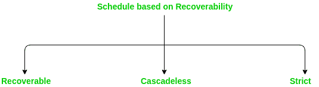
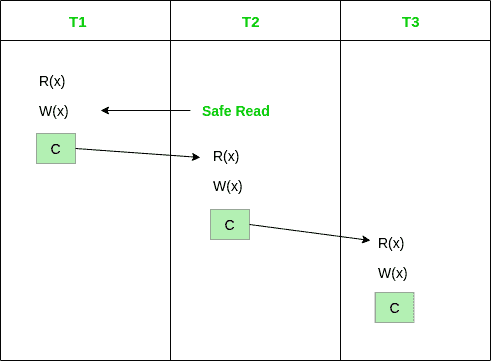
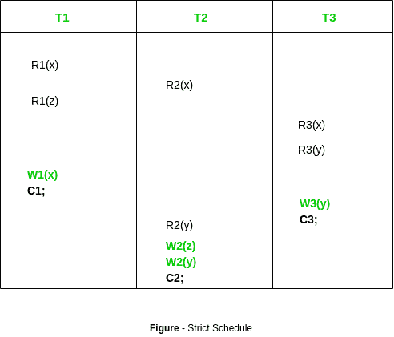
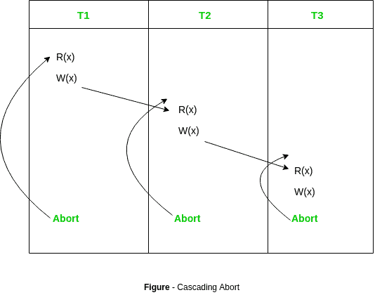
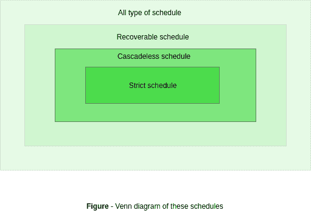

# 数据库管理系统中基于时间表的可恢复性类型

> 原文:[https://www . geesforgeks . org/基于计划类型的数据库中可恢复性/](https://www.geeksforgeeks.org/types-of-schedules-based-recoverability-in-dbms/)

通常，有以下三种类型的时间表:



**1。可恢复时间表–**
如果时间表如其名称所示是可恢复的，则称其是可恢复的。在对相同数据执行写操作之前，只允许读取。只允许读取(Ti- > Tj)。

**示例–**

```
S1: R1(x), W1(x), R2(x), R1(y), R2(y), 
         W2(x), W1(y), C1, C2; 
```

给定的时间表遵循 **Ti- > Tj = > C1- > C2** 的顺序。事务 T1 在 T2 之前执行，因此不会发生冲突。R1(x)出现在 W1(x)之前，事务 T1 在 T2 之前提交，即完成对数据项 x 执行的第一次更新的第一个事务，因此给定的时间表是可恢复的。

让我们看看**不可恢复的时间表**的例子，以进一步明确概念:

```
S2: R1(x), R2(x), R1(z), R3(x), R3(y), W1(x), 
       W3(y), R2(y), W2(z), W2(y), C1, C2, C3; 
```

**Ti- > Tj = > C2- > C3** 但是 W3(y)在 W2(y)之前执行，这导致冲突，因此必须在 T2 事务之前提交。所以给定的时间表是不可恢复的。如果时间表中给出了 **Ti- > Tj = > C3- > C2** ，那么它将成为可恢复的时间表。

**注意:**提交的事务永远不应该是回滚。这意味着从未提交的事务中读取值并提交它将使当前事务进入不一致或不可恢复的状态，这被称为*脏读问题*。

**示例:**


**2。无级联调度–**
当事务执行前没有发生**读**或**写-写**时，则相应的调度称为无级联调度。

**示例–**

```
S3: R1(x), R2(z), R3(x), R1(z), R2(y), R3(y), W1(x), C1, 
         W2(z), W3(y), W2(y), C3, C2; 
```

在这个调度中 **W3(y)** 和 **W2(y)** 覆盖冲突并且没有读取，因此给定的调度是无级联调度。

**特殊情况–**
希望中止的已提交事务。如下所示，所有事务都在读取提交的数据，因此它是无级联调度。



**3。严格时间表–**
如果时间表不包含**在提交前读取**或**写入**，则称为严格时间表。严格的时间表本质上是严格的。

**示例–**

```
S4: R1(x), R2(x), R1(z), R3(x), R3(y), 
        W1(x), C1, W3(y), C3, R2(y), W2(z), W2(y), C2; 
```

在这个时间表中，在提交之前不会出现读写冲突，因此它有严格的时间表:



**4。级联中止–**
级联中止也可以回滚。如果事务 T1 中止，因为 T2 读取了由 T1 写入但未提交的数据。因此这是级联回滚。

**示例:**



严格、无级联和可恢复计划之间的相关性:



从上图:

1.  严格计划都是可恢复的无级联计划

2.  所有无级联调度都是可恢复的