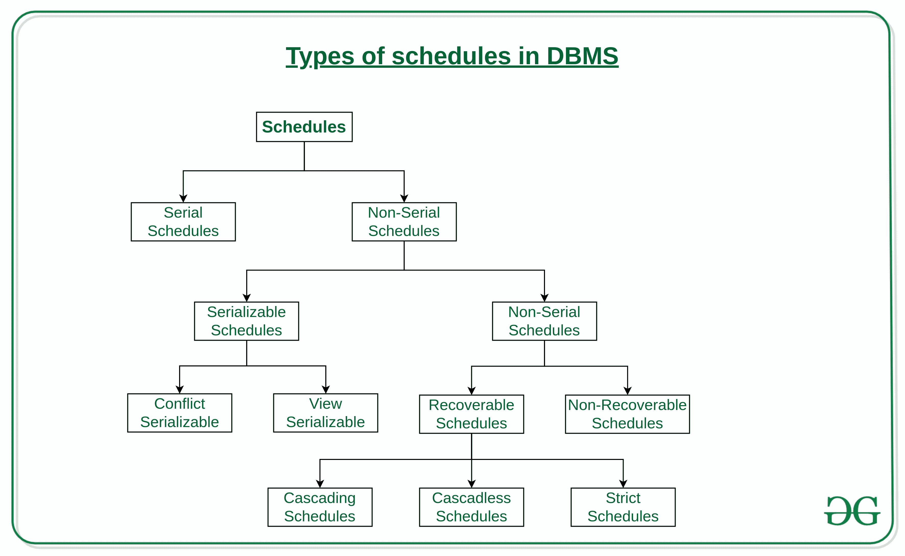
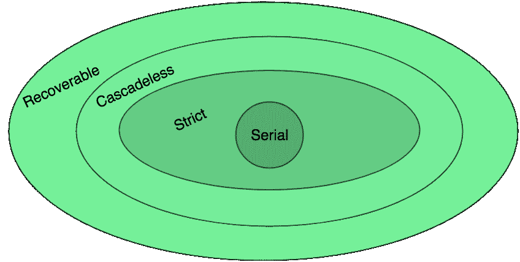

# 数据库管理系统中的时间表类型

> 原文:[https://www.geeksforgeeks.org/types-of-schedules-in-dbms/](https://www.geeksforgeeks.org/types-of-schedules-in-dbms/)

顾名思义，计划是一个排列事务并逐一执行它们的过程。当有多个事务以并发方式运行，并且需要设置操作顺序以使操作不相互重叠时，调度开始发挥作用，事务相应地计时。事务和调度的基础在[并发控制(简介)](https://www.geeksforgeeks.org/concurrency-control-introduction/)和[事务隔离级别在数据库管理系统](https://www.geeksforgeeks.org/transaction-isolation-levels-dbms/)文章中讨论。这里我们将讨论各种类型的时间表。

[](https://media.geeksforgeeks.org/wp-content/cdn-uploads/20190813142109/Types-of-schedules-in-DBMS-1.jpg) 

1.  **Serial Schedules:**
    Schedules in which the transactions are executed non-interleaved, i.e., a serial schedule is one in which no transaction starts until a running transaction has ended are called serial schedules.

    **例:**考虑以下涉及两笔交易 T <sub>1</sub> 和 T <sub>2</sub> 的时间表。

    | T <sub>1</sub> | T <sub>2</sub> |
    | --- | --- |
    | 皇家艺术学院 |  |
    | 西(阿) |  |
    | 右(乙) |  |
    |  | 西(乙) |
    |  | 皇家艺术学院 |
    |  | 右(乙) |

    其中 R(A)表示对某个数据项‘A’
    执行读操作，这是一个串行调度，因为事务按顺序 T <sub>1</sub> — > T <sub>2</sub> 串行执行

2.  **Non-Serial Schedule:**
    This is a type of Scheduling where the operations of multiple transactions are interleaved. This might lead to a rise in the concurrency problem. The transactions are executed in a non-serial manner, keeping the end result correct and same as the serial schedule. Unlike the serial schedule where one transaction must wait for another to complete all its operation, in the non-serial schedule, the other transaction proceeds without waiting for the previous transaction to complete. This sort of schedule does not provide any benefit of the concurrent transaction. It can be of two types namely, Serializable and Non-Serializable Schedule.

    非串行调度可以进一步分为可串行化和不可串行化。

    1.  **Serializable:**
        这个用来维护数据库的一致性。它主要用于非串行调度，以验证调度是否会导致任何不一致。另一方面，串行调度不需要可串行化，因为它只在前一个事务完成时才跟随事务。对于 n 个事务，只有当非串行调度等价于串行调度时，才称其为可串行化调度。因为在这种情况下允许并发，所以多个事务可以并发执行。可序列化的调度有助于提高资源利用率和 CPU 吞吐量。这有两种类型:
        1.  **[【冲突可串行化:](https://www.geeksforgeeks.org/conflict-serializability/)**
            如果一个调度可以通过交换非冲突操作转化为一个串行调度，那么这个调度就叫做冲突可串行化。如果所有条件都满足，则两个操作被认为是冲突的:
            *   它们属于不同的交易
            *   它们对相同的数据项进行操作
            *   其中至少有一个是写操作
        2.  **[视图可序列化:](https://www.geeksforgeeks.org/dbms-how-to-test-two-schedule-are-view-equal-or-not-2/)**
            如果一个计划的视图等于一个串行计划(没有重叠事务)，则该计划称为视图可序列化。冲突调度是视图可序列化的，但是如果可序列化性包含盲写，则视图可序列化不冲突可序列化。
    2.  **不可序列化:**
        不可序列化的调度分为两种类型，可恢复调度和不可恢复调度。
        1.  **[Recoverable Schedule:](https://www.geeksforgeeks.org/recoverability-in-dbms/)**
            Schedules in which transactions commit only after all transactions whose changes they read commit are called recoverable schedules. In other words, if some transaction T<sub>j</sub> is reading value updated or written by some other transaction T<sub>i</sub>, then the commit of T<sub>j</sub> must occur after the commit of T<sub>i</sub>.

            **示例–**考虑以下涉及两笔交易 T <sub>1</sub> 和 T <sub>2</sub> 的时间表。

            | T <sub>1</sub> | T <sub>2</sub> |
            | --- | --- |
            | 皇家艺术学院 |  |
            | 西(阿) |  |
            |  | 西(阿) |
            |  | 皇家艺术学院 |
            | 犯罪 |  |
            |  | 犯罪 |

            这是自 T <sub>1</sub> 在 T <sub>2</sub> 之前提交以来的可恢复时间表，这使得由 T <sub>2</sub> 读取的值是正确的。

            有三种类型的可恢复计划:

            1.  **Cascading Schedule:**

                也称为避免级联中止/回滚(ACA)。当一个事务出现故障并导致回滚或中止其他相关事务时，这种调度称为级联回滚或级联中止。示例:
                

            2.  **[Cascadeless Schedule:](https://www.geeksforgeeks.org/cascadeless-in-dbms/)**
                Schedules in which transactions read values only after all transactions whose changes they are going to read commit are called cascadeless schedules. Avoids that a single transaction abort leads to a series of transaction rollbacks. A strategy to prevent cascading aborts is to disallow a transaction from reading uncommitted changes from another transaction in the same schedule.

                换句话说，如果某个事务 T <sub>j</sub> 想要读取由某个其他事务 T <sub>i</sub> 更新或写入的值，那么 T <sub>j</sub> 的提交必须在 T <sub>i</sub> 的提交之后读取它。

                **例:**考虑以下涉及两笔交易 T <sub>1</sub> 和 T <sub>2</sub> 的时间表。

                | T <sub>1</sub> | T <sub>2</sub> |
                | --- | --- |
                | 皇家艺术学院 |  |
                | 西(阿) |  |
                |  | 西(阿) |
                | 犯罪 |  |
                |  | 皇家艺术学院 |
                |  | 犯罪 |

                这个时间表没有时间表。由于 **A** 的更新值是在更新事务即 T <sub>1</sub> 提交后由 T <sub>2</sub> 读取的。

                **例:**考虑以下涉及两笔交易 T <sub>1</sub> 和 T <sub>2</sub> 的时间表。

                | T <sub>1</sub> | T <sub>2</sub> |
                | --- | --- |
                | 皇家艺术学院 |  |
                | 西(阿) |  |
                |  | 皇家艺术学院 |
                |  | 西(阿) |
                | 流产 |  |
                |  | 流产 |

                这是一个可恢复的计划，但它不能避免级联中止。可以看出，如果 T <sub>1</sub> 中止，T <sub>2</sub> 也将不得不中止，以保持时间表的正确性，因为 T <sub>2</sub> 已经读取了 T <sub>1</sub> 写入的未提交值。

            3.  **Strict Schedule:**
                A schedule is strict if for any two transactions T<sub>i</sub>, T<sub>j</sub>, if a write operation of T<sub>i</sub> precedes a conflicting operation of T<sub>j</sub> (either read or write), then the commit or abort event of T<sub>i</sub> also precedes that conflicting operation of T<sub>j</sub>.
                In other words, T<sub>j</sub> can read or write updated or written value of T<sub>i</sub> only after T<sub>i</sub> commits/aborts.

                **例:**考虑以下涉及两笔交易 T <sub>1</sub> 和 T <sub>2</sub> 的时间表。

                | T <sub>1</sub> | T <sub>2</sub> |
                | --- | --- |
                | 皇家艺术学院 |  |
                |  | 皇家艺术学院 |
                | 西(阿) |  |
                | 犯罪 |  |
                |  | 西(阿) |
                |  | 皇家艺术学院 |
                |  | 犯罪 |

                这是一个严格的时间表，因为 T <sub>2</sub> 只在 T <sub>1</sub> 提交后才读写 T <sub>1</sub> 写的 A。

3.  **Non-Recoverable Schedule:**
    **Example:** Consider the following schedule involving two transactions T<sub>1</sub> and T<sub>2</sub>.

    | T <sub>1</sub> | T <sub>2</sub> |
    | --- | --- |
    | 皇家艺术学院 |  |
    | 西(阿) |  |
    |  | 西(阿) |
    |  | 皇家艺术学院 |
    |  | 犯罪 |
    | 流产 |  |

    T <sub>2</sub> 读取 T <sub>1</sub> 写的 A 值，提交。T <sub>1</sub> 后来中止，因此 T <sub>2</sub> 读取的值是错误的，但由于 T <sub>2</sub> 已提交，该时间表是**不可恢复的**。

**注–**可以看出:

1.  无级联计划比可恢复计划更严格，或者是可恢复计划的子集。
2.  严格时间表比无级联时间表更严格，或者是无级联时间表的子集。
3.  串行调度满足所有可恢复、无级联和严格调度的约束，因此是严格调度的子集。

各种计划之间的关系可以描述为:



**示例:**考虑以下时间表:

```
S:R1(A), W2(A), Commit2, W1(A), W3(A), Commit3, Commit1 
```

以下哪一项是正确的？
(A)调度是视图可串行化调度和严格可恢复调度
(B)调度是不可串行化调度和严格可恢复调度
(C)调度是不可串行化调度，不是严格可恢复调度。
(D)调度是可串行化调度，不是严格的可恢复调度

**解决方案:**时间表可以改写为:-

| T <sub>1</sub> | T <sub>2</sub> | T <sub>3</sub> |
| --- | --- | --- |
| 皇家艺术学院 |  |  |
|  | 西(阿) |  |
|  | 犯罪 |  |
| 西(阿) |  |  |
|  |  | 西(阿) |
|  |  | 犯罪 |
| 犯罪 |  |  |

首先，它是一个视图可序列化的调度，因为它具有视图相等的串行调度 T<sub>1</sub>—>T<sub>2</sub>—>T<sub>3</sub>，满足视图可序列化所需的变量 A 的初始和更新读取和最终写入。现在我们可以看到事务 T <sub>1</sub> 后面跟着 T <sub>3</sub> 完成了写-写对，这违反了上面提到的严格调度的条件，因为 T <sub>3</sub> 应该只在 T <sub>1</sub> 提交之后才执行写操作，这在给定的调度中是违反的。因此，给定的调度是可序列化的，但不是严格可恢复的。
所以，选项(D)是正确的。