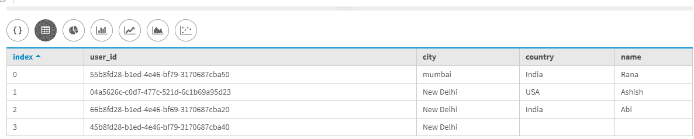
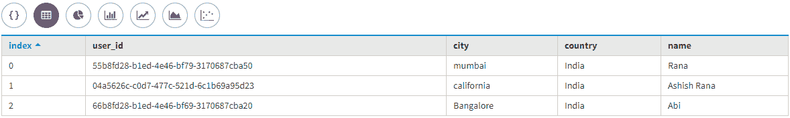

# 更新卡珊德拉中的条款

> 原文:[https://www.geeksforgeeks.org/update-clause-in-cassandra/](https://www.geeksforgeeks.org/update-clause-in-cassandra/)

在本文中，我们将讨论如何更新表中的列，如何更新单行中的多列，以及如何基于某种条件插入列值。

我们一个一个来讨论。

让我们考虑一个用户数据表，它有唯一标识行的用户标识，名称、城市、国家是该表的字段。因此，首先，我们将使用下面给出的 CQL 查询创建一个表。让我们来看看。

要创建表，请使用以下 CQL 查询。

```
CREATE TABLE User_data
(
User_Id uuid,
Name text,
City text,
Country text,
Primary key(User_Id)
); 
```

现在，我们将向表中插入一些数据。让我们来看看。

```
Insert into User_data(User_Id, Name, City, Country) 
values (04a5626c-c0d7-477c-521d-6c1b69a95d23, 'Ashish', 'california', 'USA');

Insert into User_data(User_Id, Name, City, Country) 
values (55b8fd28-b1ed-4e46-bf79-3170687cba50, 'Rana', 'mumbai', 'India');

Insert into User_data(User_Id, Name, City, Country) 
values (66b8fd28-b1ed-4e46-bf69-3170687cba20, 'Abi', 'Bangalore', 'India'); 
```

让我们看看插入到表中的数据的输出，以验证数据是否被相应地插入。
我们来看看。

```
Select * 
from User_data; 
```

**输出:**


在由[卡珊德拉查询语言(CQL)](https://www.geeksforgeeks.org/additional-functions-in-cql-cassandra-query-language/) 支持的 In 子句中的空值列表中，当我们传递空数组作为 in 子句的参数时，它在 Java 应用程序中非常有用，尤其是在 Java 驱动程序应用程序中。

现在，如果我们想更改城市名称，那么使用下面给出的 CQL 查询将用户的城市更新到 User_data 表中。让我们来看看。

```
UPDATE User_data
SET City ='New Delhi'
WHERE User_Id IN 
(
45b8fd28-b1ed-4e46-bf79-3170687cba40,
04a5626c-c0d7-477c-521d-6c1b69a95d23, 
66b8fd28-b1ed-4e46-bf69-3170687cba20 
); 
```

现在，验证用户的城市是否成功更改。

```
Select * 
from User_data; 
```

**输出:**



现在，为了更新，单行中的几列使用了以下 CQL 查询。

```
UPDATE User_data
SET 
Name = 'Ashish Rana',
Country = 'India'
WHERE User_id = 04a5626c-c0d7-477c-521d-6c1b69a95d23; 
```

现在，来验证更新是否成功。
我们来看看。

```
Select * 
from User_data; 
```

**输出:**

