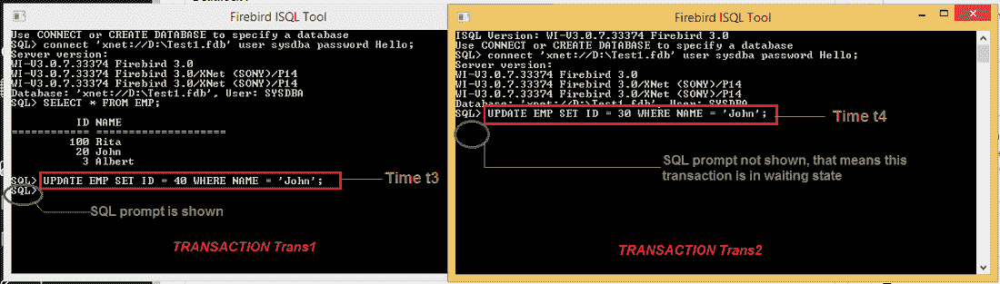
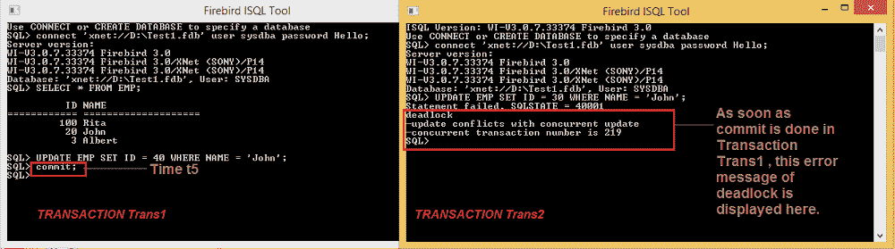

# 更新与并发更新冲突

> 原文:[https://www . geesforgeks . org/update-conflicts-with-concurrent-update/](https://www.geeksforgeeks.org/update-conflicts-with-concurrent-update/)

在本文中，我们将讨论事务、死锁的概述，并将重点关注与并发更新的更新冲突，并借助一个示例进行理解。我们一个一个来讨论。

[**事务**](https://www.geeksforgeeks.org/transaction-states-in-dbms/) **:**
事务是可以有一个或多个 SQL 语句的逻辑工作单元。事务在您提交或完全回滚时结束。

[**死锁**](https://www.geeksforgeeks.org/deadlock-in-dbms/) **:**
当多个进程所需的资源持有排他锁，而这些进程无法继续完成时，就会发生死锁。

**死锁和更新与** **并发更新:**
当多个事务想要同时修改同一行(或在另一个事务提交之前的不同时间)时，会出现“死锁更新与并发更新冲突”异常。只有一个更新程序可以真正更改行并提交。只要第一个事务没有提交，第二个/其他事务中的更新就会等待(无限期或直到配置的超时)。一旦第一个事务提交，第二个事务中的更新将以此错误结束。注意:如果第一个事务回滚，第二个事务将继续，因为事务 1 完成的更新已回滚。

[**避免死锁**](https://www.geeksforgeeks.org/difference-between-deadlock-prevention-and-deadlock-avoidance/) **:**
为了避免死锁，即避免锁被多个进程持有在一个资源上(此处为 Row)，火鸟提出了这种异常。现在让我们看一个例子来清楚地理解这种问题如下。

**示例–**
在这里，我们将借助一个示例来理解这个概念。

*   假设我们已经在数据库“Test1.fdb”中创建了一个名为“Emp”的表，该表保存了员工的 ID &员工的姓名。表格数据如下。

<figure class="table">

| 身份证明 | 名字 |
| --- | --- |
| One hundred | 丽塔 |
| Twenty | 约翰 |
| three | 艾伯特 |

</figure>

*   让我们假设我们有两个事务:Trans1 和 Trans2。Trans1 在时间 t1 开始，Trans2 在时间 t2 开始。现在两个都想更新同一行，行的名称为“John”。
*   事务 Trans1 在 t3 时刻开始更新。在 Trans1 提交之前，事务 Trans2 尝试更新 Trans1 更新的同一行。因此 Trans2 进入等待状态，等待 Trans1 提交或回滚。
*   见时间轴图，更清楚地理解如下。

<figure class="table">

| 时间 | Trans1 | Trans2 |
| --- | --- | --- |
| T1 级（一种通讯线路的名称） | 开始 |   |
| t2 |   | 开始 |
| t3 | 更新名为约翰的行 |   |
| t4 |   | 更新名为约翰的行 |
| t5 | 犯罪 | **更新冲突** |

</figure>

**注:**

*   如果 Trans1 提交— Trans2 退出等待状态，错误消息—“死锁；将显示“更新与并发更新冲突”。
*   如果 Trans1 回滚— Trans2 退出等待状态，可以在同一行上完成更新。
*   要检查这一点，打开两个火鸟 ISQL 工具窗口，在一个窗口上运行 Trans1，在另一个窗口上运行 Trans2。

*   在上面的窗口中，在 Trans1 中，您尚未提交。
*   提交 Trans1 后，错误消息–“死锁；更新与并发更新冲突”将显示在 Trans2 窗口中。

**为了避免这种错误消息:**
要么在事务 Trans1 中进行回滚，要么仅在 Trsan1 提交时才在 Trans2 中的同一行上开始更新。