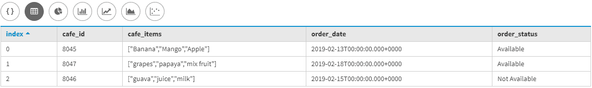
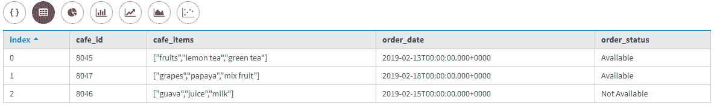
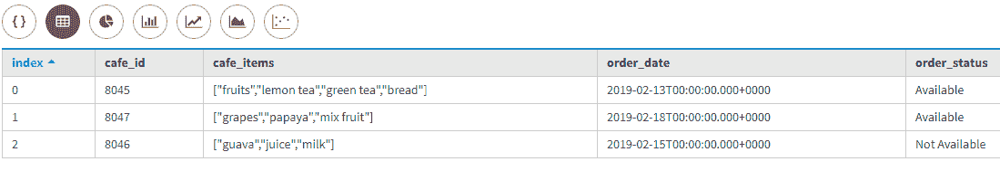
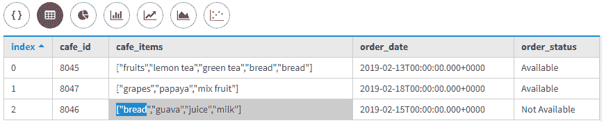

# 更新卡珊德拉列表

> 原文:[https://www.geeksforgeeks.org/updating-a-list-in-cassandra/](https://www.geeksforgeeks.org/updating-a-list-in-cassandra/)

在[卡珊德拉](https://www.geeksforgeeks.org/introduction-to-apache-cassandra/)列表中是[采集数据类型](https://www.geeksforgeeks.org/collection-data-type-in-apache-cassandra/)。在本文中，我们将讨论如何以不同的方式更新列表，以便我们可以在列表中的任何位置添加元素。我们还可以附加一个列表。

我们一个一个来讨论。

考虑集群 1 是一个键空间。

```
CREATE KEYSPACE cluster1
WITH replication = {'class': 'SimpleStrategy', 
                    'replication_factor' : 1}; 
```

现在，我们首先要创建一个表。让我们来看看。

```
Create Table Food_App 
(
 Cafe_id Int Primary Key,
  Order_Date Date,
  Order_status Text,    
  Cafe_items list<text>
 );  
```

现在，我们将向 Food_App 表中插入一些数据。

让我们看看。

```
INSERT INTO Food_App (Cafe_id, Order_Date, Order_status, Cafe_items)                                         
VALUES (8045, '2019-02-13', 'Available', {'Banana', 'Mango', 'Apple'});

INSERT INTO Food_App (Cafe_id, Order_Date, Order_status, Cafe_items)                                         
VALUES (8046, '2019-02-15', 'Not Available', {'guava', 'juice', 'milk'});

INSERT INTO Food_App (Cafe_id, Order_Date, Order_status, Cafe_items)                                         
VALUES (8047, '2019-02-18', 'Available', {'grapes', 'papaya', 'mix fruit'}); 
```

现在，让我们看看输出。

```
select * 
from Food_App; 
```

**输出:**



**更新列表:**

```
UPDATE Food_App
SET Cafe_items = ['fruits', 'lemon tea', 'green tea']
Where Cafe_id = 8045; 
```

现在，让我们看看输出。

```
select * 
from Food_App; 
```

**输出:**



要将元素追加到列表中，请切换新元素数据和列表名称的顺序:

```
UPDATE Food_App
SET Cafe_items = Cafe_items + ['bread'] 
WHERE Cafe_id = 8045; 
```

现在，让我们看看输出。

```
select * 
from Food_App; 
```

**输出:**



要将元素添加到列表的前面，请将其括在方括号中，并使用加法(+)运算符:

```
UPDATE Food_App
SET Cafe_items = ['bread']+Cafe_items   
WHERE Cafe_id = 8046; 
```

现在，让我们看看输出。

```
select * 
from Food_App; 
```

**输出:**

