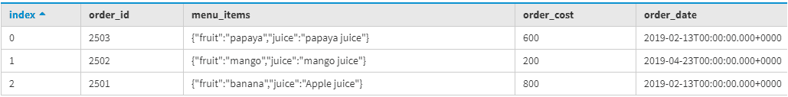
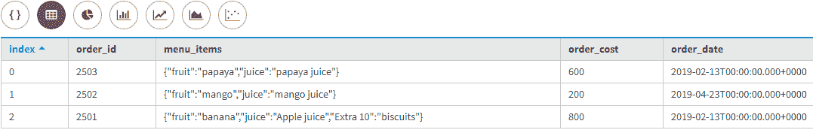
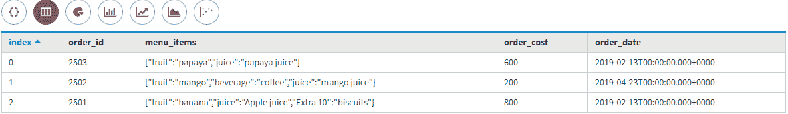
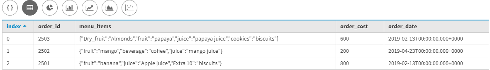

# 更新卡珊德拉中的 MAP 采集数据类型

> 原文:[https://www . geesforgeks . org/updating-map-collection-data-type-in-Cassandra/](https://www.geeksforgeeks.org/updating-map-collection-data-type-in-cassandra/)

在本文中，我们将讨论如何更新地图[集合数据类型](https://www.geeksforgeeks.org/collection-data-type-in-apache-cassandra/)以及如何更新行、如何删除行以及如何使用 update 子句添加行来更新地图集合数据类型。

首先，我们将创建一个表，让我们考虑 Food_menu 是一个表名，Order_id、Order_Date、Oreder_cost 和 Menu_items 是字段。让我们来看看。

```
Create Table Food_menu (
  Order_id Int Primary Key,
  Order_Date Date,
  Order_cost int,    
  Menu_items MAP<text, text>
 ); 
```

现在，使用下面给出的 CQL 查询向表中插入一些数据。

```
INSERT INTO Food_menu (Order_id, Order_Date, Order_cost, Menu_items)
VALUES (2501, '2019-02-13', 800, {'fruit' : 'banana',  'juice' : 'Apple juice'});

INSERT INTO Food_menu (Order_id, Order_Date, Order_cost, Menu_items)
VALUES (2502, '2019-04-23', 200, {'fruit' : 'mango',  'juice' : 'mango juice'});

INSERT INTO Food_menu (Order_id, Order_Date, Order_cost, Menu_items)
VALUES (2503, '2019-02-13', 600, {'fruit' : 'papaya',  'juice' : 'papaya juice'}); 
```

现在，让我们看看上面的 CQL 查询的输出。

```
select * 
from Food_menu; 
```

**输出:**



现在，这里我们将看到如何更新地图，我们可以通过使用(+)运算符和我们想要添加的任何元素来追加地图集合数据类型，然后将字符串放在关键字对值的柯利括号中。
我们来看看。

```
UPDATE Food_menu
SET Menu_items = Menu_items + {'Extra 10' : 'biscuits'} 
WHERE Order_id = 2501; 
```

让我们看看输出，

```
select * 
from Food_menu;
```

**输出:**



现在，这里我们将看到如何通过使用 TTL 值来更新地图收集数据类型。

```
UPDATE Food_menu
USING TTL 259200
SET Menu_items['beverage'] = 'coffee' 
WHERE Order_id = 2502; 
```

让我们看看输出，
**输出:**



在 CQL，我们可以添加一个或多个用逗号分隔的元素来更新地图。让我们来看看。
例如，这也是 CQL 支持的一种简单方法，通过使用包含集合映射的 UPDATE 子句创建新行。

```
UPDATE Food_menu
SET Menu_items = Menu_items + {'Dry_fruit' : 'Almonds', 'cookies' : 'biscuits'} 
WHERE Order_id = 2503; 
```

让我们看看输出，

```
select * 
from Food_menu; 
```

**输出:**



在[卡珊德拉查询语言(CQL)](https://www.geeksforgeeks.org/additional-functions-in-cql-cassandra-query-language/) 中，当我们在更新集合数据类型(如集合和映射)时删除条目时，我们正在用新集合替换元素或键值对，这将为删除的条目创建墓碑，即使我们知道它们将是新映射集合或集合中的条目。假设您的代码以这些方式更新所有 map 并设置集合，那么它会生成许多墓碑，这些墓碑会影响系统性能更具体地说，我们可以说可能会降低系统速度。