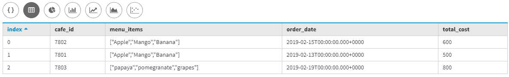
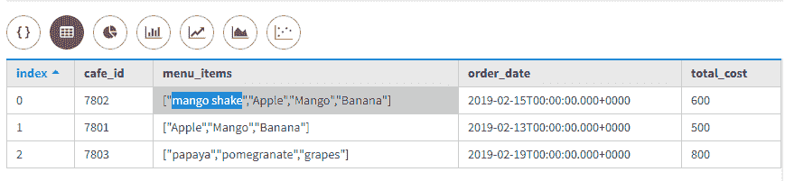
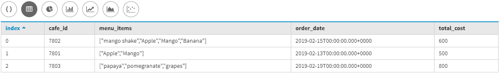
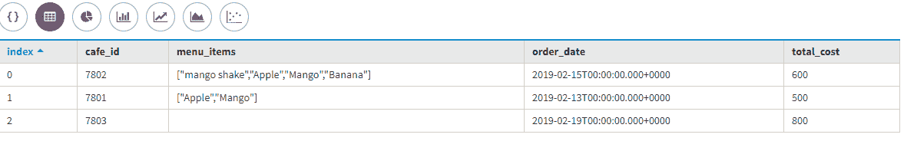

# 更新卡珊德拉中的设置

> 原文:[https://www.geeksforgeeks.org/updating-set-in-cassandra/](https://www.geeksforgeeks.org/updating-set-in-cassandra/)

在本文中，我们将讨论如何以不同的方式更新集合[集合数据类型](https://www.geeksforgeeks.org/collection-data-type-in-apache-cassandra/)我们还将讨论如何使用 update 子句插入行，如果我们不想要任何集合元素，那么我们也可以使用带有(–)运算符的 UPDATE 子句移除。

首先，我们将创建一个食品菜单表，其中咖啡标识、订单日期、总成本、菜单项是下面给定表格中的字段。让我们看看。

```
Create Table Food_menu 
(
 Cafe_id int Primary Key,
 Order_Date Date,
 total_cost int,    
 Menu_items Set<text>
);
```

现在，我们将使用下面给出的[卡珊德拉查询语言(CQL)](https://www.geeksforgeeks.org/additional-functions-in-cql-cassandra-query-language/) 查询向 Food_menu 表中插入一些数据。让我们看看。

```
INSERT INTO Food_menu (Cafe_id,  Order_Date, total_cost, Menu_items)
VALUES (7801, '2019-02-13', 500, {'Banana', 'Mango', 'Apple'});

INSERT INTO Food_menu (Cafe_id,  Order_Date, total_cost, Menu_items)
VALUES (7802, '2019-02-15', 600, {'Banana', 'Mango', 'Apple'});

INSERT INTO Food_menu (Cafe_id,  Order_Date, total_cost, Menu_items)
VALUES (7803, '2019-02-19', 800, {'grapes', 'papaya', 'pomegranate'}); 
```

让我们看看插入数据的输出。

```
select * 
from Food_menu; 
```

**输出:**



现在，这里我们将讨论更新集合数据类型。让我们看看。

1.  We can add an element in set collection data type by using (+) operator.

    ```
    UPDATE Food_menu
    SET Menu_items = Menu_items + {'mango shake'}  
    WHERE Cafe_id = 7802; 
    ```

    让我们看看上面 CQL 查询的输出。

    ```
    select * 
    from Food_menu; 
    ```

    **输出:**

    

2.  We can remove an element from a set by using subtraction (-) operator.

    ```
    UPDATE Food_menu
    SET Menu_items = Menu_items - { 'Banana'} 
    WHERE Cafe_id = 7801; 
    ```

    让我们看看上面 CQL 查询的输出。

    ```
    select * 
    from Food_menu; 
    ```

    **输出:**

    

3.  Now, if we want to remove all elements from a set then used the following CQL query given below.

    ```
    UPDATE Food_menu
    SET Menu_items = {''} 
    WHERE Cafe_id = 7803;
    ```

    ```
    select * 
    from Food_menu; 
    ```

    **输出:**

    